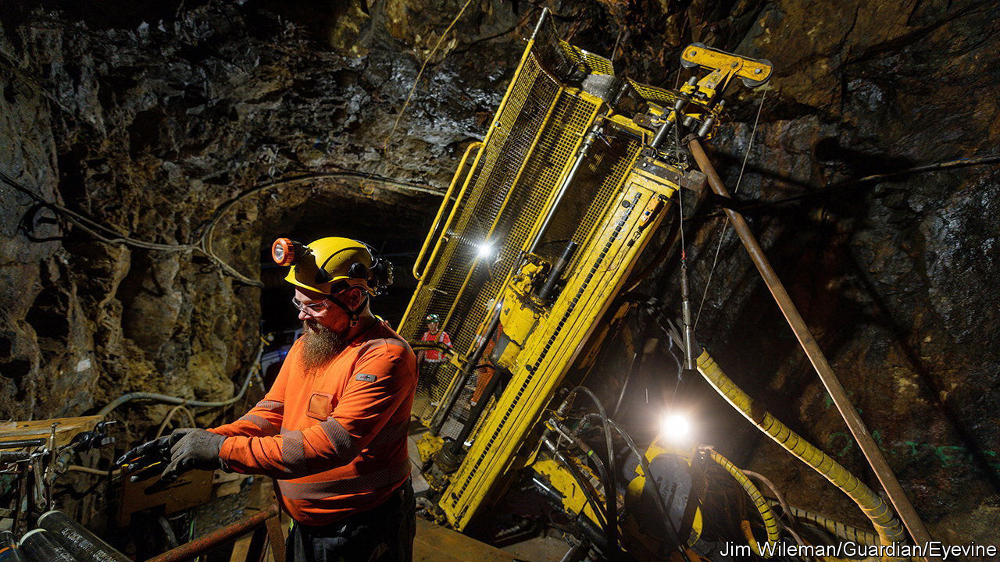
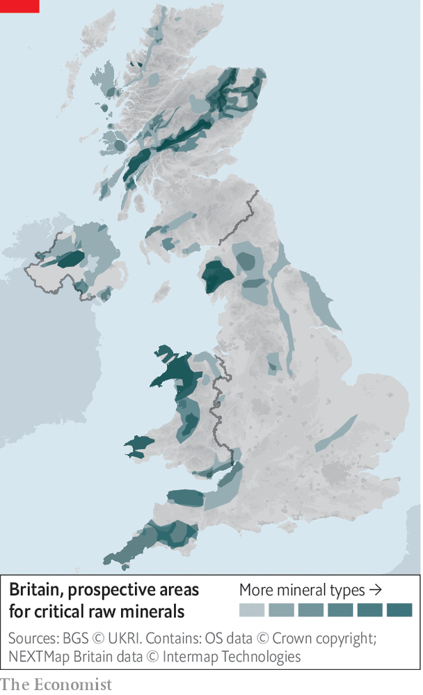

###### Li detectors

# Britain plays catch-up in a global scramble for critical minerals 

##### Too little, too late? 

 

> May 11th 2023 

IN CORNWALL’S MINING heyday in the 18th and 19th centuries, copper and tin were hewed from beneath the county’s craggy landscape. Many attempts at revival have failed, but another is under way. In April Cornish Lithium began its latest search for a prized metal of the 21st century, drilling a borehole near the village of Blackwater. Jeremy Wrathall, its founder, expects to be producing lithium by 2026. Another Cornish company, British Lithium, also expects to be in full production by then. 

Lithium, which is used to make batteries for electric vehicles (EVs), is classed as a “critical mineral”—economically essential, especially in , but with a risk-prone supply chain. Demand for such minerals is likely to increase several-fold in the next couple of decades. Companies and  are scrambling to secure supplies, build processing capacity and nurture industries such as EVs and wind power. The British government’s critical-minerals strategy, published last July and updated in March, listed 18 substances, including lithium, cobalt (another ingredient of EV batteries) and rare earths, key to the permanent magnets that drive EVs and wind turbines.

 


Geology dictates where minerals can be dug. The government’s Critical Minerals Intelligence Centre has identified where in Britain exploitable deposits may lie; these include tin and tungsten as well as lithium (see map). Whatever happens, Britain will have to rely on imports. Australia mines about half the world’s lithium; about half of known reserves are in Latin America. China is the biggest source of 12 other minerals on the list.

Dependence on an unfriendly China is troubling—especially when China also dominates the “midstream” refining of critical minerals into metals and alloys. It processes the lion’s share of lithium and cobalt. It is the leading maker of EV batteries, too. The covid-19 pandemic and Russia’s invasion of Ukraine have further exposed the precariousness of supply. 

Projects are in hand to bolster Britain’s midstream. Two lithium refineries are being developed in north-east England. The founder and chairman of the firm behind one, Paul Atherley, also heads Pensana, a mining-and-processing company, which is building Europe’s first rare-earths separation plant on the Humber estuary. It will be fed mainly by ores from its mine in Angola. It (and so far one lithium refinery) is backed by the government’s Automotive Transformation Fund (ATF). 

The government is also pursuing international co-operation. It has joined nine other countries and the European Commission in the Minerals Security Partnership, an American-led initiative to secure supply chains. It has signed bilateral agreements—for example with Saudi Arabia, which is keen to develop critical-mineral deposits it values at $1.3trn, and South Africa, a source of platinum, palladium, manganese and more. But how all this might translate into secure supplies is unclear.

Collaborators double as competitors. America is offering subsidies of $369bn to firms exploiting and processing critical minerals and making batteries, turbines and so forth on American soil, and is luring manufacturers from Europe. In Brussels the commission has proposed extending an easing of the EU’s state-aid rules to nurture critical-mineral-hungry industries. In March it proposed targets for domestic extraction and processing of critical minerals (10% and 40% respectively by 2030) and diversifying supply (no more than 65% should come from one country by then).

On May 9th industry figures told MPs looking into EV battery-making of their concern about slow progress in establishing “gigafactories”, which depend on critical minerals and which, owing to local-content rules, are needed for British electric cars to retain tariff-free entry to the EU. Britain is late to the minerals race. It lacks the heft of America, China or the EU of which it once was part: the ATF, its fund for the automotive supply chain, is worth just £1bn ($1.3bn). It is a big hole to dig out of.■


