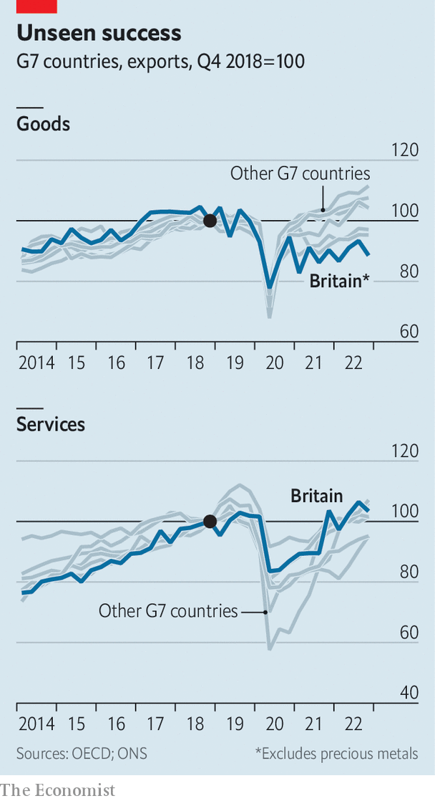

###### Pushing paper

# Britain’s services exports are booming despite Brexit. Why? 

##### Less dependence on the EU than goods exporters is only part of the answer 

 

> May 9th 2023 

FOR SOME Brexiteers, the point of leaving the EU was to shift the country back towards making things. Relinquishing the role of Europe’s financial hub, the argument went, would mean a cheaper exchange rate; that would help the country’s long-dormant manufacturing sector. Many Remainers expected only half of that scenario to materialise: Brexit would indeed kill the golden goose of services trade but would not bring back the factories.

 


It seems as if both views were wrong. Goods exports have languished. But when it comes to services exports, Britain has enjoyed one of the best performances in the G7 (see chart). According to analysis by the Resolution Foundation, a think-tank, Britain’s services exports since a new trade and co-operation agreement with the EU came into force at the start of 2021 are 3.6 percentage points higher than a typical rich country (after accounting for the differences in what it exports). Britain’s legions of white-collar exporters do not seem to have been overly harmed by Brexit.

These figures do need to be taken with a pinch of salt. Trade in services can be hard to measure: exports can consist of as little as a visit to a website or a phone call, and national statistics offices struggle to identify where exactly the work is being billed. What is more, the Office for National Statistics has recently made large adjustments to the trade figures to reconcile different measures of gross domestic product. Removing these adjustments would put the country back in the middle of the G7 pack rather than at the top, says Sophie Hale, an economist at the Resolution Foundation. Still, she says, services trade is too important to Britain to just dismiss the data out of hand. And there are plausible explanations for its sparkiness. 

One is that Britain’s services trade is less dependent on the EU than its goods trade: around 36% of its services exports head to the bloc compared with 47% of its goods exports. Consultants and bankers in London have benefited from America’s especially rapid recovery from the pandemic: services exports across the Atlantic are up by 43% compared with 2018, the last full year before trade patterns were distorted by Brexit and by the pandemic. 

Britain’s office drones have also been making inroads into some smaller markets, particularly economies with which the country has historic ties such as India, the United Arab Emirates and Nigeria. Indian students have more than offset a drop in demand for education from the EU: education-related travel exports to India have risen by 435% since 2018. A treaty agreeing mutual recognition of qualifications has helped, as has a move to liberalise the post-study visa regime for students. Saudi Arabia is another bright spot. During 2022 Britain sold roughly £8bn ($10.1bn) of services to the kingdom, a 78% increase compared with 2018. 

The biggest explanation for the divergence between goods and services, however, lies in exports to the EU itself. Goods exports from Britain to the bloc have not regained their level of 2019, whereas services exports are up by 16%. Europe’s single market in services is less developed than the one for goods; losing access to it may have mattered less to consultants than manufacturers. Services firms may also have found clever ways to ease trade frictions. Upcoming research by Martina Magli, an economist, will show that since the referendum in 2016 British firms have become more likely to sell through affiliates than directly. Since 2018 Britain’s services exports to Luxembourg, a noted hub for shell companies, have more than doubled. 

Such workarounds may not last. Regulators may crack down. Firms could find that the cost of these tactics blunts their competitive edge over time. Exporters who do not already have relationships with EU clients may simply not bother selling to the bloc at all. For now, however, the golden goose of services trade is still laying. ■


