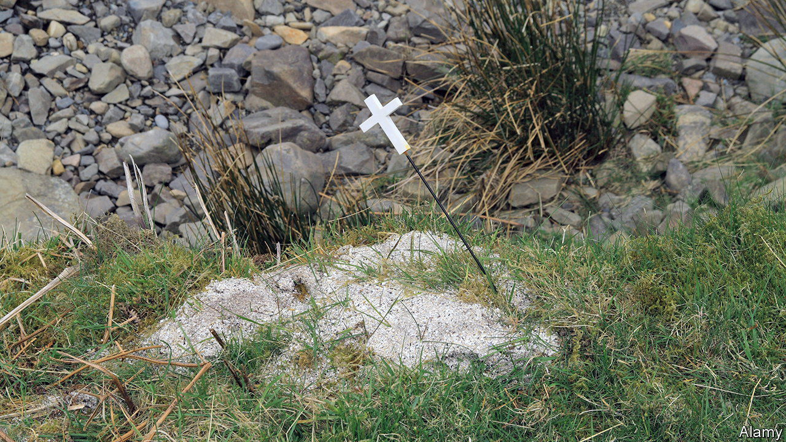

###### Fuss-free final farewells

# Direct cremations and burials offer a different way to mourn 

##### Fuss-free funerals are on the rise in Britain 

 

> May 11th 2023 

THE FERRY rounded Eel Pie Island, “The Last Time” by the Rolling Stones blowing from a tinny speaker. Celia Chasey shared memories of her brother, Colin, and cast his ashes into the Thames. There was no cremation service. Ms Chasey never saw a coffin. Farewill, a “direct cremation” specialist, simply delivered the ashes to her.

A growing number of Britons are choosing fuss-free funerals. The share of people opting for direct cremations, which include a basic coffin, transport and burning without family or friends present, has increased fivefold since 2019. They made up almost a fifth of funerals in 2022, according to figures from SunLife, an insurer. Co-operative Funeralcare says one in ten of its customers now opt for a direct cremation or burial, in which the body is buried quickly without a wake or embalming. 

Direct cremations have been around for over a decade, says Deborah Smith of the National Association of Funeral Directors, a trade group. They took off during the pandemic, as families were forced to choose unattended services. But demand is now driven by other factors. Many just want a more affordable farewell. The cost of a traditional send-off in Britain, including the undertaker’s fees, can be upwards of £5,000 ($6,315). A direct cremation is around £1,500 ($1,900). Britain’s competition regulator introduced a law in 2021 that requires funeral providers to make prices clear, helping customers compare services. 

Religion is in decline, and with it . Some clients plan send-offs on their own terms: dinner parties and discos are novel alternatives to sombre services. Others simply want less fuss. “Simplicity Cremations” by Dignity, Britain’s only listed funeral provider, promise to make funerals “less of an undertaking”.

Some worry that pithy slogans disguise how austere direct services can be. Funerals are intentionally public events, says Kate Woodthorpe, director of the Centre for Death and Society at the University of Bath. People wear black and weep in view of the coffin. “There’s a risk, without that, [that] the bereaved will carry on as if nothing has happened.” Many are happy with their choices. Ms Chasey said goodbye to her brother when he fell into a coma. After that, she says, the frills of a “proper” funeral felt trivial.


