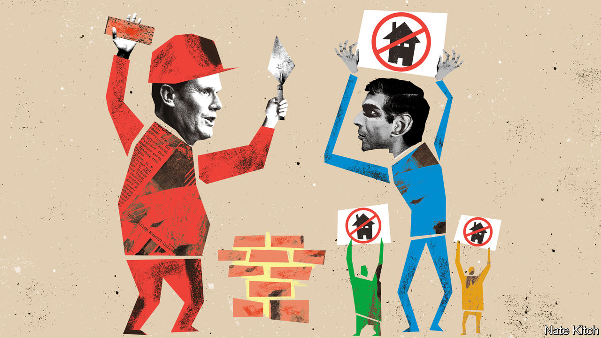

###### Bagehot

# How housing became the new divide in British politics 

##### To build or to block? 

 

> May 11th 2023 

When the Green Party launched its  in Stowmarket in Suffolk, it did so deep in Tory territory. Suffolk is a conservative place by any definition. The county’s mps are all Conservative. It voted to leave the eu by a chunky margin. It is a land of Barbour jackets, the wax coats that are ubiquitous in rural England, rather than the more Bohemian fashion found in typical Green strongholds such as Bristol. 

Yet the Greens had a compelling pitch for these voters: housing. More specifically: less of it. Sprawling developments would be a thing of the past under a Green regime. So would housing targets that compel councils to approve them. The pitch worked. On May 5th Mid Suffolk District Council became the first local authority in Britain to be solely controlled by the Green Party. 

Housing policy divides the country in odd ways. Britain has fewer houses than it needs, if its European peers are anything to go by. England has fewer homes per person than every other big rich European country. Yet Britons are split on whether to catch up. According to a study by Ben Ansell, an Oxford academic and author of “Why Politics Fails”, an average of 37% of people in each constituency support building more local housing. But an average of 39% oppose the idea. Britain is a country of Builders and Blockers—and its political parties have each decided which group to pursue. 

Labour is posing as the party of Builders. Places that most support housing are in the places Labour needs either to hold or win back at the next general election, according to Mr Ansell’s study. Support for home-building is concentrated in London and smaller cities as well as in Scotland and the so-called Red Wall, a ribbon of northern constituencies that Labour lost in the 2019 election. Plenty of natural Labour supporters may balk at building. But this is a fight the party wants to have. For Labour, nimbyism is another abstract noun to be abolished, like crime or poverty. 

The Conservatives have ended up as a party of Blockers. After a rebellion by Tory mps last year, the government scrapped targets that compelled councils to build more homes. Since the Tories came to power in 2010, various proposals to  have been thwarted by mps who rely on Blockers for their seats. Michael Gove, the cabinet minister responsible for housing, thinks the word “nimby” is an unfair slur. Conservative strategists are, rightly, more worried about the party’s traditional southern base, where opposition to building is stronger, than its newer northern seats, where voters welcome the bulldozers. There is little benefit to building an extension if the rest of your house falls down. 

Appealing to Blockers drags the Conservatives into a crowded part of the political spectrum. A nimbyish streak runs through nearly all parties bar Labour. The Liberal Democrats regularly face two ways on policy, safe in the knowledge that voters will rarely call their bluff and elect them to government. Housing is no exception. At the last general election the Liberal Democrats wanted 300,000 homes per year to be built nationally. At a local level Lib Dem councillors flaunt the number of developments scuppered, like headhunters with a belt of scalps. 

Now the Greens have their own pitch to those sceptical of building. “Right Homes, Right Place, Right Price” is a fine slogan. Britain often builds ugly homes in the wrong place at extortionate cost. Yet the party’s solutions are at best naive and at worst a triple-lock against building. The Greens hope a target of 100,000 social houses per year can be achieved partly by converting empty homes, rather than the grubby business of putting shovels in the ground. But England already has the lowest percentage of empty dwellings of any big European country. 

Each party offers Blockers something compelling: an excuse. No one likes being called a nimby, never mind a banana (“Build Absolutely Nothing Anywhere Near Anyone”). So opposition to development must hide behind broader ideals. Different parties offer different forms of ideological cover. After all, Conservatism should do what it says on the tin: those who live in a lovely village are within their rights to try and keep it that way. When it comes to the Greens, nimbyism can become environmentalism. For the Liberal Democrats, opposition becomes a defence of localism. Each results in fewer things being built. 

Placating the Blockers leads Britain into what Mr Ansell calls the “prosperity trap”. Voters in prosperous countries are unwilling to take short-term pain that will be in the country’s long-term interests. The problems associated with building are concentrated and the benefits are diffuse. The result is predictably grim. Britain’s houses are among the smallest and most expensive in western Europe, and levels of home-ownership have been dropping. 

Some in the Conservative Party understand this well enough. Simon Clarke, a former cabinet minister, has declared: “Conservatives will never be able to out-nimby the Liberal Democrats or the Greens.” Yet Mr Clarke and his ilk are in the minority among their party. A political version of the prosperity trap dogs the Tories. Opposing new homes in Conservative areas placates today’s voters at the expense of future ones. 

Going bananas 

Housing is one of the few areas in British politics where there is fundamental disagreement. Topics where voters are totally split, such as whether to leave the eu, are rare. On the big problems facing Britain—whether lousy public services or the cost of living or cutting emissions—Britons are largely agreed on what to aim for, if not on how to get there. Housing is more binary. Some voters want it; others do not. When Britain is divided, the party that can maintain its block of voters wins. In 2019 the Conservatives were able to marshal the support of “Leave“ voters, while the “Remain” vote split among Labour, the Liberal Democrats, the Greens and the Scottish National Party. Come the next election, Builders have few places to go. Blockers have plenty of choice. ■


