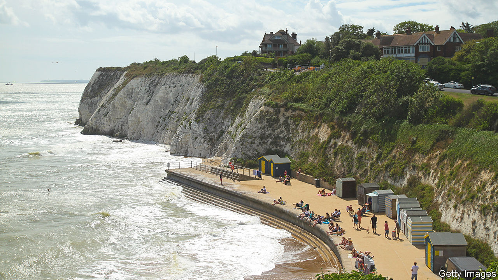
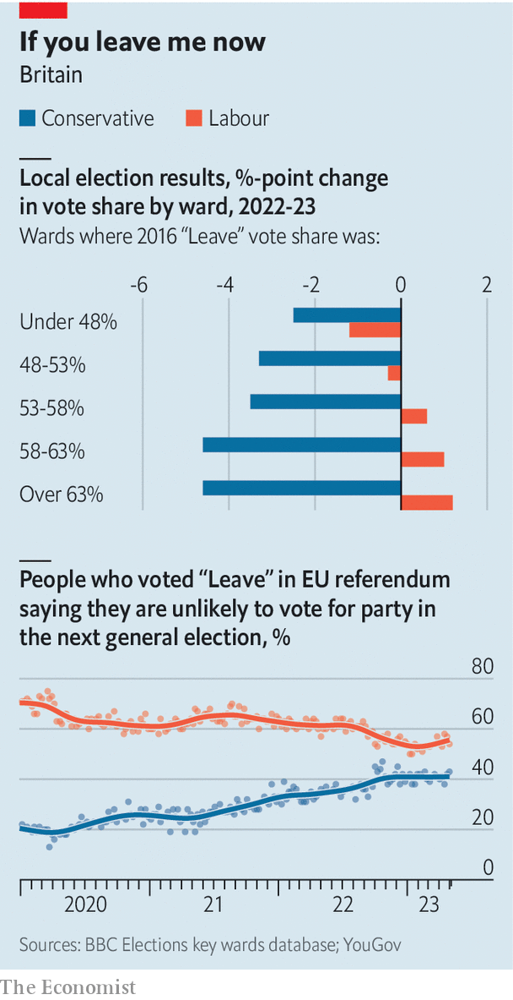

###### Same anger, different victor

# Labour makes striking gains in the heartland of Brexit 

##### In Nigel Farage’s old stamping-ground, voters turn to a party they once scorned 

 

> May 10th 2023 

Ramsgate Harbour once held a busy fishing fleet. Today the only sign of life is aboard four berthed cutters of the Border Force, whose task is to intercept migrants from dinghies in the English Channel and bring them to shore. As a fifth arrives, an elderly angler leans over the harbour wall. “Get back out there”, he bellows, pointing to sea, “and do some work!” 

Grey, Eurosceptic and itching to give Westminster a bloody nose, furious voters in blustery towns along England’s east coast have been chronicled so often that they are a political cliché. Anger at immigration and at austerity drove them first into the arms of Nigel Farage’s UK Independence Party (UKIP), then its successor, the Brexit Party, and then its imitator in Boris Johnson’s Conservatives. Along the way, they pushed Britain out of the EU. 

Ramsgate, in east Kent, is still blustery; the locals are still angry. But  held in much of England on May 4th sent this mood of insurrection in a surprising new direction. The Labour Party took control of several councils in pro-Brexit areas, including some in Kent. The long realignment of Eurosceptic voters away from Labour is partially unwinding, says Robert Ford of the University of Manchester, who was among the first to spot UKIP’s potential in this region a decade ago. 

 


Around a quarter of Leave voters now back Labour, up from 14% in the 2019 election. Strongly pro-Brexit areas swung most heavily to Labour in the local elections; the party slipped back in Remain strongholds (see chart). That makes its support more efficiently distributed to win a general election. Leave voters are also increasingly hostile to the Tories. “I was at a coronation street party in Kent and I was meeting working-class people saying ‘Nige, you should have been our prime minister,’” says Mr Farage. “But they were all voting Labour last week.” 

Labour’s victory on Thanet Council, the district that contains Ramsgate, was especially striking. Mr Farage ran for Parliament here in 2005 and again in 2015, finishing second. In 2015 UKIP took control of the council, the first and last it would run. (The result was shambolic.) The area brought together two wings of UKIP’s support, notes Michael Crick, Mr Farage’s biographer: “retired colonels in blazers, enjoying a G&amp;T after a round of golf” in towns such as Sandwich, and the white working class living on council estates around Ramsgate. Craig Mackinlay, the Tory MP, is a former UKIP bigwig. 

“The issue of Brexit has faded. It’s just not on their agenda any more,” says Rick Everitt, the local Labour leader. “People’s lives are dominated by the cost of living and the health service, and they are looking for whoever can best answer those questions.” Britain’s inflation rate stood at 10.1% in the year to March, and hospital waiting lists are not yet falling. Rishi Sunak has made “Stop the Boats” one of his main pledges, but even here it is yielding him little electoral reward. 

The decision of Sir Keir Starmer, the leader of the Labour Party, to make winning back older social conservatives his central objective is bearing fruit. That meant repudiating Jeremy Corbyn, his predecessor, dumping Europhilia and taking a hard line on criminal justice. “You have to overcorrect constantly for the fact that everyone sitting around the table in any Labour Party meeting is going to be from the cities, university-educated and Remain-inclined,” says one party official. 

UKIP’s supporters typically combined hostility to immigration with left-wing economics, and thought corporations and the rich had it too easy, notes Dr Ford. If the economy dominates their agenda, “the potential for those voters to come straight back to Labour has always been there.” Sir Keir has described his  as a more faithful response to the Brexit referendum than the Tories’ agenda. In Ramsgate, Labour has also been helped by the pandemic-era arrival of middle-class émigrés from London.

In the story of British Euroscepticism, the local elections provided another landmark: UKIP lost all its councillors, the end point of a long retreat from political influence. Reform UK, as the Brexit Party was renamed, also failed to make headway, winning just six councillors and averaging a mere 6% of the vote in wards that it contested. That is a sign of Tory success: a long march to the right on Europe has occupied the space UKIP operated in. But it is also a big problem. In previous general elections, the Tories secured victory by winning over voters who had turned to radical-right parties during local elections. That pool is much smaller now. The towns where the Brexit revolution started are showing the first signs that it may be at an end. ■


