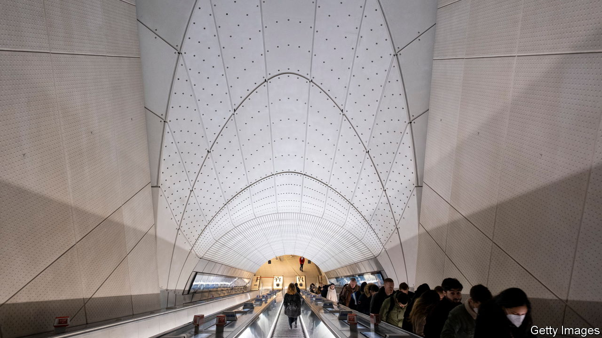

###### Have you come far?

# London’s newest train line is now also its busiest 

##### The startling success of the Elizabeth line 

 

> May 11th 2023 

John Betjeman would have been disappointed. The poet suggested bombing Slough. The town contained “bogus-Tudor bars”, “air-conditioned, bright canteens” and (a final horror) people who “often go to Maidenhead”. Instead, it has become easier to get there. The , a train line which runs across London on its way from Essex to Reading, stopping at Slough on the way, opened a year ago this month. Britons have been travelling on it in vast numbers: almost one in six of all rail journeys are, according to data from the Office of Rail and Road, now made on this line. Some people, it is said, even get off at Maidenhead.

London’s newest railway line may not be poetic—its other stations include the less-than-lyrical Woolwich—but it is epic. Building it was what is known in engineering as a “megaproject”, and the epithet is deserved. It has 42km of new rail tunnels and 13.5km of foot tunnels. Its construction involved the excavation of enough earth to build a nature reserve in the Thames, 3m cubic metres of concrete and the frequent deployment of the internationally understood unit of immensity, the Olympic swimming pool. It is big. 

It is also necessary, because London, too, is big. When Victorian balloonists first took to the skies and looked down at the European cities beneath them, they were shocked that the handsome centres of Paris or London comprised such a tiny part of the whole; the famous palaces, galleries and parks were mere islands of antiquity in seas of urban sprawl and industry. Two centuries later, the seas have become oceans. From one end of the Elizabeth line to the other, the capital’s Tube map now covers a distance of 100km. 

The line nearly didn’t happen. Just as London’s trains and Tubes suffer from congestion, so too do the engineering projects that create them. In the 1980s it was clear London needed more east-west rail capacity but it wasn’t clear how to make it happen. Cross-rail (as it was then called) found itself in a queue with other projects, including a new train line from Chelsea to Hackney, in the east of the city. Hackney saved it. When the latter was suggested by civil servants to Margaret Thatcher, she was appalled. “Do you know what sort of people live out in Hackney? They are not Conservative voters.” Cross-rail was a go. 

In the intervening years Cross-rail lost its hyphen; absorbed £18.9bn ($23.8bn) in spending; and, thanks to Boris Johnson, got a new name. The “Elizabeth line” was opened by the then queen, three-and-a-half years later than expected, on May 24th 2022. The delay was understandable. Digging a big tunnel is hard; digging it under a city is harder. Engineers less break virgin soil than weave wobbling paths through existing infrastructure: at Tottenham Court Road the boring machines passed 60 centimetres from a Northern Line tunnel. 

And the new line had complicated things in it. Betjeman may have sneered at air-conditioning but the Elizabeth line has it throughout. To ensure it worked, engineers had to consider big things, such as airflow in the tunnels (the 205-metre trains, each so long that their receding seats look like an artist’s exercise in perspective, act as pistons), and small ones, such as the people on them (each passenger produces around 100 watts of power when seated, 120 when standing). Without air-conditioning, says Phil Clayton, its chief engineer, things “become very hot”. 

It was worth the bother. Travel on London’s underground railways and you travel not only through space but through time. There is an  beneath the city’s streets, each line a railway and a relic. Whereas some typify Victorian ramshackle, the Elizabeth line is pure 21st-century chic, with uplighting and elegant, organically curving concrete. It’s like a well-lit large intestine.

The megaproject is now home to life’s minutiae. In Slough and Maidenhead, people embark and sit beneath too-intimate adverts for menopause pills and hair-loss treatments. Speak to them, and they say that they love it: the cleanliness, the speed and—above all—the air-conditioning. Betjeman can go hang. ■


