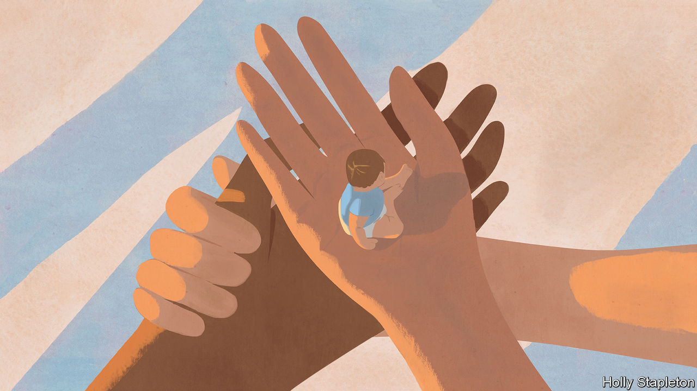
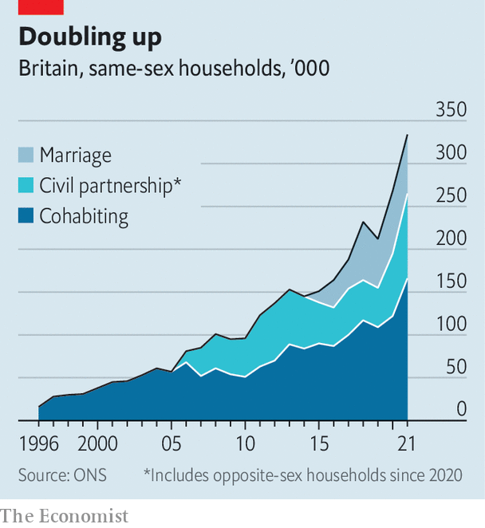

###### Modern families

# Why Britain is updating its laws on surrogacy and gamete donation 

##### The rise of the same-sex parent family and elective single mothers 

 

> May 8th 2023 

WHEN KIM COTTON, a young British woman, carried and gave birth to a baby for an anonymous couple in 1985, many Britons were horrified. Ms Cotton had been artificially inseminated by the intended father and paid £6,500 ($9,353). “Born to be sold,” ran one headline. Appalled lawmakers hurriedly passed the Surrogacy Arrangements Act, which prohibited commercial surrogacy and regulated the uncompensated kind.

The number of British babies born this way has risen from fewer than 100 each year two decades ago to more than 400 each year today. , if not uncontroversial, has become socially acceptable in a way that would once have been unimaginable. That is partly because it is now often the “gestational” sort, meaning the surrogate does not biologically mother the baby but is implanted with a fertilised egg from the intended mother or from a donor. Yet it is also because British babymaking has become altogether less traditional.

 


Some of that owes to the rise in British families headed by same-sex couples. The momentous changes to the family brought about by the legalisation of gay marriage in 2014 first became evident with adoptions. Between 2015 and 2019 the number of same-sex-couple families rose by 40% to 212,000. In 2022 540 of 2,950 adoptions in England—more than one in six—were to same-sex couples (only 3% of the adult population identifies as gay or bisexual). 

Yet most people who want children want babies and there have long been too few of those available to satisfy demand. In 2014 a law was passed to allow same-sex couples to apply for the “parental orders” by which the intended parents in a surrogacy arrangement assume legal parenthood. For gay men like Alan White, chair of the board of trustees of SurrogacyUK, a non-profit group, this represented a sea change. His desire to have children, he says, coupled with “societal norms around family”, were among the reasons he did not come out as gay until he was in his 20s. 

In parallel, advances in technology and medicine have transformed the wider fertility landscape. In vitro fertilisation means a baby can now be created by three parties—two who provide the gametes and a third who carries the fertilised egg—thus making it possible for gay men and infertile people to set about having a baby. Egg-freezing and other advances have also allowed single women to delay parenthood and undertake it alone. All this has fuelled a boom in the market for procreation: the Human Fertilisation and Embryology Authority (HFEA), a regulator, says 60% of fertility services are now paid for privately.

As a result, some of the rules governing surrogacy and fertility clinics, which in Britain are highly regulated, look out of date. The HFEA is reviewing the way fertility services are sold to patients and some aspects of sperm- and egg-donation; it will submit its recommendations later this year. In March the Law Commission (which reviews British legislation) published recommendations to update surrogacy laws. Both it and the HFEA want surrogacy and gamete donation to remain “altruistic” (meaning they cannot be profitmaking). But other changes are likely.

In particular the commission proposed that parental orders be ditched for Britain-born babies and that intended parents instead apply to have legal rights from their baby’s birth. The current system takes too long: parents tend to take surrogate-born babies home immediately but can wait up to a year to become legal parents. This can cause anxiety for everyone (the surrogate could change her mind and keep the baby; a parent might also reconsider or become unable to care for a child). 

The Law Commission says that for parents to have legal rights from birth, they and their surrogate should undergo screening and safeguarding checks overseen by non-profit surrogacy organisations, licensed by the HFEA. To allay concerns about surrogates’ rights there should be a six-week period following the birth during which, if a surrogate changes her mind, she can apply for a parental order. 

Natalie Gamble, the co-director of NGA Law, a firm that specialises in fertility cases, says one problem is that this change would not cover babies born via surrogacy overseas (around a third of British surrogate-born babies are estimated to be born abroad). One of the chief reasons parents use overseas surrogates is because there is a shortage in Britain. Those who can afford it often go to America, where the federal government does not regulate surrogacy. A rising number of developing countries, including India, and most European countries now prohibit commercial surrogacy (though Ukraine had become a big market before Russia’s invasion).

Ms Gamble says that if surrogates were compensated, more British women might consider it. Currently, the guidance says they may be paid “expenses reasonably incurred”, which routinely tot up to around £15,000. The Law Commission says that, far from allowing compensation, the law should clarify what expenses are allowable, to ensure surrogates are fairly treated.

Fears of exploitation lie behind Britain’s decision to keep surrogacy altruistic: the likelihood of coercion is greater when money is involved. Michael Johnson-Ellis, co-founder of My Surrogacy Journey, a non-profit organisation, says commercialisation would lead inevitably to the involvement of profitmaking third parties like lawyers and agencies, pushing the price of surrogacy beyond the reach of many. (Thanks to the role of lawyers, agencies and clinics, having a surrogate-born baby in America can cost upwards of $200,000.) He hopes that better regulation and some advertising (a change recommended by the Law Commission) will encourage more women in Britain to consider becoming surrogates. 

In the wider field of fertility, gamete donation creates many more babies than surrogacy: more than 4,000 annually, says the HFEA. The actual number may be far higher. Guidelines say no donor should parent more than ten families; the low-tech nature of sperm donation, which many lesbian couples and single mothers use to have babies, means no one is counting.

The HFEA says it too will not countenance a compensatory system as part of its review. But it is considering changing rules about egg- and sperm-donor anonymity, perhaps by allowing children to learn about their biological parents soon after birth, if donors agree. In 2005 the law was changed to ban lifelong anonymity, meaning that when children turned 18 they could request information about their biological parents. The first children to be affected by that law reach that age this year.

Nina Barnsley of Donor Conception Network (DCN), a charity, points out that Britain was ahead of the curve in forbidding anonymity: in the years since, DNA testing has exposed it as a false promise. Research shows that children who know how they were conceived—and, once they are older, by whom—do better psychologically. The Law Commission says Britain should create a surrogacy register, to help children trace the women who gave birth to them when they are older. The case of Kim Cotton shows the damage that can be done by secrets. “I’ll regret for the rest of my life that I don’t know who they are,” she has said of the parents who paid for her baby. “I try not to think about it now, but I always remember her birthday.” ■


