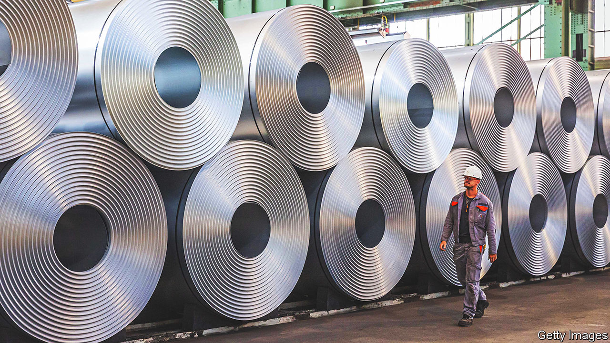

###### An iron will

# How fast can European steelmakers decarbonise? 

##### One of Europe’s dirtiest industries has ambitious plans to go green 

 

> May 11th 2023 

At the steelworks near the German city of Salzgitter, ironmaking is a dramatic affair. Red-hot molten metal pours forth from the bottom of towering blast furnaces. The noise is deafening. Sparks fly everywhere. Soon things will be much more sedate. Seven wind turbines already tower over the site, run by a firm called Salzgitter AG. In a few years the electricity they generate will power banks of electrolysers, container-sized machines that split water into oxygen and hydrogen. The hydrogen will replace coke in reducing iron ore to iron in a new type of furnace, which will operate at much lower temperatures. Instead of CO, the process will emit HO. 

The fireworks will be gone—but the climate will be grateful. Conventional steelmaking emits carbon dioxide twice over: first to generate the intense heat needed to force the coke to react with the ore in the blast furnace; then in the chemical reaction itself, as the coke snatches oxygen atoms from the ore to form iron and CO as a by-product. As a result, steelmakers account for between 7% and 9% of annual global carbon emissions, about as much as India and not much less than road transport. The Salzgitter steelworks alone contribute around 1% of Germany’s total emissions. No global net-zero goal will be possible to attain if the industry’s belching is not radically reduced, says Julia Reinaud of Breakthrough Energy, a fund which invests in climate-friendly technology.

Good news, then, that global demand for green steel is growing. Rich-world consumers increasingly expect manufacturers to strive for carbon neutrality. The makers of cars, appliances and other products that use steel have thus started to look seriously for ways to decarbonise their supply chains, and are willing to pay extra for the clean stuff. Pre-sale deals of H2 Green Steel, a Swedish startup, imply a premium of 20% and 30% over the dirty metal. 

Many governments are trying to chivvy the steel transition along. To bring down the cost of hydrogen, the making of which contributes two-thirds to the cost of green steel, America’s Inflation Reduction Act, a mammoth climate law passed last year, offers a production tax credit of $3 per kilogram of the gas. It also supports renewables. Not to be outdone, governments in Europe are footing part of the bill for their steel firms’ new equipment, which would run to $130bn if all of the continent’s blast furnaces were to be replaced, according to Morgan Stanley, a bank. Salzgitter’s transformation is being subsidised to the tune of €1bn ($1.1bn). Thyssenkrupp, a big German rival, may receive a similar sum. 

More handouts may be on the way. On May 5th Germany’s economy ministry announced plans to subsidise 80% of the electricity cost for energy-intensive firms, a group that includes steelmakers, if they pledge to go net-zero by 2045. Think-tanks like Agora Industrie suggest favouring green steel in public procurement. Ideas such as “carbon contracts” to pay firms the difference between what it costs to make grey steel and the green sort are making the rounds in European capitals.

Europe’s steelmakers have one more strong incentive to get decarbonising. Under the EU emissions-trading system, they are currently awarded 80% of their allowances for CO emissions free of charge in order to remain competitive with dirtier producers in places like China and India. Over the next ten years the EU will phase out these freebies and replace them with a carbon tariff on dirty imports. If EU steelmakers stay grey, calculates Morgan Stanley, their profits could sink by up to 70%.

Add it all together, explains Ms Reinaud, and it becomes clear why European steel firms are talking of upgrading their facilities. Besides Salzgitter and Thyssenkrupp, another German firm called Stahl-Holding-Saar wants to turn some of its mills green. ArcelorMittal, the world’s second-largest steel company, based in Luxembourg, has plans for seven such projects, mostly in Europe. At least four startup steelworks—H2 Green Steel; Hybrit, another Swedish firm; GravitHy, a French one; and Blastr, from Norway—want to give the incumbents a run for their money. 

The Energy Transitions Commission (ETC), a think-tank, recently identified 28 green-steel projects globally. Most of them, like Salzgitter’s, involve ripping out old blast furnaces and replacing them with new ones to make “direct-reduced iron” using hydrogen. Together, they would produce 60m tonnes of green steel a year. 

Though nothing to sneeze at, this is far less than the 190m tonnes a year needed by 2030 for Europe’s steel industry to be on track for net-zero emissions by mid-century, according to the ETC—and a drop in the bucket next to the nearly 2bn tonnes produced each year around the world. What is more, so far only three companies on the ETC’s roster have moved from the talking phase to actual investment: H2 Green Steel, Salzgitter and ArcelorMittal, which is erecting a green-steel mill in Canada. 

Getting more such initiatives off the ground requires overcoming a number of hurdles. Replacing old blast furnaces with cleaner equipment is the easy part. The transformation requires companies to find investors, placate regulators, and secure enough energy and resources. They must also attract enough skilled workers for their mills and, crucially, enough willing buyers for their products.

H2 Green Steel is a case in point. Financing the project involved fancy footwork. The pre-sale agreements serve as collateral to raise €5bn in debt and equity needed to cover the plant’s cost. In April the firm confirmed it was seeking €1.5bn in funding. Though it is clearing the ground for construction, it still awaits the final go-ahead from local regulators to start building. This is expected in early June. 

Meeting the energy, resource and labour needs will be no less daunting. Direct reduction with hydrogen consumes 15 times more electricity than coking, according to one estimate. At full capacity, H2 Green Steel’s and Hybrit’s plants in Sweden will between them need nearly as much power as the entire country generates today. They also need purer iron ore, because it does not melt fully in hydrogen-powered furnaces, making it more difficult to skim off contaminants. With green hydrogen still in short supply and no pipelines to get it to northern Sweden, H2 Green Steel is building what it says will be one of the world’s biggest hydrogen plants. But finding enough electrolysers, which are only beginning to be mass-produced, is hard. 

And although northern Sweden is as good a starting point as any for such projects, thanks to the proximity of many hydroelectric dams and mines, it isn’t ideal for attracting a workforce of 2,000 professionals and their families. H2 Green Steel is taking a page from Krupp, a German steel pioneer that in the 19th century built whole towns to house its workers. But that adds to the project’s cost and complexity.

Then there is the demand side. Morgan Stanley estimates that a premium of $115 per tonne will be needed for green steelmakers to break even, nearly 20% of the current market price for conventional steel. Although H2 Green Steel says that its pre-sale agreements come with the expectation that prices will be higher in the next round of contracts, buyers will not be willing to pay such hefty markups for ever. 

Industries often take time to gain traction, at which point they accelerate, before slowing again as they mature. Green steelmaking is still in the first phase of this maturity “S-curve”, says Marc van Gerven, who advises big utilities and miners on the energy transition. But the inflection point may be nigh. Sources of renewable power are multiplying. The EU expects local manufacturing capacity for electrolysers to grow ten-fold by 2025. 

As the industry moves up the S-curve, the steelmaking process may be decoupled, with the energy-hungry early stages done near sources of cheap renewables and the rest closer to where the buyers are. H2 Green Steel already intends to build another mill, probably near Sines, a city in Portugal. That site would chiefly produce not finished steel but an intermediate product called sponge iron, to be shipped to Europe’s industrial heartlands for refining. If other steelmakers follow suit, that would be quite the industrial revolution. ■


