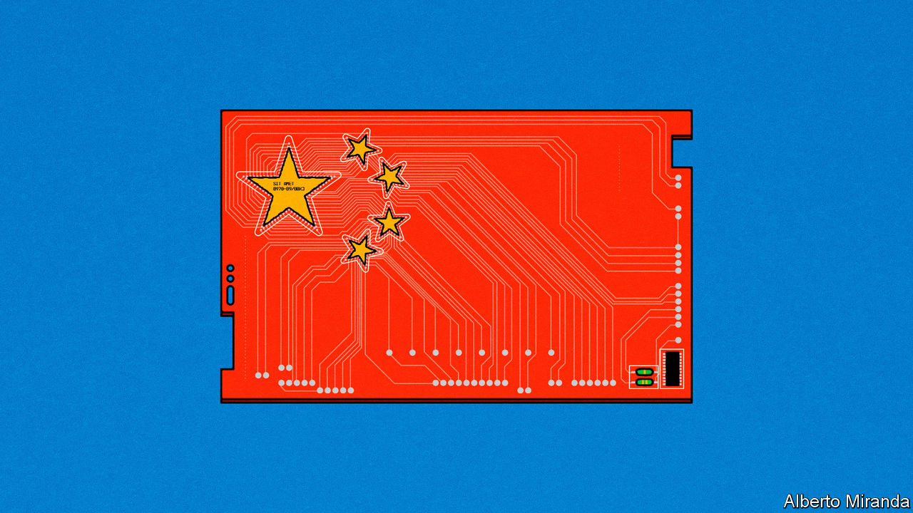
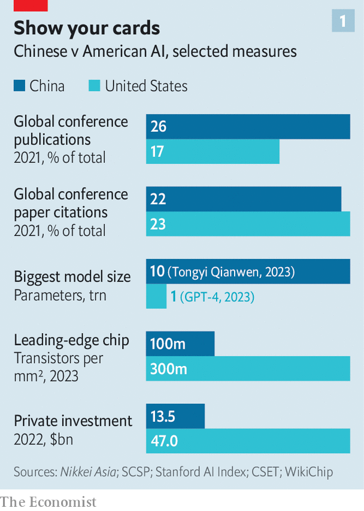
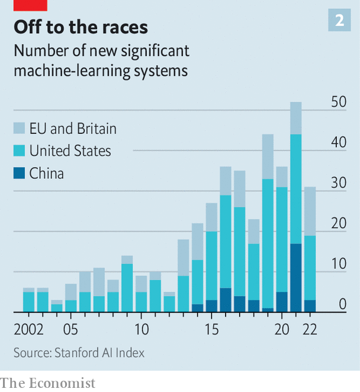
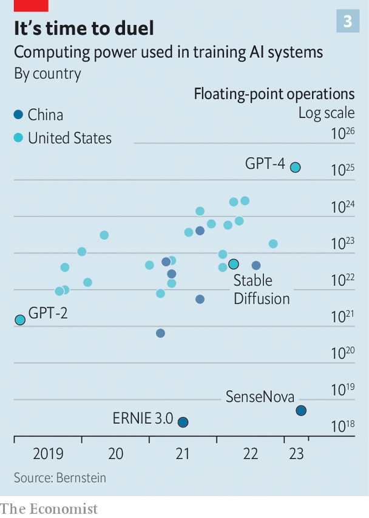
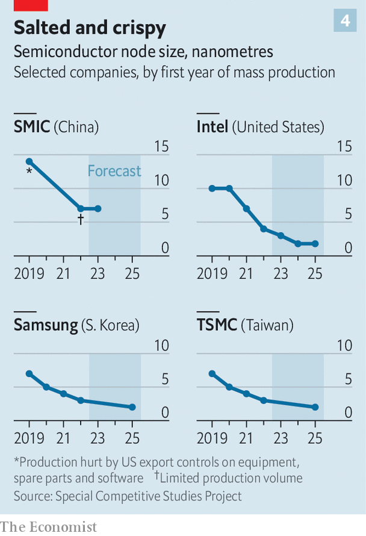

###### The Sino-American tech race

# Just how good can China get at generative AI? 

##### Its models may in time rival America’s. But that may not translate into an economic or military edge 

 

> May 9th 2023 

IF YOU LISTEN to the bombast in Beijing and Washington,  are engaged in an all-out contest for technological supremacy. “Fundamentally, we believe that a select few technologies are set to play an outsized importance over the coming decade,” declared Jake Sullivan, President Joe Biden’s national security adviser, last September. In February Xi Jinping, China’s paramount leader, echoed the sentiment, stating that “we urgently need to strengthen basic research and solve key technology problems” in order to “cope with international science and technology competition, achieve a high level of self-reliance and self-improvement”. 

No technology seems to obsess policymakers on both sides of the Pacific more right now than  (AI). The rapid improvements in the abilities of “generative” AIs like , which analyse the web’s worth of human text, images or sounds and can then create increasingly passable simulacrums, have only strengthened the obsession. If generative AI proves as transformational as its boosters claim, the technology could give those who wield it an economic and military edge in the 21st century’s chief geopolitical contest. Western and Chinese strategists already talk of an AI arms race. Can China win it?

 


On some measures of AI prowess, the autocracy pulled ahead some time ago (see chart). China surpassed America in the share of highly cited AI papers in 2019; in 2021, 26% of AI conference publications globally came from China, compared with America’s share of 17%. Nine of the world’s top ten institutions, by volume of AI publications, are Chinese. According to one popular benchmark, so are the top five labs working on computer vision, a type of AI particularly useful to a communist surveillance state.

 


Yet when it comes to “foundation models”, which give generative AIs their wits, America is firmly in front (see charts 2 and 3). ChatGPT and the pioneering model behind it, the latest version of which is called GPT-4, are the brainchild of OpenAI, an American startup. A handful of other American firms, from small ones such as Anthropic or Stability AI to behemoths like Google, Meta and Microsoft (which part-owns OpenAI), have their own powerful systems. ERNIE, a Chinese rival to ChatGPT built by Baidu, China’s internet-search giant, is widely seen as less clever. Alibaba and Tencent, China’s mightiest tech titans, have yet to unveil their own generative AIs. 

 


This leads those in the know to conclude that China is two or three years behind America in building foundation models. There are three reasons for this underperformance. The first concerns data. A centralised autocracy should be able to marshal lots of it—the government was, for instance, able to hand over troves of surveillance information on Chinese citizens to firms such as SenseTime or Megvii that, with the help of China’s leading computer-vision labs, then used it to develop top-notch facial-recognition systems. 

That advantage has proved less formidable in the context of generative AIs, because foundation models are trained on the voluminous unstructured data of the web. American model-builders benefit from the fact that 56% of all websites are in English, whereas just 1.5% are written in Chinese, according to data from W3Techs, an internet-research site. As Yiqin Fu of Stanford University points out, the Chinese interact with the internet primarily through mobile super-apps like WeChat and Weibo. These are “walled gardens”, so much of their content is not indexed on search engines. This makes that content harder for AI models to suck up. Lack of data may explain why Wu Dao 2.0, a model unveiled in 2021 by the Beijing Academy of Artificial Intelligence, a state-backed outfit, failed to make a splash despite its possibly being computationally more complex than GPT-4.

The second reason for China’s lacklustre generative achievements has to do with hardware. Last year America imposed export controls on technology that might give China a leg-up in AI. These cover the powerful microprocessors used in the cloud-computing data centres where foundation models do their learning, and the chipmaking tools that could enable China to build such semiconductors on its own. 

 


That hurt Chinese model-builders. An analysis of 26 big Chinese models by the Centre for the Governance of AI, a British think-tank, found that more than half depended on Nvidia, an American chip designer, for their processing power. Some reports suggest that SMIC, China’s biggest chipmaker, has produced prototypes just a generation or two behind TSMC, the Taiwanese industry leader that manufactures chips for Nvidia (see chart 4). But SMIC can probably mass-produce only chips which TSMC was churning out by the million three or four years ago. 

Chinese AI firms are having trouble getting their hands on another American export: know-how. America remains a magnet for the world’s tech talent; two-thirds of AI experts in America who present papers at the main AI conference are foreign-born. Chinese engineers made up 27% of that select group in 2019. Many Chinese AI boffins studied or worked in America before bringing expertise back home. The covid-19 pandemic and rising Sino-American tensions are causing their numbers to dwindle. In the first half of 2022 America granted half as many visas to Chinese students as in the same period in 2019. 

The triple shortage—of data, hardware and expertise—has been a hurdle for China. Whether it will hold Chinese AI ambitions back much longer is another matter. 

Take data. In February local authorities in Beijing, where nearly a third of China’s AI firms are located, promised to release data from 115 state-affiliated organisations, giving model-builders 15,880 data sets to play with. The central government has previously signalled it wants to dismantle Chinese apps’ walled gardens, potentially liberating more data, says Kayla Blomquist, an American former diplomat in China now at Oxford University. The latest models are also able to transfer their machine learnings from one language to another. OpenAI says that GPT-4 performs remarkably well on tasks in Chinese despite scarce Chinese source material in its training data. Baidu’s ERNIE was trained on lots of English-language data, notes Jeffrey Ding of George Washington University. 

In hardware, too, China is finding workarounds. The  reported in March that SenseTime, which is blacklisted by America, was using middlemen to skirt the export controls. Some Chinese AI firms are harnessing Nvidia’s processors through cloud servers in other countries. Alternatively, they can buy more of Nvidia’s less advanced wares—to keep serving the vast Chinese market, Nvidia has designed sanctions-compliant ones that are between 10% and 30% slower than top-of-the-range kit. These end up being costlier for the Chinese customers per unit of processing power. But they do the job. 

China could partly alleviate the dearth of chips—and of brain power—with the help of “open-source” models. Such models’ inner workings can be downloaded by anyone and fine-tuned to a specific task. Those include the numbers, called “weights”, which define the structure of the model and which are derived from costly training runs. Researchers at Stanford used the weights from LLaMA, Meta’s foundation model, to build one called Alpaca for less than $600, compared with perhaps $100m for training something like GPT-4. Alpaca performs just as well as the original version of ChatGPT on some tasks. 

Chinese AI labs could similarly avail themselves of open-source models, which embody the collective wisdom of international research teams. Matt Sheehan of the Carnegie Endowment for International Peace, another think-tank, says that China has form in being a “fast follower”—its labs have absorbed advances from abroad and rapidly incorporated them into their own models, often with flush state resources. A prominent Silicon Valley venture capitalist is more blunt, calling open-source models a gift to the Communist Party.

Such considerations make it hard to imagine that either America or China could build an unbridgeable lead in AI modelling. Each may well end up with AIs of similar ability, even if it costs China over the odds in the face of American sanctions. But if the race of the model-builders is a dead heat, America has one thing going for it that may make it the big AI winner—its ability to spread cutting-edge innovation throughout the economy. It was, after all, more efficient diffusion of technology that helped America open up a technological lead over the Soviet Union, which in the 1950s was producing twice as many science PhDs as its democratic adversary.

China is far more competent than the Soviet Union ever was at adopting new technologies. Its fintech platforms, 5G telecoms and high-speed rail are all world-class. Still, those successes may be the exception, not the rule, says Mr Ding. Particularly, China has done less well in deploying cloud computing and business software—both complementary to AI. 

And though American export controls may not derail all Chinese model-building, they constrain China’s tech industry more broadly, thereby slowing the adoption of new technology. Moreover, Chinese businesses as a whole, and especially small and medium-sized ones, are short of technologists who act as conduits for technological diffusion. Swathes of the economy are dominated by state-owned firms, which tend to be stodgy and change-averse. Parts of it are dodgy. China’s “Big Fund” for chips, which raised $50bn in 2014 with a view to backing domestic semiconductor firms, has been mired in scandals. Many of the thousands of new AI startups are AI in name only, slapping on the label to get a slice of the lavish subsidies doled out by the state to the favoured industry. 

As a consequence, China’s private sector may struggle to take full advantage of generative AI, especially if the Communist Party imposes strict rules to prevent chatbots from saying something its censors dislike. The handicaps would come on top of Mr Xi’s broader suborning of private enterprise, including a two-and-a-half-year crackdown on China’s tech industry. 

Although the anti-tech campaign has officially ended, it has left deep scars, not least in the AI business. Last year private investments in Chinese AI startups amounted to $13.5bn, less than one-third of the sum that flowed to their American rivals. In the first four months of 2023 the funding gap appears only to have widened, according to PitchBook, a data provider. Whether or not generative AI proves , the free market has placed its bet on who will make the most of it. ■


