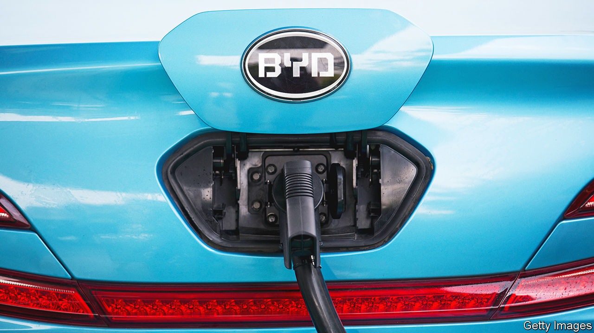

###### The Thais that bind

# Why Chinese carmakers are eyeing Thailand 

##### South-East Asia offers an appealing route to foreign expansion 

 

> May 11th 2023 

SIX DECADES ago, when Japan’s carmakers were minnows outside their home market, the future giants of global car manufacturing—Toyota, Nissan and Honda among them—began to expand production in Thailand. The South-East-Asian country’s early presence in the automotive supply chains means it is the tenth-largest producer of cars in the world, surpassing countries like France and Britain.

Today Thailand is once again a waypoint for the international ambitions of carmakers—this time from China. Chinese companies have been announcing investments in Thai factories left and right. In March BYD, which in the first quarter overtook Volkswagen as the best-selling car firm in China, broke ground on an EV factory in Rayong, already a carmaking hub. In April Changan unveiled a $285m investment to make its first right-hand-drive vehicles outside China. And on May 6th Thai officials said that Hozon, another Chinese firm, will produce its mass-market NETA V electric model in Thailand. 

As their home market matures, domestic competition stiffens and China’s economic growth becomes , carmakers’ cost of acquiring new Chinese customers is becoming “just so high”, says Tu Le of Sino Auto Insights, a consultancy in Detroit. In recent months a price war has broken out in China between EV marques. Many carmakers see foreign expansion as the surer route to growth. China exported $21bn-worth of cars in the first quarter of 2023, 82% more than in the same period last year. 

Given the rising geopolitical and commercial tensions between China and the West, Chinese manufacturers are seeking a neutral ground from which to stage their global expansion. Thailand, as an American ally and member of the Regional Comprehensive Economic Partnership, which loosens restrictions on trade in intermediate goods, looks particularly appealing. 

Some of the Chinese companies’ Thai-made cars will be sold in South-East Asia, where the economy is helpfully growing at a fast clip. Car sales in the region rose by 23% last year, to 3.4m. But the carmakers also have designs on the lucrative Western markets. Research by Allianz, a German insurer, finds that Chinese firms accounted for about 4% of battery-EV sales in Germany between January and March, three times the share a year earlier. Some, including BYD, are even attempting to conquer the American market, as Japanese firms had done before them (though sour relations between the two governments and America’s protectionist subsidy regime for EVs complicate this effort).

Whether or not the Chinese car companies’ Thai plans succeed in their ultimate goal, the investments reinforce China’s already dominant position in Asian supply chains. Last year Thailand received $3.4bn in foreign direct investment from companies in China (including Hong Kong), more than it did from America or Japan. Even among American allies like Thailand, the commercial benefits from closer ties to the world’s second-biggest economy are too juicy to ignore. ■


