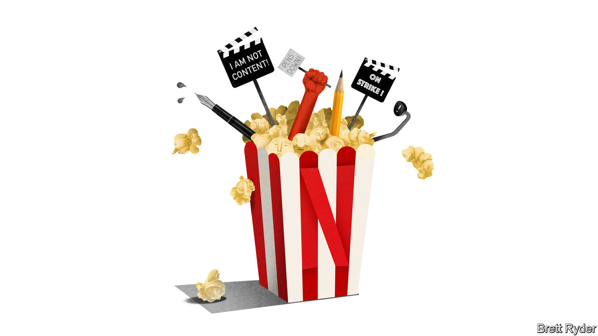

###### Schumpeter

# Writers on strike beware: Hollywood has changed for ever 

##### Blame Netflix if you like, but it is well placed to survive the work stoppage 

 

> May 10th 2023 

You cannot see the Hollywood sign from the picket line outside Netflix’s compound on Sunset Boulevard. It is obscured by an office tower with a busty advertisement for a “Bridgerton” spin-off splashed on the wall. Yet Hollywood, with its arcane paraphernalia, is all around you. The Writers Guild of America (WGA), which called the strike, traces its roots back to cinema’s early days. The language that the strikers use is steeped in history. They talk of “rooms” where writers gather to work on a script and of “notes”, the often brutal feedback they receive from studio executives. In Los Angeles, Hollywood still confers cachet. You can tell from the horns blasting out in support of the strikers from passing cars. 

It is a town, and an industry, in upheaval, though. The strike, the first in 15 years, is the latest manifestation of that. Cinemas are still struggling to lure audiences back after the pandemic. Media companies are drowning in debt. Amid a surfeit of TikTok celebrities and minor Hollywood glitterati, only a few old warhorses like Tom Cruise are guaranteed to bring out the crowds. The main cause of the turmoil is streaming. Its firehose of content keeps people at home, rather than going to the multiplex. Its shows cost the film industry a fortune to make. And they are served up with such blink-and-you-miss-them rapidity that it is harder than ever to create universal cultural icons. Yet as leisure activities go, there are few better ways to get a bang for 15 bucks or less. 

Streaming hasn’t just changed the way people watch TV. It has changed the business model, too. With studios and streamers under the same roof, what used to be a value business driven by hits has turned into a volume business driven by subscriptions. MoffettNathanson, a media-focused consultancy, vividly illustrates this with a quote from a talent agent: “Streaming turned an industry with a profit pool that looked like New York’s skyline into the Los Angeles skyline.” In other words, a few monumental hits, with a sprawl of minor hits and misses in between. Over this landscape, no streamer stands taller than Netflix. Not for nothing is Hollywood calling this “the Netflix strike”.

Netflix may not have single-handedly changed Hollywood; HBO, a maker of edgy TV, deserves a screen credit. But its success shows there is no going back. At the end of March it had 232.5m subscribers worldwide. That gives it a huge base for absorbing the costs of shows. Unlike its rivals, its streaming service is profitable, which allows it to reinvest in better content. Its geographic reach lets it take low-budget series from local markets, as it did in 2021 with “Squid Game”, a dystopian South Korean satire on inequality, and turn them into global hits. Its new cheap ad-supported tier offers huge potential to increase revenue and subscriber growth.

Given its strength, one might think it could afford to splash out on writers. Perish the thought. In a volume business, cost is key. Its ability to control production expenses helped bolster its cashflow in the first quarter. Investors loved it. Writers, once accustomed to more lavish treatment, did not. Their retort, visible on the picket lines outside Netflix offices: “Fists up. Pencils down.”

Talk to the strikers and it is hard not to feel sympathetic. In the pre-streaming era, writing for a moderately successful film or TV series guaranteed a steady income. Writers’ rooms, with at least eight scribes firing off each other, were common when working in pre-production, on set and during editing. Helping write a 26-episode TV show could take up most of the year. Once a film was released, or a TV show broadcast, there was a lucrative aftermarket, including home video and syndicated sales, which brought in residual royalties. It was easy to measure success. Third-party firms reported ratings, box-office numbers and after-sales. 

The early days of streaming were, if anything, even better. Not only did Netflix, and deep-pocketed tech giants such as Apple and Amazon, spray cash on content to attract subscribers. They made payments up front, regardless of success (they kept most of the viewing figures to themselves). They gave writers unusual creative freedom. The streaming wars gave rise to a golden age of TV. 

But since investors have taken fright at the ballooning budgets, the money-spigot has been turned off. Shows are shorter than in the pre-streaming era, and work is intermittent. Writing after pre-production has virtually ground to a halt, says Danielle Sanchez-Witzel, union captain and writer for Netflix, whose comedy show, “Survival of the Thickest”, comes out this summer. She says she was shocked at how intransigent the platform was when she asked for more writers on set. “It’s led to a lot of soul-searching.” 

It isn’t just the WGA. Directors and actors are starting separate contract negotiations with the Association of Motion Picture and Television Producers (AMPTP), which represents the studios, ahead of a June 30th deadline. They, too, have concerns about pay, staffing and residuals. In the background lurks artificial intelligence, and the question of whether it will change the economics of the movie industry as much as—or more than—the internet did. 

Sunset Boulevard, sunset industry 

Given such seismic changes, it would not be surprising if the guilds dig in their heels. They have loud voices on social media. The lavish salaries studio bosses pay themselves, while cutting costs elsewhere, make for easy targets. 

Yet the strikers’ leverage is limited. Netflix’s rivals could have offered more generous terms to win the war for talent. They didn’t, instead joining under the AMPTP umbrella. Netflix may be one of the strike’s biggest targets, but it has a large slate of releases ready to go that may insulate it better than its peers from a lack of new scripts. The global reach of the streamers could undercut American content creators; there are plenty of non-unionised foreigners keen to step into their shoes. This is a world where unscripted fare, including YouTube and TikTok, competes with traditional media for viewers’ attention. The skyline has changed. It is foolish to think Hollywood will not change with it. ■


 


