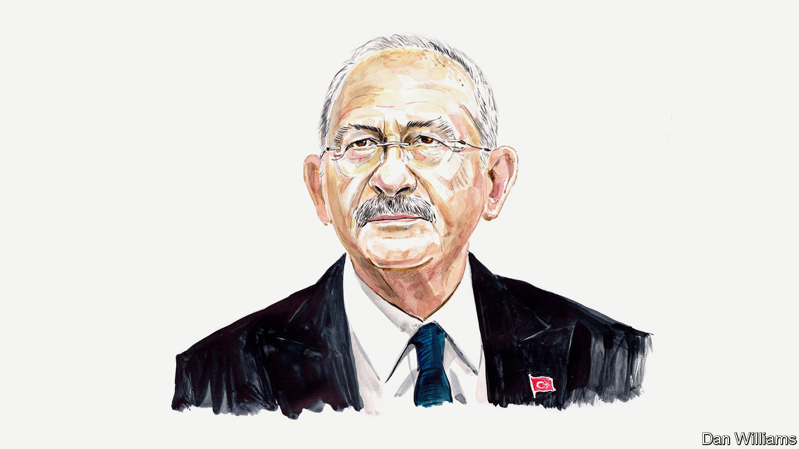

###### Turkey’s election

# A more democratic Turkey is within grasp, says Kemal Kilicdaroglu 

##### Recep Tayyip Erdogan’s challenger for the presidency on the need to end authoritarian rule 

 

> May 5th 2023 

SIX YEARS ago, at a global forum in Strasbourg, I called on the world’s democrats to unite to address regional and global challenges. The same understanding underpins the policies I have pursued at home. I did my best to unite Turkey’s democrats against an anti-democratic and authoritarian government, and we succeeded in forming a large coalition for democracy. The Nation Alliance is composed of six parties, including my Republican People’s Party, or CHP. Each of them represents a different tradition in Turkish political history. As such, the Nation Alliance symbolises our will to co-exist peacefully, despite our differences, by finding common ground on universal principles of liberal democracy. I have no doubt that we will perform strongly in the presidential and parliamentary elections on May 14th, . 

We will demonstrate that, even under —with the ruling party applying constant pressure to silence the opposition—a peaceful change of government is possible through elections. As a result,  for other countries struggling against authoritarian governments, especially in the Middle East. This is a role that we have played before. Recall that the founder of our republic, Mustafa Kemal Ataturk, was an inspiration to reformers and anti-colonialists across the region. The Turkish Republic, founded on the tenets of secularism and the popular will, served as a model for many who have fought for democracy in their own countries. 


A century on, it is our generation’s turn to play its part in re-establishing Turkey as a role model: a republic in which no citizen is discriminated against, and where the protection of fundamental rights, rule of law, secularism, transparency and accountability are the main pillars of the state. In this republic, corruption will be eliminated, income inequality will be minimised, politics will be used to promote social peace rather than to stoke conflict and polarisation. Foreign policy will be guided by rational decision-making that adheres to international law. This achievement will fan the winds of change in the region and beyond.

The vision of Turkey as a democratic role model does not, of course, solely extend eastwards. Consider the challenges posed in Europe by anti-democratic regimes, xenophobia and the Russo-Ukrainian war, and it becomes clear that our elections may be a reference point for our neighbours in the West, too. A victory in Turkey for our democratic alliance could herald a new beginning for Europe. I hope it will show the importance of European democrats banding together to confront their opponents. 

It is imperative that all European political parties that believe in human rights, lower inequality and respect for international law form a united front in the face of global challenges. High on the list of challenges are climate change, which has a severe impact on the Mediterranean basin, uncontrolled migration caused by the failures of the international security system, and global wealth inequalities. These can only be resolved by an international coalition that spans the political spectrum. 

Our victory on May 14th will also restore Turkey’s Western orientation. That orientation is the reflection of an ideal. For Turkey, the West means democracy, rule of law, human rights (not least women’s rights) and equality. Under our leadership there will be no “other” in our society. No one will be discriminated against because of their political, personal, religious or regional identities and choices. For Turkey, the main promise of the Nation Alliance is freedom, and we are willing to be held accountable for fulfilling it.

Turkey’s Western orientation is not aimed against any of its neighbours; rather it reflects the country’s desire to co-exist peacefully with all of them. When defined based on these shared values, Turkey will always be a proud member of the West. In all international institutions Turkey belongs in the Western grouping, and will continue to act as such.

The government that we will form will bring us closer to our Western allies politically, economically, socially and culturally. This need not undermine relations with our other neighbours. We are fully aware that there are issues that need to be resolved between Turkey and the West, particularly the European Union. We know that no solution can be found to these problems through public showdowns, mutual threats, blackmail or endless, meaningless negotiations. For us, it is crucial that international relations be conducted rationally, with dignified diplomacy. In government we will work constructively to restart the EU accession process and commit Turkey to complying with the decisions of the European Court of Human Rights.

We have come together not only to win the elections but also to address Turkey’s fundamental problems. The Nation Alliance will mend the fault lines in Turkish politics and will heal our wounds peacefully. The winners will not only be those who vote for us but all Turkish citizens. 

The motto of the Nation Alliance’s election campaign is “I promise, spring will come again”, a line from a well-known Turkish pop song. Our union of parties will deliver on that pledge. And the resulting benefits will not be confined to our borders, but will also extend to Turkey’s relations with Europe, the United States, the Middle East, Russia, China and beyond.

We are almost there. Spring is coming. ■


