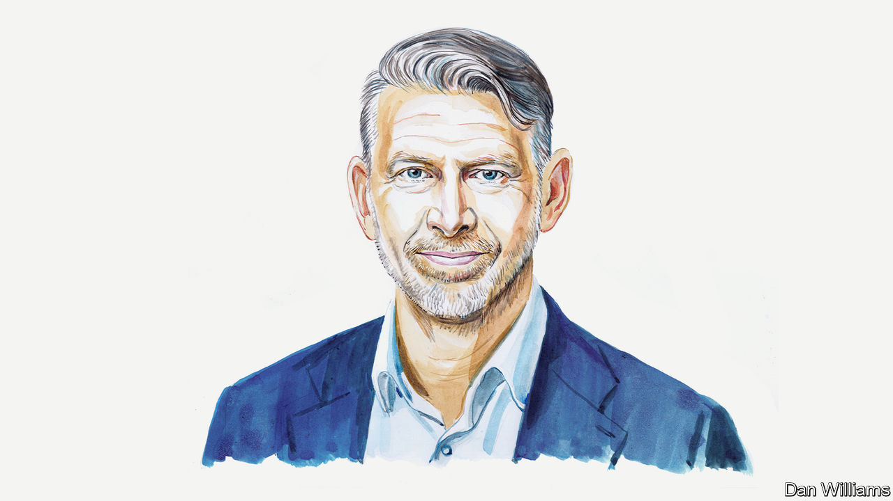

###### The battery economy

# Peter Carlsson on how the global battery race should be run 

##### China’s headstart complicates the journey to sustainability, says the boss of Northvolt 

 

> May 9th 2023 

ONE OF MY most harrowing, and motivating, meetings of the past few months was with Johan Rockström, a fellow Swede and globally leading researcher of climate impact at the Potsdam Institute. He told me that although we are trying to limit global warming to 1.5°C above pre-industrial levels, today’s projections show a trend towards a 2.8-2.9°C increase. That would mean a very different world from the one we currently live in.

We now have 10-15 years to halve our carbon footprint, and batteries are a key technology to replace the use of coal, oil and natural gas before it’s too late. But it will only work if we expand the industry in a sustainable way—and that’s not happening today.

China is in the lead. Companies like CATL, BYD and Eve have developed great products and managed to scale production faster than anyone else. Is that a problem? Yes and no. No, because the world needs a lot of batteries and these companies have been scaling faster and more cost-competitively than anybody else. Yes, because of the way it’s being done.

To take an example, Chinese firms are currently making big investments in Indonesia, creating the world’s fastest-growing nickel supply chain. Rainforest has been cut to build huge open-pit mines, using diesel generators as the source of energy, and disposing of waste products, such as acids and highly polluted water, in rivers and oceans. Of course, it provides low-cost nickel and cheap batteries, but at what overall cost?

The carbon footprint of Chinese batteries is disturbingly large: somewhere between 100 and 130 kilograms of carbon dioxide per kilowatt hour. This means that the global battery industry is on a path to creating an annual carbon footprint that is roughly half the size of Germany’s. If we continue along it, batteries will just be a new, innovative way to create the same old emissions.

The good news is that there is another way. Half of the overall carbon footprint associated with batteries comes from the energy intensity of manufacturing battery cells and cathode material. The other half comes from the supply chain, where processing graphite, lithium and nickel is creating huge pollution. We can combat this by doing three things. 

First, battery factories should be built in areas where renewable energy is already available or can be quickly expanded. We need to rebuild critical supply chains with a low carbon footprint, for example by establishing graphite-manufacturing plants that use fully hydro-powered electricity to produce anode material. 

Second, the industry needs to start building fully circular flows, by creating closed-loop systems in which all damaged and defunct batteries can be recycled into material for new batteries. New technologies are being developed to raise recycling levels for nickel, cobalt and lithium to above 90%. Meanwhile, policymakers need to drive both investments and recycling requirements, and the battery industry and carmakers need to collaborate closely to monitor the batteries in the field, while also determining the right moment to bring them back into a recycling flow.

Third, more work is needed on battery technology. Higher energy densities and faster charging are high on carmakers’ wish lists. These goals are being achieved with higher nickel content in the cathode and more silicon or lithium in the anode. The promise of electric-powered aviation is the strongest driver for these super-performance cells—but they are pushing demand for nickel and lithium ever higher.

To increase sustainability, we need to challenge the fundamentals of battery production. I’m very positive about the latest developments in lithium metal, sodium-ion and large cylindrical form factors. As the electrification of industries progresses, these new technologies are critical to increasing energy density, bringing down costs and making value chains—the lifecycles of products and processes—more local and sustainable. I believe these new technologies, paired with AI and machine learning to enable research on virtual cells, virtual battery systems and virtual gigafactories, will become mainstream for electromobility and energy storage.

The next 10-15 years are likely to see the biggest industrial transition of our lifetime. Most of the key investment decisions will happen in the next five years—with huge benefits for regional economies. The booming battery industry will drive research and development, facilitate university research, foster local machine and equipment builders, and build new supply chains. This will enrich the lives of millions of industrial workers, and us all.

America’s Inflation Reduction Act and the European Union’s Temporary Crisis and Transition Framework, both designed to combine public and private investment in green technologies, will ensure a more level playing-field for the battery race with China. But it would be dangerous to lose track of that race is run. Because how we run it will have a big impact on our chances of reaching 1.5°C instead of 2.9°C, which, as my fellow Swede made painfully clear, is a choice between a world like our own and a world we never want to witness. ■


