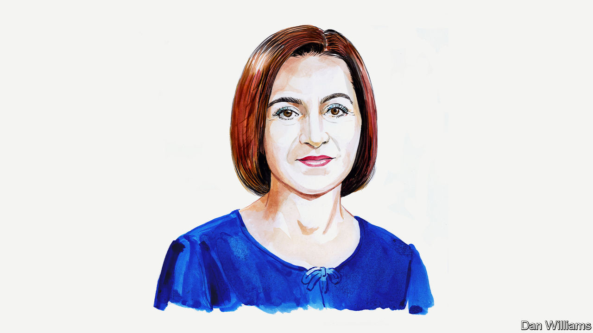

###### Moldova

# Russia’s efforts to destabilise Moldova will fail, says its president 

##### Maia Sandu sees her country as destined to join the EU 

 

> May 10th 2023 

CRISES CAN make or break countries. Crises can make or break leaders.

The Republic of Moldova, like much of the rest of Europe, is facing multiple challenges the likes of which haven’t been seen since our country, bordered by Ukraine and Romania, declared independence in 1991. Russia’s ruthless and senseless war against Ukraine is supposed to make us, and other countries, crack under the pressure. We won’t.

As president, I am heartened to see the resilience and perseverance of our people in the face of the intertwined crises: the war on our doorstep, Russia’s energy blackmail and resulting soaring inflation, economic downturn and staged protests. Our citizens have stood firm, and our partnerships with friends and allies have helped us weather the storm.

Moldova is emerging stronger. This is a crisis that I believe will make, not break, our country and set the direction of our travel for decades to come.

We watch the suffering in our neighbour, Ukraine, with horror. I am proud of the way our people have opened hearts and homes to hundreds of thousands of refugees fleeing brutal attacks there. While nothing can compare to the devastation in Ukraine, the war just across our border is sending out shockwaves which affect us, too.

Russia’s aggression against Ukraine is a military invasion. Its assault on Moldova is hybrid and designed to destabilise us and force us, like Ukraine, back into Moscow’s orbit. The strategy hasn’t succeeded in Ukraine, and it will not succeed in Moldova. We have held the line for well over a year and will continue to do so.

We are fighting back against this hybrid offensive by strengthening our resilience, reforming our institutions and moving closer to the EU. Energy interconnections with Romania and other European countries have helped us withstand gas blackmail, access new energy sources and keep the lights on and homes heated through a difficult winter. We have reoriented our exports to new markets and kept the economy functioning. Two-thirds of our trade is with the EU.

We have also stepped up measures to counter disinformation. Law enforcement has uncovered the schemes behind paid protests orchestrated by proxies of Russia, which is seeking to interfere from abroad and incite violence on our streets.

Those who have gambled that they can change our outlook have made the wrong bet. We set our course a long time ago, and we will not be shaken from the journey that we are on—a journey towards EU membership, a journey towards peace, democracy and prosperity.

Our move towards EU accession is irreversible. For decades the EU has worked to build peace in most of Europe, bringing greater social cohesion, democracy and respect for human rights. I see too what the EU has brought us, in Moldova, even without being a member. For the past 20 years the EU has anchored the peaceful, prosperous and democratic development of our country.

The decision to formally apply to join the EU in March 2022 was a clear choice for us: the appeal of democracy would triumph over the oppression of authoritarianism. We are now looking for EU member states to open accession talks. We have lots to do before we can join the bloc, but we are determined.

We are comprehensively reforming the justice system, redoubling our efforts to stamp out corruption and organised crime, and working to counter the sway of the oligarchs who at one point had captured our state; the influence of two fugitive criminals has been reduced after they were hit with sanctions by America and Britain. We are also boosting our administrative capacity so that we can deliver even deeper reform in future.

Moldova’s accession to the EU is a crucial investment in the shared stability and security of Europe. We believe that it is vital to enhance our relationship, and I urge the EU to make a decision this year to launch accession talks in early 2024. The step will give us the momentum we need to sustain reforms and cement Moldova’s position as a future member.

We also need to strengthen security and defence co-operation, enhance energy interconnections and accelerate pre-accession support for our infrastructure development. Ukrainian ports, which served as the gateway for Moldovan trade, remain under the Russian blockade, making it imperative to prioritise infrastructure development to safeguard our shared socio-economic stability. 

Our domestic reform efforts are paying off already. Since 2021 Moldova has climbed from 89th to 28th out of 180 countries in the Press Freedom Index published by Reporters Without Borders. Last year we were named as a democratic bright spot by the Global State of Democracy report, which is published by the International Institute for Democracy and Electoral Assistance. In addition, we have also increased efforts to modernise our economy, reducing red tape for local and foreign investors.

We are proving ourselves a reliable partner to the EU and many other countries. We are contributing to the security of our common European home, by being a strong neighbour to Ukraine, by maintaining calm in the breakaway Transnistrian region and by joining forces with the EU in countering security challenges thrown up by the war on our doorstep.

This commitment to Europe will be on display in Moldova when we host the next European Political Community summit in June. Peace, security, energy resilience and connectivity will be on the agenda when I meet Europe’s heads of state and government and leaders of the EU. It will be an opportunity to have an open discussion about shared challenges.

The world has changed dramatically since February last year, but not in the way that those who ordered war might have expected. They hoped to force us, along with Ukraine, to look back, but they have only succeeded in reinforcing our resolve to stay part of the free world. They hoped to weaken Europe’s collective security, but instead we have strengthened it. They wanted fragility to replace agility, but it was yet another miscalculation. We are only becoming even more nimble as we pursue our European trajectory. Moldova, a future EU member, is standing firm, strong and confident. ■


