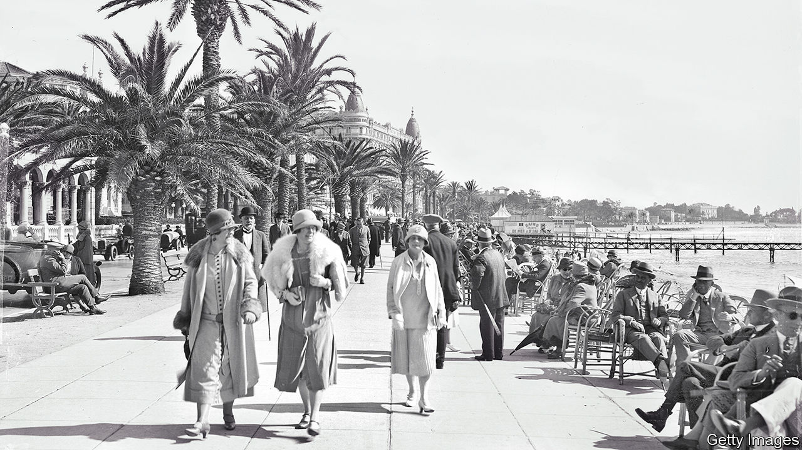

###### A chronicle of the Côte d’Azur

# Famous names and historical forces collide on the Riviera 

##### “The Once Upon a Time World” charts the development of a fabled French idyll 

 

> May 11th 2023 

 By Jonathan Miles. 

In the summer of 1922 Gerald Murphy, an American artist and collaborator with Sergei Diaghilev on the Ballet Russes, was invited to visit Cole Porter, an old friend from Yale, in the south of France. The following year, having enjoyed the deserted beaches,  and their three children booked into a hotel which had, unusually, stayed open for the summer season. Only two other families were there, one of which was . Sara and Picasso probably had an affair; soon afterwards another friend, F. Scott Fitzgerald, used the Murphys as the model for the fraught marriage of Dick and Nicole Diver in his novel “Tender is the Night”.

This myth of origin for the glitz and glamour of the French Riviera is almost perfect in its mix of rich, name-droppingly famous and talented people having fun in the sun. Murphy, “whose great gift was to embellish the tiniest gesture with panache”, in effect invented this slice of Provençal coast as the supreme summer destination for the smart set, and in due course for a wider demographic. But as Jonathan Miles explains in his entertaining and comprehensive history, the Riviera had been a fashionable haunt long before then, albeit in a different season and for a different crowd.

As far back as the 1830s the seashore was being tamed in anticipation of promenades and  and the hills behind it were filling up with grand villas, hotels and tennis courts. Then the new owners were mostly British aristocrats seeking restorative exposure to the winter sun. As one French observer noted a few decades later, Cannes had become a place to “build a reproduction of Windsor and live for ever”. When Queen Victoria visited Menton in 1882, the British influence was still strong enough for the town’s signage to be predominantly in English. The local pastor was none other than the inventor of rugby football, William Webb Ellis.

The Riviera’s evolution from a winter to a summer venue saw a new aristocracy taking over from the old. Writers, artists and film stars (Brigitte Bardot in St Tropez, Princess Grace in Monaco) were followed by rock stars (the Rolling Stones in the early 1970s and, 40 years later, Bono of U2 thanking the mayor of Nice for trying to make it “a green city under blue skies”). The celebrities paved the way for post-Soviet oligarchs, tech bros and other fixtures of the 21st-century plutocracy.

Yet there have been many less predictable visitors and encounters.  came to Monte Carlo to see a doctor (he found the hotel workers there “devoid of class consciousness”). Harpo Marx, meanwhile, struck up an unlikely holiday friendship with George Bernard Shaw in Cap d’Antibes.  inspected 40 boarding houses before finding one that was satisfactory; Vladimir Lenin stayed at the same  as Anton Chekhov had before him.

If world history largely took place elsewhere—with the harrowing exception of the second world war—seemingly all the people who made that history passed through at some stage. Distant conflicts, revolutions and financial crises, as much as the oscillations of Paris fashion, all echoed on the Côte d’Azur. The author chronicles all this with a keen eye for piquant details: from the procedure for removing those who couldn’t pay their debts from the casino at Monte Carlo (they were photographed for posterity and dispatched on a train in second class), to the annual gift of decorated cushions from King Gustav of Sweden, “an enthusiastic embroiderer”, to the mayor of Cannes.

In a study that focuses on the great, the good and the not-so-good, the experiences of ordinary tourists and residents are, unsurprisingly, less well documented. Still, at the elegiac close of his book, the author describes depredations wrought on the coast that affect everyone: not just the rampant building, but the accompanying organised crime, corruption and social tensions. These are among the by-products of a remarkable experiment in the generation of human pleasure.

The Murphys left France in 1929 when one of their children became ill. Two would die prematurely. When Gerald wrote to Fitzgerald he reflected on their shared seasons in the sun, concluding that “only the invented part of our life—the unreal part—has had any scheme, any beauty.” ■


