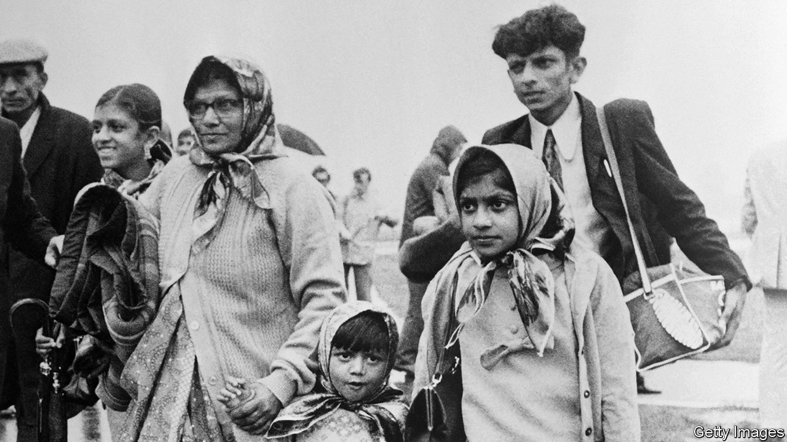

###### Debut fiction

# Janika Oza’s debut novel charts the Indian diaspora’s struggles 

##### “A History of Burning” stretches across continents and a century 

 

> May 11th 2023 

 By Janika Oza. 

The title of Janika Oza’s highly accomplished debut novel suggests a detailed chronicle of destruction and suffering. This impression is only partly accurate. “A History of Burning” is a multi-stranded, intergenerational, polyvocal epic that charts the struggles of an Indian family over the course of almost a century. Its members endure discrimination and displacement, but refuse to be broken. This is less a tale of woe than of endurance against the odds.

The ambitious story opens in 1898, on 13-year-old Pirbhai’s final day in India. While out looking for work, he is tricked and taken by dhow to Kenya. There he is forced into servitude, helping build the railway to Lake Victoria. One morning he is tasked with burning down the huts of a village and thereby removing some “obstructions”—an act that will haunt him throughout his life.

Years later, after the railway is complete, Pirbhai marries Sonal, another Indian in Kenya, and the pair move to Uganda to help run a pharmacy and make a new life. They start a family and their fortunes change when their son Vinod proves successful in a company trading  and . Vinod and his wife Rajni produce three daughters. The eldest, Latika, falls for her parents’ paying guest, Arun, who introduces her to the student-protest movement. 

They, too, marry, this time against both sets of parents’ wishes. Latika finds her voice and speaks her mind as a journalist, reporting on the feverish state of the nation. The family’s luck runs out when  seizes power and declares that “Asians have milked the cow but did not feed it.” Driven out of the country, many of the characters flee to Canada. But after her husband is arrested, Latika opts to stay behind, learning the hard way that “every choice has a shadow.”

Ms Oza’s novel captivates from the outset. Her depiction of Pirbhai’s plight is moving; she generates tension by embroiling her characters in real historical dramas—as in Rajni’s escape from ethnic clashes in Karachi in 1947 to a seemingly safer existence in Kampala,  capital. When the family faces persecution in its adopted African homeland, the momentum of the narrative gathers propulsively.

The author lives in Toronto; her own family was expelled by Amin. She dramatises this moment of history in a series of well-drawn scenes that convey terror, injustice and brutality. Vinod pithily sums up his clan’s predicament: “Too Indian for Africa, too African for India.”

For a while it seems that the stakes are lower in the story’s final section in Canada. But when a long-lost daughter resurfaces, and racism flares up, the novel blazes fiercely once again. ■


