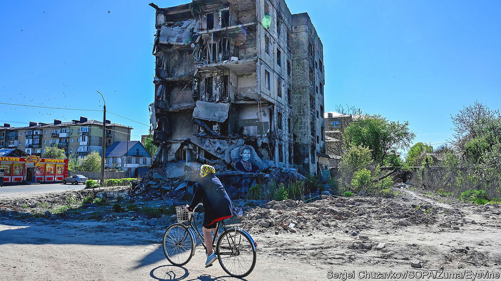

###### Russia’s invasion of Ukraine

# Serhii Plokhy’s new book traces Vladimir Putin’s road to war 

##### The Ukrainian historian shows how the Kremlin’s bloody campaign has backfired 

 

> May 11th 2023 

By Serhii Plokhy.

As the reader picks up this useful account of the origins and early progress of , the conflict hangs in the balance. Ukraine’s commanders are about to launch their long-prepared  against the invaders who have occupied around a sixth of their country. No one can know whether the Russians will break and flee, as they have done before when faced with determined Ukrainian attacks, or dig in and hold on to their gains. The ink will hardly be dry on the first edition before a second will be needed.

But this book is still very much worth reading now. Those who are familiar with , Serhii Plokhy’s history of Ukraine, might be inclined to skip the first six chapters; but those who aren’t will find laid out an excellent survey of unresolved regional tensions, going all the way back to the Kyivan Rus of the late ninth century, but focusing on the 20th. These issues, and Vladimir Putin’s inability to deal with them peacefully, drove the first phase of the current conflict: the seizure of Crimea and the eastern Donbas in 2014. The same unresolved questions in the minds of Russian nationalists produced the invasion on February 24th 2022.

“Where Russia begins and ends, and what territories the historical ‘gathering of the Russian lands’ should encompass, are old questions that have preoccupied Russian thinkers and statesmen for generations,” Mr Plokhy, a Ukrainian historian at Harvard, writes. For all its benefits to mankind, the dissolution of the Soviet Union renewed that debate; and it left some 30m Russian-speakers outside the new Russia’s borders, a large proportion of them in now-independent Ukraine.

For Mr Putin, these questions became all-consuming, perhaps because they are a distraction from his failure to develop Russia as anything other than a hydrocarbon reservoir—just as the age of hydrocarbons is coming to an end. Mr Plokhy describes the models for the restoration of some version of the Russian empire that have tempted Russia’s president: the “Eurasia” model, which involved reconstituting almost the entire Soviet Union in the guise of a trading union (minus the Baltic states, which revanchists are less likely to see as part of Moscow’s patrimony); “big Russia”, a tighter union of Russia, Belarus and Ukraine; and “Greater Russia”, a version of Russia only, but with the addition of swathes of eastern and southern Ukraine. 

The first of these ideas fizzled out long ago. The second is undoubtedly what Mr Putin was after when he decided to invade last year. The third, more or less, is what he has ended up with for now. 

 “The Russo-Ukrainian War” is stronger at explaining the war’s antecedents than it is as a history of the conflict itself. One problem with a book written this quickly is that it has not given Mr Plokhy much time to engage in original research. Especially as the events become more recent, too much of it becomes just a competent assemblage of press cuttings.

But he rounds the book off with some thoughtful observations about geopolitics. Russia went into this war, indeed into the whole period since the first flush of post-cold-war enthusiasm for the West began to fade, with the hope of creating a multipolar world. Instead, the author writes, “the conflict presaged a return to the bipolar world of the cold war, now centred not on Washington and Moscow, but on Washington and Beijing.” A well-done chapter sketches (but only sketches) what looks like the terrible failure of , and the transition from a friendship “without limits”, as he and Xi Jinping once put it, to something that places Russia firmly in a submissive posture.

And as for Ukraine, the book notes, Mr Putin has achieved something remarkable. When he was first elected president in 2000, Ukraine was deeply divided between its Russia-facing and Europe-oriented elements. He has united it in loathing for him and Russia itself. Mr Putin’s real legacy will be to have destroyed for ever the dream of an imperial restoration. ■


