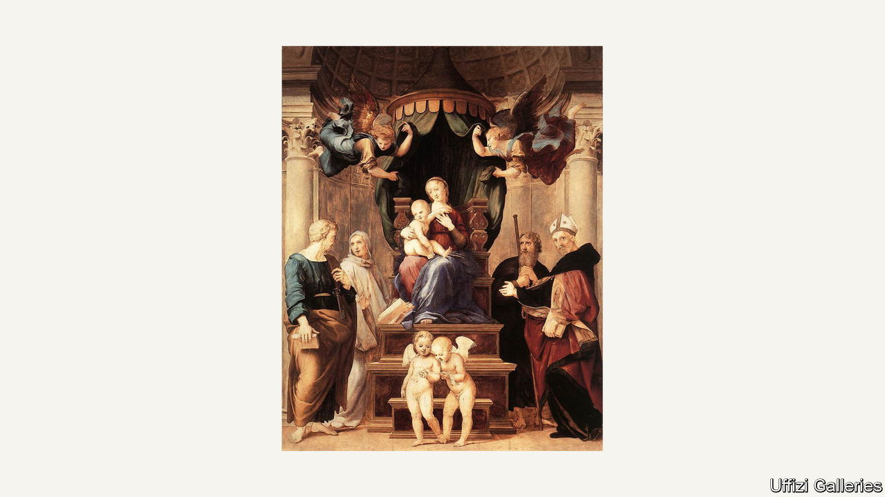

###### Museums on the move

# The Uffizi is taking its art to the people 

##### Its innovation may prove a model for other museums and galleries 

 

> May 9th 2023 

Painted by  in the early 16th century, the “Madonna of the Baldacchino” has had an adventurous life. An altarpiece originally intended for the basilica of Santo Spirito in Florence, it subsequently travelled west in Tuscany to the cathedral of Pescia. Later it went back to Florence and from there to Paris, before returning again to Florence—where it has hung in Palazzo Pitti since 1813.

Now Raphael’s early masterpiece is on the move once more. It will be on display in Pescia’s cathedral (again) from May 11th to July 30th, alongside a copy by Pier Dandini that was commissioned to replace it in the 1690s. This time its voyage is part of an innovative experiment in curation. 

The show is the latest to be staged by the Uffizi galleries, which include Palazzo Pitti, in a project that their director, Eike Schmidt, has dubbed the “Uffizi diffusi” (the “extended” or “scattered” Uffizi). The aim is to give the public a chance to see paintings and sculptures in places where they have a special relevance. Often the art on display would otherwise be hidden away in the Uffizi’s storerooms (though that is not the case with the “Madonna of the Baldacchino”).

In the first such exhibition, in 2021, artworks associated with Napoleon Bonaparte were shown at Portoferraio on the island of Elba, to which the French emperor was exiled in 1814 (he escaped the following year). Another was held in the village where Andrea del Castagno was born and featured his portrait of . The Tuscan hill town of Anghiari, site of a battle between Florence and Milan in the 15th century, was chosen for a show on the links between culture and warfare. “Some places just want to have an exhibition,” comments Mr Schmidt. “In other cases, the authorities want us to leave the works behind indefinitely.”


Now, after more than 30 such shows, the project is entering a new phase: the creation of a network of permanent satellite museums in various parts of Tuscany. To an extent, the Uffizi is following the examples of the Louvre, which has opened a branch at Lens, and the Victoria and Albert Museum in London, which now has an outpost in Dundee. But Mr Schmidt’s scheme is both more local and more ambitious. Within a few years, he plans to inaugurate satellite Uffizis in up to four locations in Tuscany, each with a particular speciality and together displaying hundreds of works.

The first in line to open is the Villa Ambrogiana at Montelupo Fiorentino, which overlooks the River Arno west of Florence. As Mr Schmidt explains, this was one of the biggest of the villas owned by the , the dynasty that ruled Florence for three centuries, “yet the only one not on UNESCO’s World Heritage List, because it was not accessible to the public”. Until 2017 the huge villa, which has a tower at each of its four corners, served as a psychiatric prison. It is currently undergoing a €24m ($26m) restoration. After that, the plan is to bring back several hundred paintings and sculptures that were taken to the Uffizi in the 18th century.

Another Medici villa, in the Florentine suburb of Careggi, is also being restored with a view to becoming a part of the Uffizi network. And Mr Schmidt has set his sights on a couple of former health spas: the Terme Excelsior at Montecatini Terme, which might house some of the Uffizi’s works from the late 19th and early 20th centuries, and the Terme del Corallo in Livorno, on the Tuscan coast, which has been earmarked for an “Uffizi of the Sea”.

The project has already been the subject of a scholarly study, published in the . “It could provide a model for regional museums in other parts of Italy and indeed the world,” says the study’s author, Serena Giusti of the Scuola Superiore Sant’Anna in Pisa. But much remains to be done. The Livorno scheme requires what Mr Schmidt blithely terms “a reconfiguration of the centre of the city”. And the site is in a deplorable state. “When we first went there, it was full of mud,” says Mr Schmidt, turning to German Romantic painting for a worthy simile: “Like…well…a landscape with ruins by Caspar Friedrich.” ■


