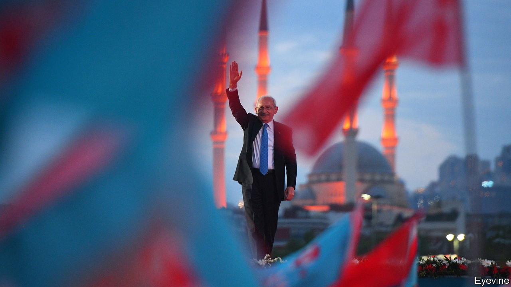
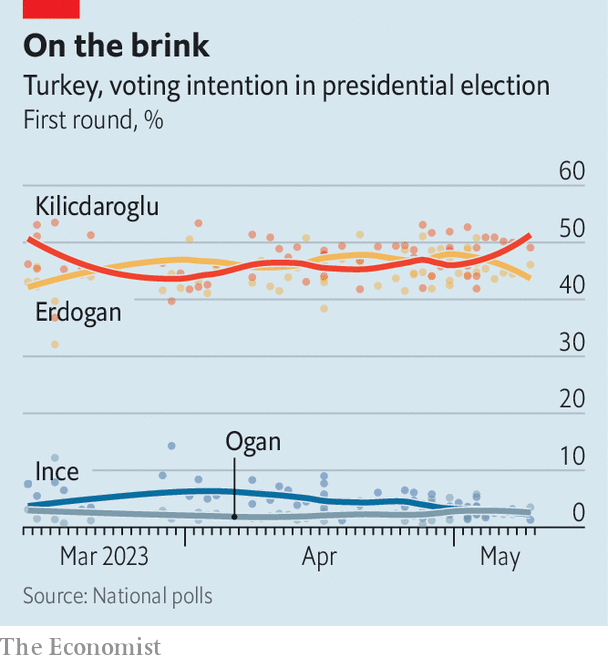

###### The man who can

# A former bureaucrat is giving Erdogan a run for his money 

##### Kemal Kilicdaroglu is in a race against Turkey’s strongman, and against time 

 

> May 10th 2023 

KEMAL Kilicdaroglu rarely talks about his personal life, and even less about his religion. But last month the man hoping to replace  as Turkey’s president recorded a video in which he acknowledged he belonged to the Alevi sect, a minority that continues to face prejudice. The move was widely perceived as an attempt to pre-empt attacks by Mr Erdogan against his opponent’s faith. “We have to respect different beliefs, identities and lifestyles,”  tells  at his office in Ankara, when asked why he decided to make the video. “My main task is to unite.”

The 74-year-old opposition leader has his work cut out for him. Mr Erdogan has been fanning the flames of Turkey’s culture wars for more than a decade. Now that the prospect of losing power is looming for the first time in his long career, he has doubled down. In the final stretch of the campaign for presidential and parliamentary elections on May 14th, Mr Erdogan has accused Mr Kilicdaroglu and the rest of the opposition of “taking orders from terrorists” and courting “deviant organisations like the LGBT” community. The president’s main coalition partner, Devlet Bahceli, recently went one better. “Every vote for the CHP”, he said on May 4th, referring to Mr Kilicdaroglu’s Republican People’s Party, “is a bullet for our soldiers.”

Such inflammatory talk has not fallen on deaf ears. On May 7th stones lobbed by pro-government protesters smashed the windows of a campaign bus carrying the CHP mayor of Istanbul, Ekrem Imamoglu, injuring a dozen people. The opposition called the attack, which took place in Erzurum, a city in eastern Turkey, a government provocation. Mr Erdogan said Mr Imamoglu incited the violence.

 


Mr Kilicdaroglu, looking slightly frazzled, possibly by the pace of the campaign, says he will heal the divisions Turkey’s strongman has sown. But he has an election to win first. Most polls give the CHP leader a narrow edge over Mr Erdogan. But unless either man receives an absolute majority on May 14th a run-off will take place two weeks later. That seems the more likely scenario, because two other first-round candidates are expected to receive a combined 5% or so of the vote.

Yet Mr Kilicdaroglu hopes to win in round one. “Turkey cannot afford to lose any more time,” he says, referring to the need to tame inflation and corruption, breathe life into the Turkish lira and attract foreign investment. “We need to restore confidence, abroad and at home.” 

Opposition supporters fear a run-off could give Mr Erdogan time to make up ground by stoking more division, promising more handouts and using his control over state institutions. He has already commandeered public resources for his campaign, offered millions of households free natural gas and launched one megaproject after another. The country’s captive media have risen to the occasion. The state news channel gave Turkey’s leader over 32 hours of live coverage last month. Mr Kilicdaroglu got 32 minutes.

Mr Kilicdaroglu has already done a fair deal of uniting. Over the past few years he has brought together the CHP, which he has headed since 2010, the nationalist Good Party and four smaller parties to form the Nation Alliance. He has also transformed his own party. In the 2000s, the staunchly secular CHP refused to have anything to do with the elected president because his wife wore an Islamic headscarf, and refused to discuss new rights for the Kurds, Turkey’s biggest ethnic minority. Mr Kilicdaroglu has dumped some of the ideological baggage, and it has paid dividends. Turkey’s main Kurdish party, the Peoples’ Democratic Party (HDP), formally endorsed him last month.

His priorities, says Mr Kilicdaroglu, would be the economy and rule of law. Both are in bad shape. Mr Erdogan’s conviction that bringing down interest rates stabilises prices, a misguided theory reborn as government policy, has unleashed annualised inflation that topped 85% last year, before easing to 44% last month. Mr Kilicdaroglu and company say they would allow the central bank to raise rates, slow or stop the sale of dollar reserves, and lure back foreign investors.

Mr Kilicdaroglu says Turkey needs to be pulled back from the brink of dictatorship. “The legislature and the courts are in the hands of one man,” he says. “We need to restore the separation of powers.” He pledges to scrap a law that foresees prison terms for “insulting” the president, to end Mr Erdogan’s policy of sacking elected HDP mayors and to implement decisions of the European Court of Human Rights. This would mean freedom for Osman Kavala, a philanthropist sentenced to life in prison on farcical coup charges; Selahattin Demirtas, a former leader of the HDP; and perhaps other political prisoners.

But Mr Kilicdaroglu may struggle to deliver on his promise to dismantle Mr Erdogan’s executive presidency and hand power back from his 1,150-room palace to the country’s 600-seat parliament. Polls suggest the Nation Alliance and the HDP might scrape together a narrow majority in the assembly, but will not come close to the 360 votes needed to put an amended constitution to a referendum. Cohabitation would not look pretty, either. If Mr Kilicdaroglu wins the country’s top office but Mr Erdogan’s coalition retains control of parliament, the new president would have little choice but to govern by decree.

Even so, Mr Kilicdaroglu says he will take key decisions together with the five other leaders of his alliance and give ministers considerable leeway. Rule by consensus instead of charisma would come naturally to Mr Kilicdaroglu, a former finance-ministry and social-security official. “He’s a bureaucrat, and his whole personality is shaped by bureaucracy,” says Riza Turmen, a former CHP parliamentarian. “He’s not a man of radical changes.”

But he may be the change Turkey needs. “Alevi”, the video he posted to social media in April, has been viewed 115m times. “It shows people are tired of these divisions,” Mr Kilicdaroglu says, “and that they want them to end.” ■

