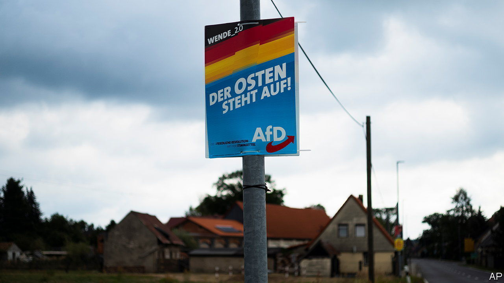
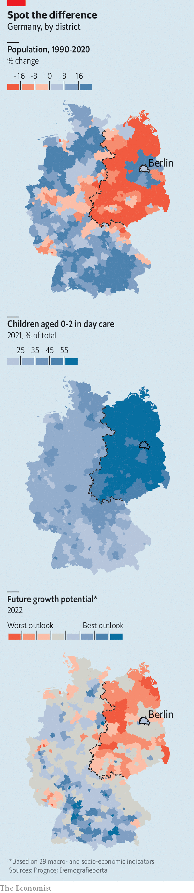

###### Ost is Ost

# A generation after Germany reunited, deep divisions remain 

##### Extremists are now polling well in the former East Germany 

 

> May 11th 2023 

The man in a lilac jumper is blunt. Why, he asks, is Germany a vassal of the USA? In reply Olaf Scholz, Germany’s chancellor, sketches a history of the Federal Republic, patiently adding that the danger it faces right now is not America, but Russia’s war on Ukraine. His conclusion, “We do not take orders,” wins polite applause.

It may seem odd that 33 years after the cold war ended Germany’s leader should need to persuade a fellow citizen that their country, Europe’s weightiest by population and GDP, is independent. A clue lies in where this exchange happened: Cottbus, a small city at the heart of the once-vital coal industry of the once-proud country of East Germany. Across the five eastern “new states” that joined the 11 western ones of the Federal Republic in 1990, all too many people still share the dark scepticism of the man in the lilac jumper. Despite decades of massive public investment, wrenching demographic change and growing prosperity, the 20% of Germans who live in the east still tend to think differently, act differently and vote differently. 

 


These differences matter. The east German electorate includes a big proportion of free-floaters, attached to no party. This encourages traditional parties, such as Mr Scholz’s Social Democrats, to try extra-hard to woo them. Politicians may also hesitate to act—the chancellor was accused last year of being slow to release German-made Leopard tanks for Ukraine—for fear of alienating the lilac jumpers. 

The worries are not misplaced. Polling by INSA, a research group, shows that in early May, for the first time, the far-right Alternative für Deutschland (AfD) overtook both of Germany’s traditional centrist rivals to become the most popular party in the east (excluding Berlin). Aside from the 26% of  who would vote for the AfD in a national election, another 9% intend to support the far-left Die Linke party. Those tallies are respectively double and triple what either party scores in the west. 

On the subject of Russia and Ukraine, it is not just with other Germans that tend to differ, but with almost everyone else from the former Soviet Bloc. Around half of west Germans agree that America is a “dependable partner”, and that Germany should boost military aid to Ukraine. But nearly three-quarters of east Germans reject both suggestions. A survey of attitudes to Russia in 2020 showed a similar gap. Easterners were far more likely to agree that Vladimir Putin was “an effective president”, and far less likely to describe him as “a threat to Europe”. Several explained in focus groups that experience made them “understand propaganda better” so as to “see through” the Western version. Meanwhile disgruntled elements in the east, such as Soviet-trained former army and intelligence officers whose prestige crumbled after unification, help sustain a constant anti-American hum: NATO “provoked” Russia, American oil companies profit from the war at German expense, etc.

Not exactly ostalgia

Few ordinary want to go back in time, insists Dirk Oschmann, the author of a recent bestseller sympathetic to their grievances. Unification is overwhelmingly a success, and the moaning partly just reflects a national penchant for gloom. Yet the gaps remain striking, starting with demography. The east is markedly older, more thinly populated and less diverse. East Germans remain underrepresented in elite professions. There are no generals in the German army. They account for well below 5% of federal judges or CEOs of Germany’s top 100 companies. A 2022 study suggests they hold a minority of leading positions even in the east. 

This lingering lag is partly a result of obvious handicaps. Unification barely touched most , but it tipped the east upside down, notes Katja Hoyer, an East German-born academic, in a new history of the communist state, “Beyond the Wall”. It felt less like a merger than an abrupt takeover, into which the “new states” fell with zero capital of their own, few marketable assets and the wrong skills. 

Not surprisingly a quarter of between the ages of 18 and 30, often the most qualified or ambitious, moved west. Some 3m moved the other way, but largely into bigger towns, leaving rural areas desolate. The newcomers grabbed choice property, pushing natives to cheaper urban fringes. In March, a local plebiscite about stronger environmental measures in Berlin, Germany’s once-divided capital, revealed a stark new divide: gentrified central districts voted hugely in favour, whereas among the bleak suburban housing estates of Marzahn-Hellersdorf, an AfD stronghold, three-quarters voted against.

Yet what bothers easterners, says Mr Oschmann, is less economics than attitudes. To the extent that they care at all, west Germans see the east as “a place of sickness, of imbalance, of noisy whining”, he says. The old East Germany may in fact have enjoyed better day care for children, less class friction and greater equality for women, but to say so invites charges of ignoring the brutish side of communist rule. Popular culture tends to portray eastern Germany as either a chamber of horrors or a theme park of ghastly fashion. 

Germany’s two parts are in fact slowly converging. The income gap, in particular, is shrinking, helped by big investments from firms such as Infineon, Intel and Tesla. But as jolts such as the war in Ukraine expose, the underlying fissures in German society may take yet another generation to close. ■

