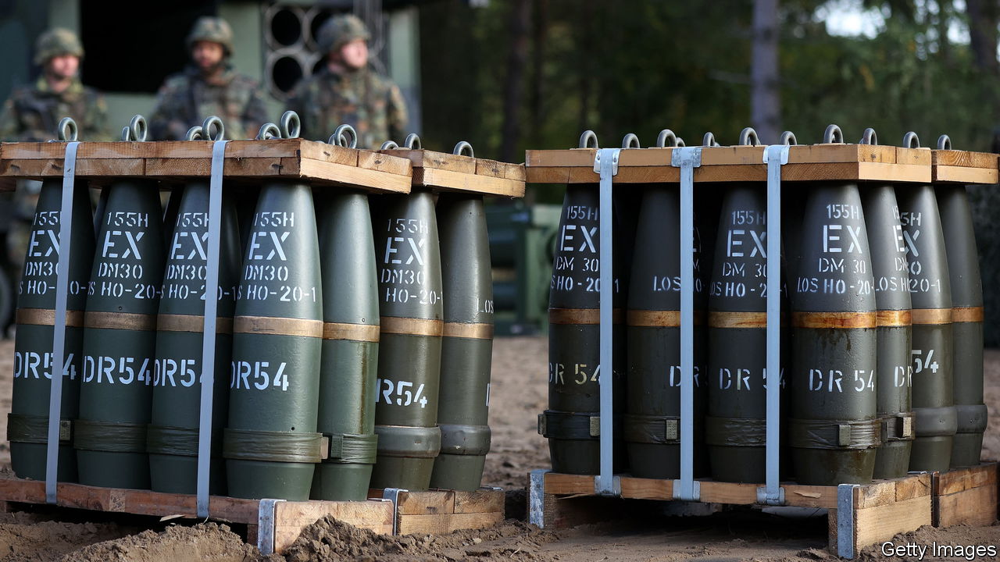

###### Europe’s armies

# Europe is struggling to rebuild its military clout 

##### It is spending more on defence, but some countries do much better than others 

 

> May 7th 2023 


FOR DECADES after the fall of the Berlin Wall Europeans spoke of their peace dividend, a welcome freeing-up of money that seemed no longer needed for defence but could now be spent on pleasanter and more productive uses. Since Russia invaded Ukraine, all that should have changed. Yet in the 14 months since then, the picture across the continent when it comes to actually putting money where mouths are is still patchy. European defence spending went up overall by an impressive-sounding 13% last year, according to SIPRI, a think-tank in Sweden. But two-thirds of that was eaten up by inflation—and anyway it included Russia and Ukraine.

Look first at . Three days after the invasion its chancellor, Olaf Scholz, promised a , a historic shift. His main measure was a €100bn ($110bn) debt-funded special fund for the modernisation of the country’s armed forces. But the fund is so far . That is partly because the defence minister for most of that time, Christine Lambrecht, was out of her depth. Her successor, Boris Pistorius, who took over in January, has brought a new dynamism to the job. 

 


Some €30bn has been earmarked for big-ticket items, such as 35 F-35 fighter jets. But most of this will not be delivered until near the end of the decade, and little money has yet found its way into actual contracts. Besides, Germany’s procurement process is unwieldy. It took until the end of last year just to prepare contracts for the parliament’s budget committee, which must approve any purchase bigger than €25m. And as the government is a coalition, it finds it hard to agree on how to spend the money.

Moreover, the fund will be used to help Germany’s otherwise frozen €50bn defence budget limp towards the NATO goal whereby each member country should spend at least 2% of its GDP on defence. Germany will not reach that figure until 2024, ten years after Angela Merkel made her pledge when Russia annexed Crimea in 2014. The budget could then fall again.

Worse still, the longer the money sits around, the more it is eroded by inflation and the less it will buy, notes Bastian Giegerich of the International Institute for Strategic Studies, a British think-tank. Rafael Loss of the European Council on Foreign Relations reckons that if you include VAT, the sum of money left to spend on hardware may be only €50bn-70bn. Mr Giegerich thinks that up to €20bn of that may have to be spent on bringing Germany’s stock of munitions up to the level expected by NATO. At present, the Bundeswehr may have only enough for two days of high-intensity warfare. 

In that respect is barely better off. It has about eight days’ worth, according to simulations in a war game held in 2021: stocks have since been further depleted by the £2.3bn ($2.9bn) worth of military support it has given Ukraine (the most generous contribution in Europe). But the problems for the armed forces of the country with the second-biggest defence budget in NATO (about £50bn a year) run deeper than that.  to the army have called into question its ability, in a conflict involving NATO, to field even one heavy division: about 30,000 soldiers with tanks, artillery and helicopters.

Bring back Bonaparte

Just 76,000-strong and with more cuts in the pipeline, Britain’s army is at its smallest since the Napoleonic era. It has to manage with  and will not get new ones for years because of successive procurement disasters that have cost billions. The defence secretary, Ben Wallace, a former army officer, describes his forces as “hollowed out”. 

The British army’s lack of claws reflects how the defence budget has been skewed away from the contingencies of a European land war and towards “out of area” expeditions. Two large aircraft-carriers, embarrassingly often inoperable, have recently come into service, both needing escorts and a version of the F-35 to fly from them. 

The other big drain on the British budget is the nuclear deterrent’s modernisation. Four new Dreadnought ballistic-missile submarines are being built to replace ageing Vanguards at a cost of at least £31bn. Britain is also expanding its arsenal of Trident missile warheads. It has already exceeded the NATO spending target, but it is unlikely to fulfil a promise to hit 2.5%.

, too, invests heavily in its nuclear deterrent but is unlikely to start replacing its four Triomphant submarines until well into the 2030s. In January President Emmanuel Macron pledged to boost spending over seven years starting in 2024 to €413bn, a 40% cash increase from the last budget cycle that began in 2019. That should exceed NATO’s target. Mr Giegerich notes that Ukraine will not determine the kind of investments that France is likely to make: “It still looks at the threat environment more in terms of the southern flank and the so-called ‘arc of instability’ than the eastern flank and Russia.” 

, under Giorgia Meloni’s new right-wing government, seems unlikely to spend more on defence. Despite earlier promises to get to 2% of GDP by 2028, it will probably come in at just below 1.5% this year, according to Francesco Vignarca, a military-budget analyst. Italy’s biggest security concern is irregular migration and turmoil in its Mediterranean near-abroad. 

By stark contrast ’s equally right-wing government under Mateusz Morawiecki aims to spend 4% of GDP this year. No country in Europe, not even the Baltic states of , and , which all promise to up their military spending to 3% of GDP, has felt more threatened by Mr Putin. Despite their membership of NATO, ordinary Poles believe that if he prevails in Ukraine, they will be next. Polish analysts fear that Russia is capable of reconstituting its land forces within just a few years. 

So Poland’s shopping list is huge: $10bn for 18  rocket launchers; $4.6bn for F-35 jets and 96 Apache helicopters; $4.9bn for 250 Abrams tanks; six more Patriot air-defence batteries, and much else. Poland plans to double its army to 300,000 within 12 years, making it probably the strongest land force in Europe. Quite how it will pay for all this muscle is less clear. 

Russia’s invasion of Ukraine has given Europe a collective shock. NATO has renewed energy and purpose. Across the continent, defence budgets are starting to rise. But the test will be how long this sense of urgency will endure. ■

