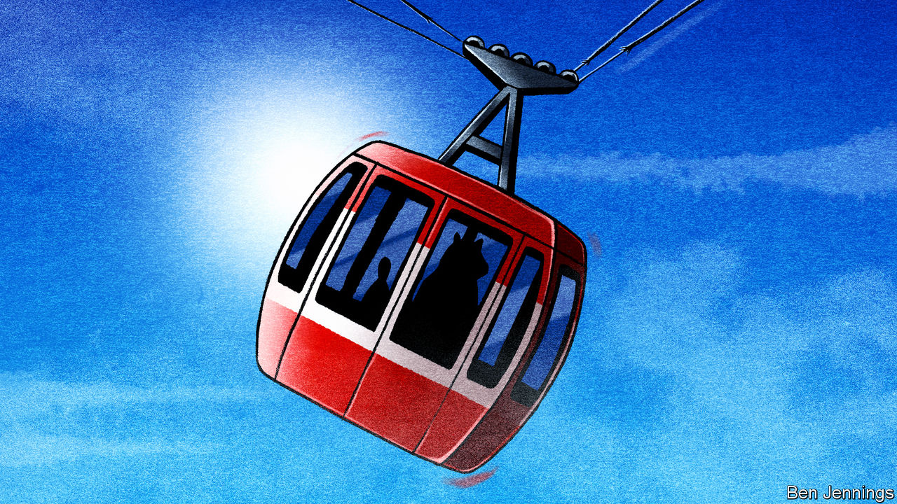

###### Charlemagne

# Once Russia’s best friend in the West, Austria is facing trouble 

##### When bear-hugging goes wrong 

 

> May 11th 2023 

Take a wrong turn or two in the labyrinthine Austrian federal chancellery and you might end up in a small room sporadically used for press conferences. Only the plush carpet and glistening chandeliers betray the Kongresssaal’s past glories. From September 1814 to June 1815, assorted emperors, dukes and ambassadors crammed inside in a bid to restore continental order in the wake of Napoleon’s wars. The Congress of Vienna turned into a nine-month orgy of masked balls and lavish banquets with occasional interruptions for diplomatic chit-chat. By adroitly balancing power between rival nations, the agreement (mostly) kept the peace in Europe for just shy of a century.

Once the centre of an empire spanning from Italy to Ukraine, Vienna is now merely the capital of the EU’s 14th-biggest member state. Notwithstanding the loss of its empire, in recent decades Austria thought it had found itself a role: as a member of the West, but with a special relationship with the Soviet bloc, then with Russia. The strategy had a certain dubious rationale—at least until Vladimir Putin, Russia’s pound-shop Bonaparte, launched a failed full-scale invasion of Ukraine a year ago. But things in Austria have steadily got worse. A slew of corruption scandals has rumbled on nearly uninterrupted since 2019. Confidence in the country’s body politic has collapsed: the chancellorship has changed hands five times in the past six years, a rate not even Italy nor Britain has been able to match.

Austria’s domestic woes have links to Russia. In 2019 a leaked video showed the then vice-chancellor, Heinz-Christian Strache, chilling in Ibiza with what he thought was the niece of a pro-Kremlin businessman. In it, Mr Strache, then also the leader of the migrant-bashing Freedom Party, suggested that his new chums should take over Austria’s most popular tabloid and turn it into a hard-right mouthpiece; in return, they would be granted juicy government contracts. As if to prove his own point, Mr Strache added: “We have decadence in the West.”

Ensuing official investigations have revealed a veritable doll of interlocking state misdeeds. Text messages sent by political grandees reportedly paint a picture of a clannish elite indulging in everything from dodgy party financing to placing pals in lucrative jobs, bribing journalists or steering tax authorities to their advantage. Dozens of top figures in the fields of politics, business and the media are being probed. The scandals have dragged in Sebastian Kurz, a political wunderkind, who stepped down as chancellor in October 2021, aged just 35 (he now works for a Silicon Valley firm, and denies any wrongdoing).

Mr Kurz had accumulated near-unchecked levels of power, and his departure from the political scene left Austria politically rudderless, says Marcus How of VE Insight, a consultancy in Vienna. This first became apparent during covid-19. The authorities imposed harsh measures such as compulsory vaccinations—and then failed to enforce them. But the war in Ukraine has proved a still greater challenge. Some consequences, such as voters left grouchy by high energy prices, can be found across Europe. But Austria’s links to Russia pose unique problems.

“There has long been a feeling in Austria that we could hug the Russian bear,” says Thomas Hofer, a political analyst in Vienna. Having narrowly dodged being on the wrong side of the Iron Curtain (like Germany, Austria was partitioned after the second world war, but Soviet troops moved out in 1955), it saw itself as a bridge between the rival blocs. Neutral Austria, a rare western European country to be outside NATO, played the geopolitical field to its advantage. In 1968, it became the first Western country to import Soviet gas, inspiring Germany and others later on. An anti-American bent among the population helped justify business entanglements in the unfree world.

Politically, the links with Moscow could sometimes merely be eyebrow-raising, as in 2018, when the foreign minister joyfully waltzed away with Mr Putin at her own wedding, even as other Western countries had imposed sanctions on Russia. Occasionally it looked downright dodgy, such as when former chancellors took jobs with large Russian energy and rail concerns. Vienna is rumoured to be crawling with Russian spooks: at one point Austrian intelligence services were deemed to be so compromised that their European allies refused to share information with them.

Bridge to nowhere

The war caused several European countries to rethink their ways. Finland and Sweden rushed to join NATO; Germany has weaned itself from Russian gas and is bolstering its armed forces. Austria for its part has proved slow to pivot. True, it has signed up to wide-ranging EU sanctions, and promised to spend more on defence. But it remains wedded to the idea of neutrality, making it look ambivalent during a conflict its neighbours think poses an existential threat. It is still importing oodles of Russian gas, citing “contractual obligations”. Its second-biggest bank, Raiffeisen, generated over half its profits from Russia last year. In April last year the current chancellor, Karl Nehammer, became the first Western leader to visit Mr Putin since the start of the war, unsuccessfully playing the card of a bridge-builder between Russia and its foes.

Austrians like to paint themselves as mini-Germans living in a well-run Alpine type of place. The way things are going, the more apt analogy may soon be Hungary, its erstwhile partner-in-empire, which under Viktor Orban has also grown queasily close to Russia. The hard-right Freedom Party—the very one that prompted the Ibiza imbroglio, and which retains close links to Russia—has surged to a wide poll lead ahead of elections due next year. Its members of parliament showily walked out of a recent video address by Ukraine’s Volodymyr Zelensky. That hardly bodes well. Vienna was once where diplomats gathered to assuage continental tensions. It may soon contribute to them instead. ■


