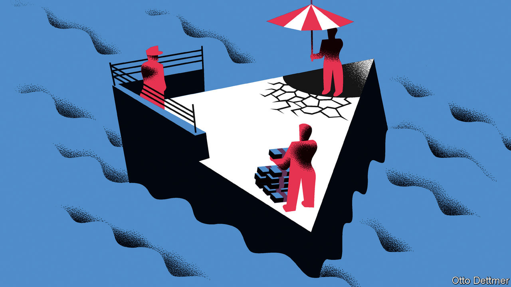

###### Free exchange

# A new world order seeks to prioritise security and climate change 

##### But policymakers must not forget the lessons of economics 

 

> May 11th 2023 

After the cold war, America and Europe established an economic order based upon open markets, global trade and limited state meddling in the economy. Climate change was a distant threat. Allowing countries like China or Russia into the global economy was widely seen to be beneficial for both them and their Western trading partners. As the two countries grew they would surely adopt market economics and, ultimately, democracy. Other things mattered. But economic considerations took precedence. 

Not anymore. Policymakers on both sides of the Atlantic have come to the conclusion that national security and climate change must now come first. In Brussels talk is of “economic security” and “strategic autonomy”—policymakers want the bloc to be able to chart its own course. Ursula von der Leyen, president of the European Commission, recently said that she wants to “derisk” relations with China. Officials in Washington have similar ambitions. They believe that the old world order allowed America’s industrial base to wither, created economic dependencies that could be exploited for geopolitical gain, left the climate crisis unaddressed and increased inequality in a manner that undermined democracy. Yet pursuing greater security, tackling climate change and seeking to counter the threat of China involves all manner of trade-offs. Even if economic considerations are no longer dominant, the discipline of economics still has much to offer.

In order to make sensible use of an economic weapon such as sanctions, for instance, national-security types must accurately gauge their costs. Russia’s invasion of Ukraine last year provided a test case. At the time, debates raged in the eu about whether to ban imports of Russian gas. The fear—forcefully voiced by businesses and industrial unions—was that an embargo would be a brutal economic hit not to Russia, but to Europe instead. When a group of economists, including Ben Moll at the London School of Economics and Moritz Schularick at the University of Bonn,  of such measures at the time, they forecast a hard, if less severe, hit, as they expected the economy to adjust swiftly to the shock. And the eu did avoid a recession, even though gas consumption in the 12 months to February was 15% lower than a year earlier. In a new paper, three economists from the group that provided the initial forecast argue that Europe could even have withstood an immediate gas embargo in April 2022, instead of the later cut-off over the summer. A forthcoming paper by Lionel Fontagne of the Paris School of Economics and others, which studies energy-price shocks in France over the past couple of decades, comes to a similar conclusion: firms adapt quickly, and only in part by cutting employment and production.

What about an economic clash between the West and a bigger, more powerful rival, such as China? Using the same model as the group above—and looking solely at intermediate inputs, such as semiconductors or engine parts, rather than finished products—researchers at the European Central Bank divide the world into two blocs: “East” and “West”. If the blocs were to return to the limited trade of the mid-1990s, the analysis finds that the short-term hit, before the world economy has adjusted, would be large, at about 5% of global gdp. But over time the loss would fall to about 1%. The hit to America and China would be relatively small, compared with more globally integrated economies like the euro zone. Small open economies, like South Korea, would bear the brunt. 

An intriguing aspect of an East-West clash is technological diffusion, a crucial ingredient in economic growth. Less trade means fewer learning opportunities, especially for poorer countries. Carlos Goes of the University of California, San Diego, and Eddy Bekkers of the wto look at the impact a breakdown in relations may have on such diffusion. They find that the consequences for the American economy, as the technological leader, are again manageable. The impact on China or India is considerable, since both countries would miss out on opportunities to advance. 

Trade-offs may be more painful when it comes to climate change. President Joe Biden has set aside more than $1trn over the next decade for green stimulus and manufacturing. Already there have been high-profile investments by large firms. But these could very well be plans that have been brought forward to secure subsidies. Meanwhile, evidence on intervention to boost industrial employment is decidedly mixed. Chiara Criscuolo of the oecd and others have analysed the eu’s previous efforts. They find that the bloc’s schemes do support employment, but only at small firms. Large firms tend to take the payment without adding jobs. 

Other countries are responding with their own green subsidies, and are likely to add more—which may be unwise. The world needs every bit of economic efficiency to maintain a stable climate, as resources are limited and . In a new working paper Katheline Schubert of the Paris School of Economics and others look at different combinations of carbon taxes and green subsidies. They find, in line with earlier research, that relying on subsidies to green an economy entails large costs compared with a carbon price.

The danger of consensus

Dani Rodrik of Harvard University, a critic of the old “Washington” consensus, welcomes much of the new era. But in a recent essay on industrial policy, he describes just how difficult such intervention is to get right, and warns that trying to achieve multiple goals (say, to tackle climate change, boost industry and enhance security) with a single lever raises the chance of failure. What’s more, any paradigm that becomes conventional wisdom is in danger of promoting one-size-fits-all solutions, writes Mr Rodrik. In the eyes of its critics, the old Washington consensus fell short when it came to fairness and growth. Now it is easy for economists of all stripes to see the dangers of the new consensus. Policymakers would be wise to listen. ■


