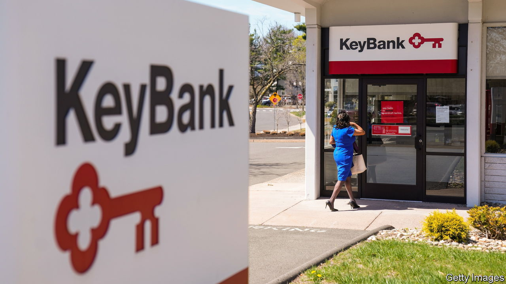
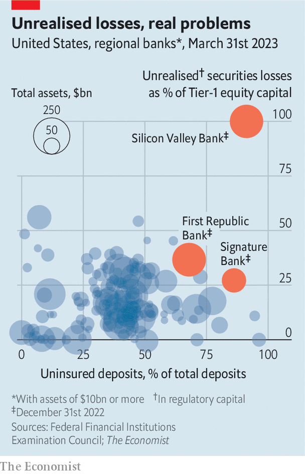

###### Number-crunching

# Are America’s regional banks over the worst of it? 

##### New data offer a glimpse at their balance-sheets 

 

> May 11th 2023 

More people are paying attention to America’s regional banks than ever before. But it is difficult to work out the state of their balance-sheets. Recent data from the Federal Financial Institutions Examination Council, a regulator, offer a glimpse. Our analysis suggests several regional banks are struggling with flighty deposits, interest-rate mismatches and pricey borrowing. Even if none are about to collapse, the outlook is grim. 

Start with deposits. Before the panic in March, savers were moving money to high-yielding money-market funds. The fall of Silicon Valley Bank (svb) sped up the trend. Accounts with balances over the $250,000 federal-insurance limit fell by nearly 5% across the banking system—and by more than 11% at midsized lenders. At PacWest, an institution in California, total deposits dropped by 17% and uninsured ones by more than half. 

 


Many banks are still sitting on billions in unrealised losses. The data show that America’s banks in aggregate have more than $500bn in such losses on their securities portfolios. Charles Schwab, a broker that has seen its share price fall by two-fifths this year, holds more than $21bn in paper losses through its banking subsidiaries. When svb collapsed, unrealised losses on its securities amounted to 100% of core equity capital (see chart).

Outstanding borrowing at American banks reached $1.3trn in the most recent quarter, up more than 40% on the previous one. At large institutions, borrowing rose by 26%; at midsized ones, it more than doubled. Schwab reported $39bn of short-term advances from the Federal Home Loan Banks (fhlb), up from $12bn in the previous three months. KeyBank, an Ohio-based lender, borrowed $19bn in short-term fhlb loans, up from $11bn. Such loans come at today’s high interest rates. Banks that rely on them might survive the crisis. But they will probably see their profits suffer.


