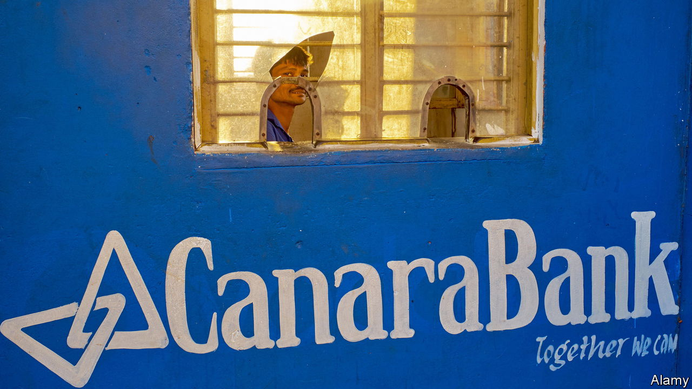

###### Credible

# India’s once-troubled banks are generating huge profits 

##### What lies behind the unlikely turnaround? 

 

> May 11th 2023 

People looking for tips on how to run a bank do not often head to Mumbai, and for good reason. On May 2nd India’s Supreme Court ruled that the fraud-investigation office could prosecute auditors for their role in the collapse in 2018 of an infrastructure-finance firm backed by state banks. Last year four bosses at Indian Bank, a state lender, were jailed for fraud. Prosecutions of those at three other banks are grinding through the country’s courts.

Yet Indian banks’ recent annual earnings have been spectacular. State lenders have led the way: Canara Bank’s net earnings jumped 87% against last year, Union Bank of India’s 61% and idbi’s 49%. Private banks are hardly laggards: icici’s earnings rose by 37%, Kotak Mahindra’s 28% and hdfc’s 19%. JPMorgan Chase, global banking’s benchmark for excellence, offers a return on equity of 14%. India’s state-owned banks generate, on average, over 11% and private banks almost 15%. In a development few, if any, predicted, Indian banks are among the world’s most profitable.

During the first half of the 2010s, Indian banks reported numbers that were strong—but unbelievably so. The practice of rolling over bad loans to avoid recognising losses was rampant, particularly with those made by state banks to borrowers with political connections. Reality would have intruded eventually; an accelerant came in the form of scandals over the allocation of government licences in industries including coal, which concluded with the Supreme Court cancelling hundreds of mining permits in 2014, and telecoms, with the surprising exoneration of defendants in 2017. Approvals for projects froze, undermining their financial viability.

Outside expertise helped the process along. In 2015 Raghuram Rajan, a professor at the University of Chicago who was then the head of India’s central bank, initiated an “asset-quality review”. Write-downs and failures followed, notably in energy, steel and telecoms. Political and business leaders faulted Mr Rajan for pushing reforms, which they saw as throwing a wrench into the economy. His tenure did not extend to a second term.

In time, however, even critics have reconsidered Mr Rajan’s stint at the Reserve Bank of India. It took more than five years for the benefits of his review to emerge, but they did so at an extremely helpful time: just as covid-19 hit. Rather than collapse under lockdowns, India’s banks built on early signs of improvement. Non-performing loans peaked at 16% of corporate lending in 2018. They have since fallen sharply. By early 2024, predicts Crisil, a ratings agency, they should drop below 2%.

Narendra Modi’s government also deserves credit. Bankruptcy reforms in 2016 have sped up the liquidation of failing firms, and prodded delinquent businesses to pay up. In 2019, as part of the seemingly endless mop-up of Indira Gandhi’s banking nationalisation half a century ago, the government announced that 27 state-owned banks would become 12, with many branches closing. According to Boston Consulting Group, state banks have also written off $91bn in bad loans in the past five years—just a little less than their combined worth. Many survived thanks to an infusion of 2.6trn rupees ($31bn) from the state, in return for shares, over the past three years. Such infusions have more recently been curtailed, as banks have learned how to stand on their own feet.

The process has both accelerated and benefited from India’s economic growth. The imf expects the country to be the fastest-growing major economy this year. As the system has become healthier, banks have lent more. Annual credit growth slowed to 3% in 2017. It is now up to 18%. Interest rates have risen less sharply than in America, helping limit stress.

Nonetheless, investors are not entirely convinced by the clean-up at state banks. hdfc, Kotak Mahindra and icici, three private-sector banks, trade at triple their book value. Many state-owned institutions still trade at just a fraction of theirs, meaning they are worth more dead than alive. One reason for this lack of confidence is that India has made similar steps before, notably in 1993, when other bankruptcy reforms passed, and in 2002, when a law made it easier for banks to go after deadbeats. Both instances, ultimately, proved to be blips in longer-term decline. 

The state still retains enormous influence over the country’s state banks. Senior appointments must go through the government. Bosses often serve two- to three-year terms, undermining long-term planning. Fear had its uses: when the banks were in trouble, ministers were forced to aim for solvency rather than use them for political ends. But as it ebbs, will a laxer era now begin? Only continued success for the state banks will show that Indian finance has truly changed. ■


