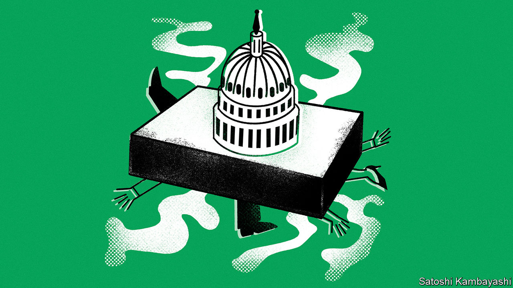

###### Buttonwood

# Investors brace for a painful crash into America’s debt-ceiling 

##### A solution will probably be found. But default is no longer unthinkable 

 

> May 10th 2023 

Most of the time, the impossibility of America defaulting on its sovereign bonds is taken as a fundamental axiom of the financial system. The country issues the world’s reserve currency, so investors always stand ready to lend it money. And if you are able to borrow more, you can pay back your debts.

Yet Washington is once again reminding the world that, through sheer mulishness, a default is indeed possible. Every now and again—as in 2011, 2013 and today—America smacks into its “debt ceiling”, a political device that places a hard limit (currently $31.4trn, or 117% of gdp) on gross government borrowing. Congress must then agree to raise or waive the ceiling in order to prevent the Treasury from failing to make bond payments or meet spending obligations. This time Janet Yellen, the treasury secretary, has warned that the government may run out of cash and accounting manoeuvres as soon as June 1st. And so on May 9th, congressional leaders gathered in the Oval Office with President Joe Biden for the very first stage of negotiation. They are a long way from a deal.

The stage is thus set for a game of brinkmanship in which a Republican-controlled House of Representatives tries to wring concessions from Mr Biden, as the nation’s creditworthiness hangs in the balance. The two sides should find a way to avoid catastrophe. But as Washington’s staring contest intensifies, Wall Street’s finest are less inclined to get involved. The merest hint of a default has already set traders to work looking for ways to protect their investments.

To understand why, consider what a default would mean. Short-term Treasuries, or “t-bills”, are the closest thing there is to a risk-free asset. This makes them a favourite of corporate cash managers (who want an ultra-safe return) and any trader needing to post collateral (which must hold its value and be easy to sell). If the government stiffs corporate treasurers, companies will miss payments to one another and the wheels of commerce will grind to an agonising halt. Make traders’ collateral vanish, and financial contracts of all stripes will start to fall apart, unleashing chaos in global markets.


Small wonder, then, that investors are rushing to protect themselves. A clamour for t-bills maturing before any possible default has given rise to wild swings in the yield of the world’s safest asset. One-month bills yielded 4.7% at the start of April. Over the next three weeks that fell to 3.4%, even as the Federal Reserve prepared to raise its interest rate to 5-5.25%. But one-month bills now mature after June 1st, when the Treasury might have exhausted its cash. And so demand has cratered, with their yield soaring by more than two percentage points in a matter of weeks. One trading boss describes having her team attempt to manually override their settlement software, to ensure that bills which mature without being paid do not simply vanish from the system.

Longer-term Treasuries have so far seemed safer, under the assumption that an actual default would shock politicians out of their stubbornness, and would be quickly rectified. Yet even they are not immune. The cost of insuring five-year Treasuries against default, once the very definition of throwing away money, has quadrupled over the past 12 months (a fact admittedly explained in part by the market’s lack of liquidity).

What next? For investors who think there is no chance of Washington careening over the precipice, it is time to snap up t-bills at a discount and sell pointless bond insurance to the nervous. But even optimists have cause for concern. Since the Treasury would have run down its cash reserves to virtually nothing, a deal would be followed by a glut of issuance to rebuild the buffer. Even the best-case scenario would drain liquidity from the market and may push yields higher.

The stockmarket, meanwhile, looks shaky either way. Analysts at pimco, an asset manager, note that over the past dozen years, the s&p 500 index has fallen by an average of 6.5% in the month running up to a debt-ceiling deadline—even though these have always been met. Under a default it would fare much worse. In 2013, during a previous debt-ceiling stand-off, Fed officials simulated the effects of a month-long default. They estimated that stock prices would fall by 30% and the dollar by 10%.

In the meantime, expect traders to get even more jittery. America’s politics will prevent an early deal, and it could well take the markets freaking out to force one at all. Default remains the least likely outcome. But as investors are acutely aware, it is no longer unthinkable.


