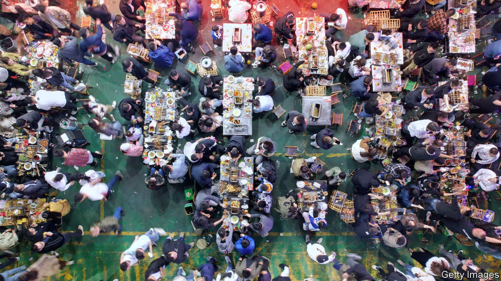
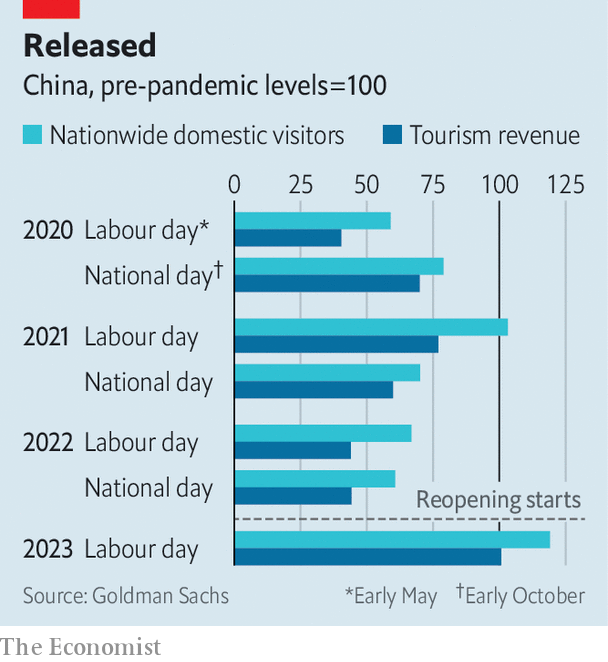

###### National statistics, grilled

# The meaty mystery at the heart of China’s economic growth 

##### What kebab consumption says about the country’s consumption 

 

> May 11th 2023 

Over the past few decades, the small, industrial city of Zibo has been best-known for its petrochemical output. In recent months, however, it has become the centre of a national barbecue craze and social-media phenomenon unlike anything China has seen before. Tourists have flooded the city in the central province of Shandong in the hope of munching its mythical kebabs, posting videos on Douyin, the local version of TikTok, and then departing. Arenas have been converted into makeshift dining halls in order to cope with the massed crowds. To ease constraints on the supplies of meat and grills, local banks have started handing out low-interest loans designed specifically for merchants in barbecue-related industries. 

During the recent May Day holiday, one of the most important weeks of the year for domestic shopping and entertainment spending, the chemicals hub was listed as a top tourist destination alongside other popular places such as the Great Wall and the Terracotta Warriors. A widely shared internet meme jokes that the last time this many people showed up in the city was during the Siege of Qi, a famous battle that took place in the area in 284bc.

 


This frenzied activity in Zibo should be helping China recover from its disastrous zero-covid era. Analysts have highlighted consumption as a bright spot in the Chinese economy this year amid a gloomier outlook for construction and manufacturing. Indeed, at first glance activity during the recent holiday appears to be strong. The resumption in tourism has been stunning. A record 274m people travelled, up 19% from before the pandemic. Just months ago, a short jaunt could land you in a quarantine camp for weeks.

Yet other data reveal a more modest recovery—only to levels last seen in 2019, before covid-19, and not beyond them. Although more people travelled this year, spending per head was down by more than 10% against 2019, according to hsbc, a bank. As a consequence, domestic tourism revenues were up by a mere 0.7% on four years ago. “Chinese consumers are not back to normal,” warns the boss of an asset-management firm. They are focused on food and fun, not big-ticket items like cars, he says. Auto sales were down 1.4% year on year in the first four months of 2023.

Young folk are going out of their way to spend less. Since the end of zero-covid, many tourists have described themselves as “special-ops” travellers. This alludes to dropping into a location, spending as little time and money as possible, and then moving on to the next spot—much as an elite military outfit might pass through a location unnoticed. The activity has become something of a sport, where young people visit a list of popular places and check them off by posting pictures on social media. Zibo’s kebabs have been one of the top items to tick off from the list.

It is not, though, just youthful frugality behind weak consumption figures. Urban disposable incomes barely grew, at least by Chinese standards, in the first three months of the year, up just 2.7% in real terms compared to the same period a year ago, notes Raymond Yeung of anz, a bank. A fifth of youngsters are now out of work, double the rate in April 2019, he adds.

Zibo kebabs are the perfect treat for a budget traveller. They are consumed at low tables with a small stove, heated by coal. When the fat starts to drip, the meat is scraped into a thin pancake and dipped first into a garlic and chilli paste and then into a salty mixture of sesame and peanut. A bottle of the city’s local beer, called Lulansha, comes to less than three yuan ($0.40). Four people can eat and drink for hours on less than 350 yuan. The craze is about more than the simple food. One barbecue purveyor who has operated a shop for several years in the city’s Linzi district points out that anyone can sell , as the dish is called locally. It is Shandong’s big-hearted hospitality that people across the country are seeking out in Zibo. 

Yet the cheap eats have stirred controversy among social commentators. Wu Xiaobo, a popular author, wrote recently that viral internet trends playing out on the streets of cities such as Zibo are evidence of a robust free-market economy at work in China. His article, however, generated such a backlash that it has been censored.

Others are less sanguine. One widely circulated article, by Liu Yadong, a professor, asserts that the trend is evidence of social decay in China, with young people fixated on online fads that hold little cultural value. Another article, by Wang Mingyuan, a think-tank researcher, suggests that the barbecue hype is a sign of the end of a decades-long economic cycle. The small cities where most of China’s population dwell have run out of more standard drivers of growth; the demographic dividend is running low, as the country’s population ages. Thus local officials must leap on whatever passing internet craze comes their way. How much longer, Mr Wang asks, can the barbecue party continue? ■


