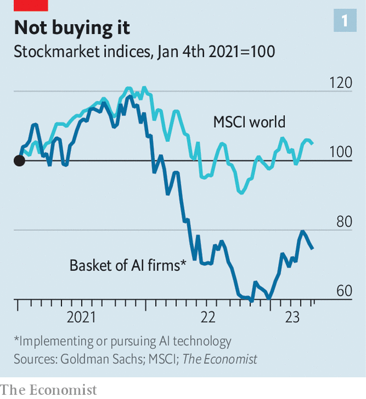
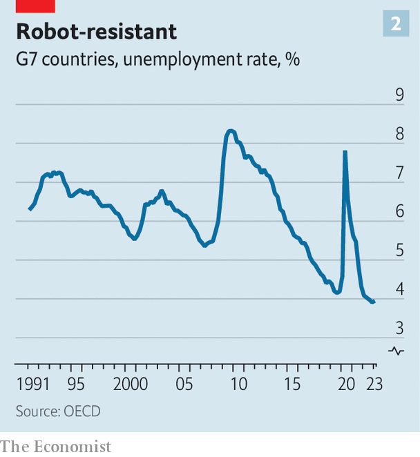

###### Beyond the hype

# Your job is (probably) safe from artificial intelligence 

##### Why predictions of an imminent economic revolution are overstated 

 

> May 7th 2023 

The age of  has well and truly arrived. Openai’s chatbots, which use large-language-model (llm) technology, got the ball rolling in November. Now barely a day goes by without some. An ai-powered song featuring a fake “Drake” and “The Weeknd” recently shook the music industry. Programs which convert text to video are making fairly convincing content. Before long consumer products such as Expedia, Instacart and OpenTable will plug into Openai’s bots, allowing people to order food or book a holiday by typing text into a box. A recently leaked presentation, reportedly from a Google engineer, suggests the tech giant is worried about how easy it is for rivals to make progress. There is more to come—probably a lot more. 

The development of ai raises profound questions. Perhaps most pressing, though, is a straightforward one. What does this mean for the economy? Many have grand expectations. New research by Goldman Sachs, a bank, suggests that “widespread ai adoption could eventually drive a 7% or almost $7trn increase in annual global gdp over a ten-year period.” Academic studies point to a three-percentage-point rise in annual labour-productivity growth in firms that adopt the technology, which would represent a huge uplift in incomes compounded over many years. A study published in 2021 by Tom Davidson of Open Philanthropy, a grantmaking outfit, puts a more than 10% chance on “explosive growth”—defined as increases in global output of more than 30% a year—sometime this century. A few economists, only half-jokingly, hold out the possibility of global incomes becoming infinite. 

 


Financial markets, however, point to rather more modest outcomes. In the past year share prices of companies involved in ai have done worse than the global average, although they have risen in recent months (see chart 1). Interest rates are another clue. If people thought that the technology was going to make everyone richer tomorrow, rates would rise because there would be less need to save. Inflation-adjusted rates and subsequent gdp growth are strongly correlated, notes research by Basil Halperin of the Massachusetts Institute of Technology (mit) and colleagues. Yet since the hype about ai began in November, long-term rates have fallen. They remain very low by historical standards. Financial markets, the researchers conclude, “are not expecting a high probability of…ai-induced growth acceleration…on at least a 30-to-50-year time horizon.” 

To judge which group is right, it is helpful to consider the history of previous technological breakthroughs. This provides succour to investors. For it is difficult to make the case that a single new technology by itself has ever radically changed the economy, either for good or ill. Even the industrial revolution of the late 1700s, which many people believe was the result of the invention of the spinning jenny, was actually caused by all sorts of factors coming together: increasing use of coal, firmer property rights, the emergence of a scientific ethos and much more besides. 

Perhaps most famously, in the 1960s Robert Fogel published work about America’s railways that would later win him a Nobel Prize in economics. Many thought that rail transformed America’s prospects, turning an agricultural society into an industrial powerhouse. In fact, it had a very modest impact, Fogel found, because it replaced technology—such as canals—that would have done just about as good a job. The level of per-person income that America achieved by January 1st 1890 would have been reached by March 31st 1890 if railways had never been invented.

Of course, no one can predict with any certainty where a technology as fundamentally unpredictable as ai will take humans. Runaway growth is not impossible; nor is technological stagnation. But you can still think through the possibilities. And, so far at least, it seems as though Fogel’s railways are likely to be a useful blueprint. Consider three broad areas: monopolies, labour markets and productivity. 

A new technology sometimes creates a small group of people with vast economic power. John D. Rockefeller won out with oil refining and Henry Ford with cars. Today Jeff Bezos and Mark Zuckerberg are pretty dominant thanks to tech. 

Many pundits expect that before long the ai industry will generate huge profits. In a recent paper Goldman’s analysts estimate in a best-case scenario generative ai could add about $430bn to annual global enterprise-software revenues. Their calculation assumes that each of the world’s 1.1bn office workers will adopt a few ai gizmos, paying around $400 in total each. 

Any business would be glad to capture some of this cash. But in macroeconomic terms $430bn simply does not move the dial. Assume that all of the revenue turns into profits, which is unrealistic, and that all of these profits are earned in America, which is a tad more realistic. Even under these conditions, the ratio of the country’s pre-tax corporate profits to its gdp would rise from 12% today to 14%. That is far above the long-run average, but no higher than it was in the second quarter of 2021. 

These profits could go to one organisation—maybe Openai. Monopolies often arise when an industry has high fixed costs or when it is hard to switch to competitors. Customers had no alternative to Rockefeller’s oil, for instance, and could not produce their own. Generative ai has some monopolistic characteristics. gpt-4, one of Openai’s chatbots, reportedly cost more than $100m to train, a sum few firms have lying around. There is also a lot of proprietary knowledge about data for training the models, not to mention user feedback. 

There is, however, little chance of a single company bestriding the entire industry. More likely is that a modest number of big firms compete with one another, as happens in aviation, groceries and search engines. No ai product is truly unique since all use similar models. This makes it easier for a customer to switch from one to another. The computing power behind the models is also fairly generic. Much of the code, as well as tips and tricks, is freely available online, meaning that amateurs can produce their own models—often with strikingly good results. 

“There don’t appear, today, to be any systemic moats in generative ai,” a team at Andreessen Horowitz, a venture-capital firm, has argued. The recent leak purportedly from Google reaches a similar conclusion: “The barrier to entry for training and experimentation has dropped from the total output of a major research organisation to one person, an evening, and a beefy laptop.” Already there are a few generative-ai firms worth more than $1bn. The biggest corporate winner so far from the new ai age is not even an ai company. At , a computing firm which powers AI models, revenue from data centres is soaring.

Yeah, but what about me?

Although generative ai might not create a new class of robber barons, to many people that will be cold comfort. They are more concerned with their own economic prospects—in particular, whether their job will disappear. Terrifying predictions abound. Tyna Eloundou of OpenAI and colleagues have estimated that “around 80% of the us workforce could have at least 10% of their work tasks affected by the introduction of llms”. Edward Felten of Princeton University and colleagues conducted a similar exercise. Legal services, accountancy and travel agencies came out at or near the top of professions most likely to face disruption. 

Economists have issued gloomy predictions before. In the 2000s many feared the impact of outsourcing on rich-world workers. In 2013 two at Oxford University issued a widely cited paper that suggested automation could wipe out 47% of American jobs over the subsequent decade or so. Others made the case that, even without widespread unemployment, there would be “hollowing out”, where rewarding, well-paid jobs disappeared and mindless, poorly paid roles took their place. 

 


What actually happened took people by surprise. In the past decade the average rich-world unemployment rate has roughly halved (see chart 2). The share of working-age people in employment is at an all-time high. Countries with the highest rates of automation and robotics, such as Japan, Singapore and South Korea, have the least unemployment. A recent study by America’s Bureau of Labour Statistics found that in recent years jobs classified as “at risk” from new technologies “did not exhibit any general tendency toward notably rapid job loss”. Evidence for “hollowing out” is mixed. Measures of job satisfaction rose during the 2010s. For most of the past decade the poorest Americans have seen faster wage growth than the richest ones. 

This time could be different. The share price of Chegg, a firm which provides homework help, recently fell by half after it admitted Chatgpt was “having an impact on our new customer growth rate”. The chief executive of ibm, a big tech firm, said that the company expects to pause hiring for roles that could be replaced by AI in the coming years. But are these early signs a tsunami is about to hit? Perhaps not.

Imagine a job disappears when ai automates more than 50% of the tasks it encompasses. Or imagine that workers are eliminated in proportion to the total share of economywide tasks that are automated. In either case this would, following Ms Eloundou’s estimates, result in a net loss of around 15% of American jobs. Some folk could move to industries experiencing worker shortages, such as hospitality. But a big rise in the unemployment rate would surely follow—in line, maybe, with the 15% briefly reached in America during the worst of the covid-19 pandemic in 2020. 

Yet this scenario is unlikely to come to pass: history suggests job destruction happens far more slowly. The automated telephone switching system—a replacement for human operators—was invented in 1892. It took until 1921 for the Bell System to install their first fully automated office. Even after this milestone, the number of American telephone operators continued to grow, peaking in the mid-20th century at around 350,000. The occupation did not (mostly) disappear until the 1980s, nine decades after automation was invented. ai will take less than 90 years to sweep the labour market: llms are easy to use, and many experts are astonished by the speed at which the general public has incorporated Chatgpt into their lives. But reasons for the slow adoption of technology in workplaces will also apply this time around.

In a recent essay Mark Andreessen of Andreessen Horowitz outlined some of them. His argument focuses on regulation. In bits of the economy with heavy state involvement, such as education and health care, technological change tends to be pitifully slow. The absence of competitive pressure blunts incentives to improve. Governments may also have public-policy goals, such as maximising employment levels, which are inconsistent with improved efficiency. These industries are also more likely to be unionised—and unions are good at preventing job losses. 

Examples abound. Train drivers on London’s publicly run Underground network are paid close to twice the national median, even though the technology to partially or wholly replace them has existed for decades. Government agencies require you to fill in paper forms providing your personal information again and again. In San Francisco, the global centre of the ai surge, real-life cops are still employed to direct traffic during rush hour. 

Au revoir!

Many of the jobs at risk from ai are in heavily regulated sectors. Return to the paper by Mr Felten of Princeton University. Fourteen of the top 20 occupations most exposed to ai are teachers (foreign-language ones are near the top; geographers are in a slightly stronger position). But only the bravest government would replace teachers with ai. Imagine the headlines. The same goes for cops and crime-fighting ai. The fact that Italy has already temporarily blocked Chatgpt over privacy concerns, with France, Germany and Ireland said to be considering the option, shows how worried governments are about the job-destructive effects of ai.

Perhaps, in time, governments will allow some jobs to be replaced. But the delay will make space for the economy to do what it always does: create new types of jobs as others are eliminated. By lowering costs of production, new tech can create more demand for goods and services, boosting jobs that are hard to automate. A paper published in 2020 by David Autor of mit and colleagues offered a striking conclusion. About 60% of the jobs in America did not exist in 1940. The job of “fingernail technician” was added to the census in 2000. “Solar photovoltaic electrician” was added just five years ago. The ai economy is likely to create new occupations which today cannot even be imagined. 

Modest labour-market effects are likely to translate into a modest impact on productivity—the third factor. Adoption of electricity in factories and households began in America towards the end of the 19th century. Yet there was no productivity boom until the end of the first world war. The personal computer was invented in the 1970s. This time the productivity boom followed more quickly—but it still felt slow at the time. In 1987 Robert Solow, an economist, famously declared that the computer age was “everywhere except for the productivity statistics”. 

The world is still waiting for a productivity surge linked to recent innovations. Smartphones have been in widespread use for a decade, billions of people have access to superfast internet and many workers now shift between the office and home as it suits them. Official surveys show that well over a tenth of American employees already work at firms using ai of some kind, while unofficial surveys point to even higher numbers. Still, though, global productivity growth remains weak.

ai could eventually make some industries vastly more productive. A paper by Erik Brynjolfsson of Stanford University and colleagues examines customer-support agents. Access to an ai tool raises the number of issues resolved each hour by 14% on average. Researchers themselves could also become more efficient: gpt-x may give them an unlimited number of almost-free research assistants. Others hope ai will eliminate administrative inefficiencies in health care, reducing costs. 

But there are many things beyond the reach of ai. Blue-collar work, such as construction and farming, which accounts for about 20% of rich-world gdp, is one example. An llm is of little use to someone picking asparagus. It could be of some use to a plumber fixing a leaky tap: a widget could recognise the tap, diagnose the fault and advise on fixes. Ultimately, though, the plumber still has to do the physical work. So it is hard to imagine that, in a few years’ time, blue-collar work is going to be much more productive than it is now. The same goes for industries where human-to-human contact is an inherent part of the service, such as hospitality and medical care. 

ai also cannot do anything about the biggest thing holding back rich-world productivity growth: . When the size of cities is constrained and housing costs are high, people cannot live and work where they are most efficient. No matter how many brilliant new ideas your society may have, they are functionally useless if you cannot build them in a timely manner. It is up to governments to defang nimbys. Technology is neither here nor there. The same goes for energy, where permitting and infrastructure are what keep costs uncomfortably high. 

It is even possible that the ai economy could become less productive. Look at some recent technologies. Smartphones allow instant communication, but they can also be a distraction. With email you are connected 24/7, which can make it hard to focus. A paper in 2016 by researchers at the University of California at Irvine, Microsoft Research and mit found that “the longer daily time spent on email, the lower was perceived productivity”. Some bosses now believe that working from home, once seen as a productivity-booster, gives too many people the excuse to slack off. 

Generative ai itself could act as a drain on productivity. What happens, for instance, if ai can create entertainment perfectly tailored to your every desire? Moreover, few people have thought through the implications of a system that can generate vast amounts of text instantly. gpt-4 is a godsend for a nimby facing a planning application. In five minutes he can produce a well written 1,000-page objection. Someone then has to respond to it. Spam emails are going to be harder to detect. Fraud cases could soar. Banks will need to spend more on preventing attacks and compensating people who lose out. 

Just what we need

In an ai-heavy world lawyers will multiply. “In the 1970s you could do a multi-million-dollar deal on 15 pages because retyping was a pain in the ass,” says Preston Byrne of Brown Rudnick, a law firm. “ai will allow us to cover the 1,000 most likely edge cases in the first draft and then the parties will argue over it for weeks.” A rule of thumb in America is that there is no point suing for damages unless you hope for $250,000 or more in compensation, since you need to spend that much getting to court. Now the costs of litigation could fall to close to zero. Meanwhile, teachers and editors will need to check that everything they read has not been composed by an ai. Openai has released a program that allows you to do this. It is thus providing the world a solution to a problem that its technology has created. 

ai may change the world in ways that today are impossible to imagine. But this is not quite the same thing as turning the economy upside down. Fogel wrote that his argument was “aimed not at refuting the view that the railroad played a decisive role in American development during the 19th century, but rather at demonstrating that the empirical base on which this view rests is not nearly so substantial as is usually presumed”. Some time in the mid-21st century a future Nobel prizewinner, examining generative ai, may well reach the same conclusion. ■


