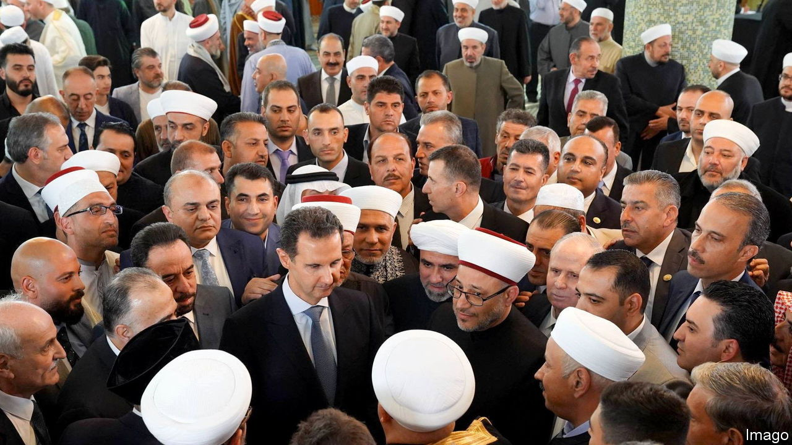
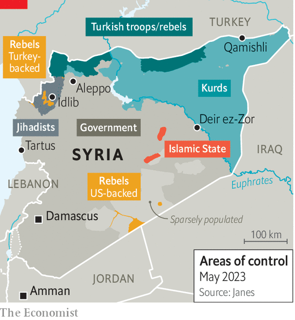
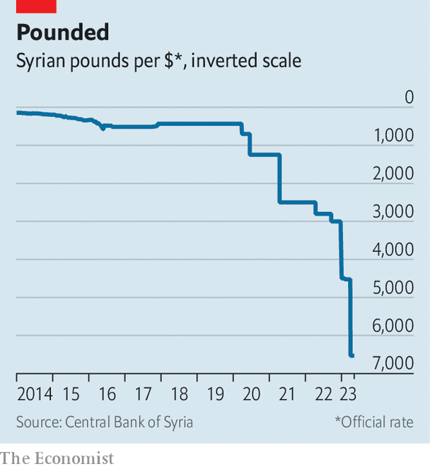

###### The Syrian civil war and its aftermath

# After 12 years of blood, Assad’s Syria rejoins the Arab League 

##### One of the 21st century’s worst war criminals makes a comeback 

 

> May 9th 2023 

No one enjoys Arab League meetings. Morocco was scheduled to host a summit in 2016 but decided not to bother, calling the event a waste of time. Muhammad bin Salman, the , procured a doctor’s note to skip last year’s gathering in Algeria. Heads of state are sometimes spotted falling asleep.

 


No one enjoys them—except Bashar al-Assad, the Syrian dictator, who will relish his next Arab summit. Syria has been suspended from the league since 2011, when Mr Assad began a brutal crackdown on anti-government protests that plunged the country into civil war (see map). On May 7th, however, the body agreed to readmit Syria and said it would invite Mr Assad to a summit in Saudi Arabia on May 19th.

An invitation from a dull talking shop crammed with dictators may seem hollow. For Mr Assad, though, it is the culmination of a long effort to end his Arab isolation—and, he may hope, another step towards .

His regime has done nothing so far to merit a renewed embrace: neither making concessions towards political reform nor taking accountability for war crimes, nor trying to bring home Syria’s 6m refugees, most of them in neighbouring countries. Before the war the country had some 22m people; roughly half of them had to flee either abroad or elsewhere in Syria because of it. He rules a kleptocracy that floods the Gulf with illicit drugs and maintains close ties with Iran, an arch-rival to some Arab states. Poverty is widespread. Yet even the bloodiest dictator, it seems, can find a road to diplomatic redemption—if he simply causes enough problems for others.

That is one lesson from his return to the world stage. Another is that the autocrats and warlords who court Russian support are likely to end up disappointed. Mr Assad needs the Arab world—and the wealthy Gulf states in particular—because Russia cannot rebuild his ruined country.

Better still, for him, would be a rapprochement with the West, which has placed his regime under sanctions meant to deter reconstruction. Those on the energy sector, for example, bar firms from building new power plants or supplying equipment. Would-be investors in the Gulf are even jittery about small-scale solar-energy projects, fearing they might run afoul of the measures. So a rapprochement seems unlikely. But talk of one raises an unsavoury question, one that has echoes from Venezuela to Zimbabwe: if a regime endures and sanctions fail to force change, should they be maintained despite their toll on civilians?

Mr Assad was never entirely a pariah in his own region. Algeria declined to cut ties with his regime. Egypt briefly did, under its short-lived democratic government, but restored them after a military coup in 2013. Still, the past decade was lonely. When Mr Assad arrived in the United Arab Emirates (uae) for an official visit last year, it was his first trip to an Arab country in 11 years.

The uae was among the first to break his isolation when it reopened its embassy in Damascus in 2018 and urged allies to do the same. The massive earthquakes that struck Syria (and Turkey) in February gave a larger jolt to . Many Arab leaders had wanted to reach out to Mr Assad; the disaster gave them an excuse, as they called to offer condolences and co-ordinate aid.

There are several reasons why they sought normalisation. One is a broader spirit of detente. The Saudis struck a deal in March with Iran to restore diplomatic ties and reopen embassies. After years of proxy wars in Syria, Yemen and elsewhere, both sides were keen to lower tensions and shore up their positions at home. Turkey and Egypt, mired in mutual economic crises, are trying to end a decade of animosity. Gulf states have ended their embargo of Qatar, their tiny, wayward neighbour on the Arabian peninsula, which accomplished little. Old foes across the region are keen to pretend they are friends.

When it comes to Syria, however, they want something bigger in return. Its neighbours hope to get rid of millions of Syrian refugees. The , with a population of just 5m, are seen as a burden, blamed unfairly for the country’s economic collapse. In Turkey the mood has also turned hostile. Kemal Kilicdaroglu, the main opposition candidate in the election on May 14th, vows to  within two years if elected.

Some also wager that closer ties with Mr Assad could peel him away from Iran. After relying for years on Iranian military support, his country is now a base for the Islamic Revolutionary Guard Corps, Hizbullah and other armed groups linked to Iran. Their presence is unsettling for countries including Saudi Arabia and Jordan, which see Iran as a menace.

No one should be too hopeful. Some in the sprawling Syrian diaspora have built decent lives in their adopted countries, although others are consigned to squalor, living in tents and surviving on handouts. Few, however, wish to return to Syria. They are unlikely to—at least not by choice—unless the regime makes both political reforms and progress on reconstruction.

As for Iran, it is hard to imagine Mr Assad booting out the forces that kept him in power. When Ebrahim Raisi, the arch-conservative Iranian president, visited Damascus this month, he was treated to a musical number extolling Iran. Many Syrians doubt that their president, whose capital is ringed by Iranian militias, would even have the power to push them out.

Still, Syria may make a few gestures. It has become the world’s leading producer of Captagon, an amphetamine that is a popular recreational drug in the Gulf. Authorities in the uae seized almost 36m tablets in 2020, hidden inside a shipment of electric cables. The following year Saudi customs officials found 20m pills in a cargo of grapefruit. Jordan says it intercepted 17m pills in the first four months of 2022, up from 15m in all of 2021 and just 1.4m in 2020. Border guards have been killed in shoot-outs with armed smugglers.

For every high-profile bust, many shipments go undetected. The  is often exaggerated. The British government put its annual value at $57bn, a patently absurd figure, larger than the gdp of Jordan or the combined annual revenue of Mexico’s drug cartels. The real figure is probably an order of magnitude smaller—but that is still large enough to make it Syria’s top export.

 


The past 12 years have been good for the small clique of drug dealers and war profiteers around the president. For everyone else in Syria, they have been miserable. The Syrian pound, stable at around 50 to the dollar before the war, now trades at around 6,500 according to an official rate published by the country’s central bank (see chart) and at 8,700 on the black market. Official statistics are unreliable, but annual inflation is probably above 100%. Syria exports just $1bn-worth of licit goods a year, down from $11bn before the war. The government is able to provide only a few hours of electricity a day.

Mr Assad owes his survival partly to Russia, which in 2015 sent thousands of troops and dozens of warplanes to back his regime. What it helped destroy, though, it has done little to rebuild. In 2019 and 2020, with much fanfare, Russian officials announced projects worth billions of dollars for Syria: a modernised electricity network, a grain hub at the port of Tartus, a cross-country railway. Years later the country still endures blackouts and wheat shortages; its trains sit idle.

Lately Russia has stopped making even empty promises. Bogged down in Ukraine, mired in its own sanctions, it has little to offer. Vladimir Putin has secured his own narrow interests in Syria: a naval base at Tartus and some phosphate-mining concerns, among other things. Those interests do not extend to providing homes and jobs for impoverished Syrians.

Other aspiring presidents-for-life should take note. The Wagner Group, a mercenary outfit that fought in Syria, also has a presence in Sudan, where it oversees a gold-mining operation. It works closely with  (known as Hemedti), a warlord whose paramilitary Rapid Support Forces are now fighting the Sudanese army for control of the country. Russia has been happy to send men and munitions to support his fighters; it is unlikely to kick in much for reconstruction.

If Syria is to be rebuilt, the money will have to come from elsewhere. Western governments, understandably, are loth to foot the bill. The Gulf states might be more willing—if it wins them either political influence or economic returns.

Officially, America opposes this: it wants Mr Assad to remain a pariah. Antony Blinken, the secretary of state, called his Jordanian counterpart on May 4th and reiterated that America would not recognise the regime and “does not support others normalising”. The eu has also maintained a tough line, even though some countries in central and southern Europe would prefer to restore ties (in the hope of getting rid of their Syrian-refugee populations). In private, though, Arab diplomats say the Americans gave them a “yellow light” to reach out to the Assad regime. Try it, they were told—but make sure you get something out of it. 

The Captagon crisis shows why this is a fraught endeavour. Western officials make a straightforward argument: since Mr Assad created the problem, restoring ties with his regime would reward him for flooding the region with drugs. Arab leaders think the diagnosis is correct but the prescription is not. If Mr Assad is using drugs as leverage, they say, the only solution is to work with him. They risk endless blackmail. Perhaps Mr Assad will stem the flow—but he can easily turn it back on when he wants further concessions.

At the same time, though, Western policy is fanciful. America wants Mr Assad to abide by un Security Council resolution 2254, which calls for a ceasefire, a new constitution and free elections in Syria. A less odious Syrian government would probably not want the country to be a narco-state. Unsurprisingly, though, Mr Assad has shown no interest in such reforms in what has been a hereditary dictatorship since 1971. Arab states are probably too optimistic about what their outreach can achieve—but shunning him has already failed. ■

