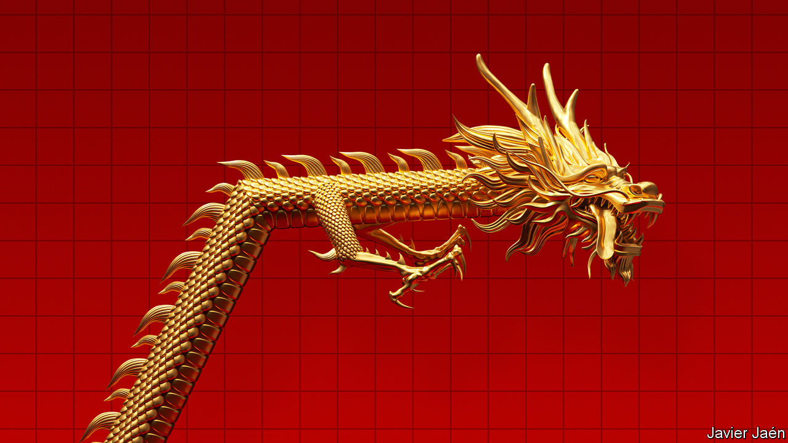

###### China and the world

# Is Chinese power about to peak? 

##### The country’s historic ascent is levelling off. That need not make it more dangerous 

 

> May 11th 2023 

The rise of China has been a defining feature of the world for the past four decades. Since the country began to open up and reform its economy in 1978, its GDP has grown by a dizzying 9% a year, on average. That has allowed a staggering 800m Chinese citizens to escape from poverty. Today China accounts for almost a fifth of global output. The sheer size of its market and manufacturing base has reshaped the global economy. , who has ruled China for the past decade, hopes to use his country’s increasing heft to reshape the geopolitical order, too.

There is just one catch: China’s rapid rise is slowing down. Mr Xi promises a “great rejuvenation” of his country in the coming decades, but the economy is now undergoing something more prosaic: a great maturation. Whereas a decade ago forecasters predicted that China’s GDP would zoom past America’s during the mid-21st century (at market exchange rates) and retain a commanding lead, now a much less dramatic shift is in the offing, resulting in something closer to economic parity.

This change in economic trajectory is the subject of fierce debate among China-watchers (see our special ). They are thinking again about  and its rivalry with America. One view is that Chinese power will fall relative to that of its rivals, which could paradoxically make it more dangerous. In a book last year, Hal Brands and Michael Beckley, two scholars, popularised a theory they called “Peak China”. The country faces decay, they argue, and has reached “the point where it is strong enough to aggressively disrupt the existing order but is losing confidence that time is on its side”. Their study opens with an imagined war over Taiwan.


The Peak China thesis rests on the accurate observation that certain tailwinds are turning to headwinds, hindering Chinese progress. The first big gust comes from . China’s working-age population has been declining for about a decade. Last year its population as a whole peaked, and India has now overtaken it. The Communist Party’s attempts to convince Chinese couples to have more children are not working. As a result, the UN thinks that by mid-century China’s working-age population could decline by over a quarter. Wave goodbye to the masses of young workers who once filled “the world’s factory”.

Adding workers is one way for an economy to grow. Another is to make better use of the existing population. But China’s second problem is that output per worker is unlikely to rise as fast as forecasters once hoped. More of its resources will go to caring for the elderly. After decades of building houses, roads and railways, spending on infrastructure faces diminishing returns. Mr Xi’s autocratic tendencies have made local entrepreneurs more nervous, which may reduce China’s capacity to innovate in the long run. Geopolitical tensions have made foreign firms eager to diversify supply chains away from China. America wants to hobble China’s capabilities in some “foundational” technologies. Its ban on exporting certain semiconductors and machines to Chinese firms is expected to cut into China’s GDP.

All of this is dampening long-run forecasts of China’s economic potential. Twelve years ago Goldman Sachs thought China’s GDP would overtake America’s in 2026 and become over 50% larger by mid-century. Last year it revised that prediction, saying China would surpass America only in 2035 and peak at less than 15% bigger. Others are more gloomy. Capital Economics, a research firm, argues that the country’s economy will never become top dog, instead peaking at 90% of America’s size in 2035. These forecasts are, of course, uncertain. But the most plausible ones seem to agree that China and America will approach economic parity in the next decade or so—and remain locked in this position for decades to come. 


How might China handle this flatter trajectory? In the most optimistic scenario, Mr Xi would make changes to boost productivity growth. With income per person less than half of America’s, China’s population will be keen to improve their living standards. He could try to unleash growth by giving the animal spirits of China’s economy freer rein and his people more freedom of movement. The Chinese government could stop relying on wasteful state-owned banks and enterprises to allocate capital. And it could adopt a less prickly posture abroad, easing geopolitical tensions and reassuring firms that it is safe to do business in China. Such reforms might ultimately make China more powerful—but also, one would hope, less aggressive. The trouble is that Mr Xi, who is 69 and now probably China’s ruler for life, shows no sign of embracing economic or political liberalisation. 

Pessimists fear that China will become more combative as its economic trajectory falters. There are plenty of reasons to think this plausible. Mr Xi stokes a dangerous nationalism, to persuade ordinary Chinese that critics of his rule are slighting China itself. China’s  is forecast to rise by over 7% this year, in line with nominal gdp. Its military spending is lower than America’s, but still catching up. Its navy could be 50% bigger than America’s by 2030, and its nuclear arsenal will almost quadruple by 2035. “Beijing’s economic power may be peaking, but no other country is so capable of challenging America globally,” write Messrs Brands and Beckley.

Peer review 

Yet the most likely scenario is in the middle ground. The speed of China’s rise in the past two decades has been destabilising, forcing adjustments in the global economic and geopolitical order. That phase of intense economic disruption may now be over. And for all its troubles China’s economy is unlikely to shrink, triggering the kind of nihilistic and destructive thinking that Messrs Brands and Beckley fear. Mr Xi is unpredictable but his country’s long-run economic prospect is neither triumph nor disaster. Faced with decades of being a near-peer of America, China has good reason to eschew hubris and resist invading Taiwan. A crucial question is whether the superpowers can avoid misreading each other’s intentions, and thus stumbling into a conflict. Next week we will examine America’s global leadership—and how it should respond to China in the coming age of superpower parity. ■


