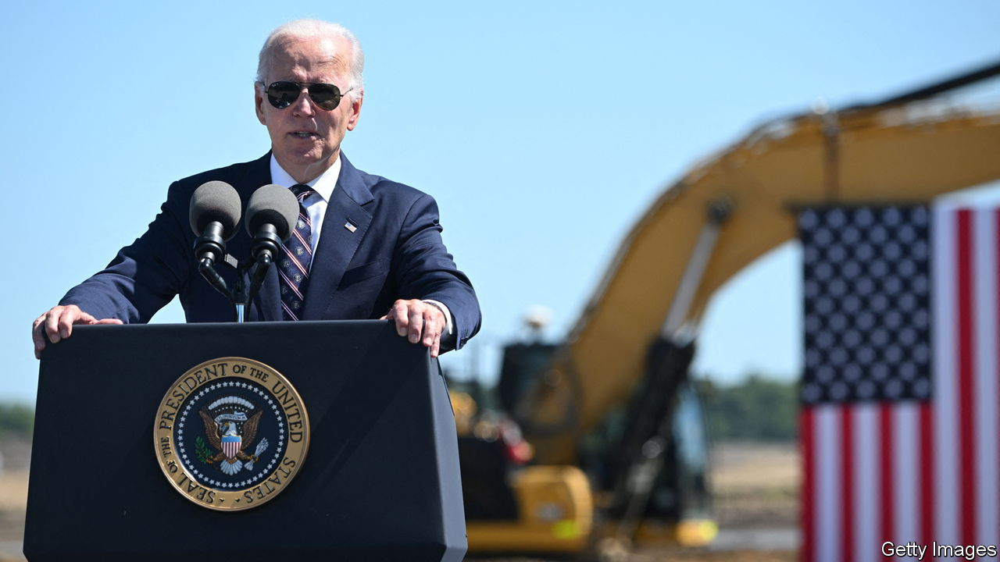
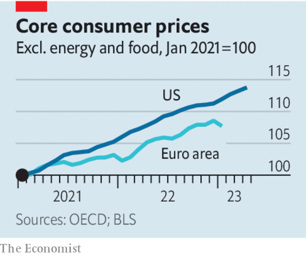

###### A bad balance

# Joe Biden is more responsible for high inflation than for abundant jobs 

##### The main effect of the president’s economic policies has been to boost prices 

 

> May 11th 2023 

The way Joe Biden tells it, the only part of his  that really matters is jobs. America’s roaring labour market beat expectations again in April. The unemployment rate is lower than in any year since 1969. The share of 15- to 64-year-olds in employment has surpassed its pre-pandemic peak, which was itself the highest seen since 2007. Mr Biden likes to tell people that his presidency, which began in the midst of a rapid recovery from covid lockdowns, has coincided with more monthly job creation, on average, than any other in history. Provided America avoids a , and the associated halt to federal spending and probable lay-offs, the booming labour market looks like a ticket to re-election in 2024.

Unfortunately for , however, another part of his record tells a less flattering story. High inflation continues to imperil the economy and vex voters. And placing his record in a global context reveals that he is more responsible for surging prices than he is for abundant jobs. 

 


Mr Biden is right that America’s post-covid jobs recovery has been exceptional by historical standards. After the global financial crisis it took 13 years, by some measures, for the labour market to regain its health. This time it has taken little more than three years. The White House attributes surging employment to the $1.9trn “rescue plan” Mr Biden unleashed shortly after taking office in 2021. It contributed nearly a third of America’s total pandemic-related fiscal stimulus, which was worth an astonishing 26% of GDP, more than twice the average in the rich world. 

If the Biden stimulus had been responsible for the jobs boom, though, you would expect America’s labour market to be stronger than those of its peers. But in Canada, France, Germany and Italy working-age employment rates surpassed pre-pandemic highs by the end of 2021; Japan followed in 2022. Among the g7 group of economies America has beaten to a full recovery only Brexit-blighted Britain, where the employment rate is still lower than it was at the end of 2019. 

That employment bounced back in most places suggests that America’s jobs recovery had more to do with the unusual nature of the pandemic recession, brought about by lockdowns and social distancing, than with Mr Biden’s gargantuan stimulus. The extra public spending surely boosted demand for workers, but what followed was a historic surge in job vacancies and worker shortages as the economy overheated. Actual employment would almost certainly have shot up anyway. By the time Mr Biden came to office the jobs recovery was already two-thirds complete, having defied economists’ gloomy predictions. 

Mr Biden’s stimulus did, however, put a rocket under inflation. In April “core” consumer prices, which exclude energy and food, were 13.4% higher than when he came to office. They have risen more than in other g7 countries, and their acceleration coincided with the introduction of Mr Biden’s stimulus. Research suggests that, even by September 2022, the largesse was pushing up core inflation by about four percentage points.

The White House is not solely responsible for inflation: the  failed to raise interest rates in time to offset the fiscal stimulus, and the energy crisis that followed Russia’s invasion of Ukraine made a bad problem worse. But it was Mr Biden who lit the inflationary touch-paper—and whose signature policies are probably still boosting prices. It is now clear that the Inflation Reduction Act, which was supposed to cool the economy by shrinking deficits, will in fact widen them, owing to the higher-than-forecast take-up of its clean-energy tax credits. 

Where America’s recent record looks exceptionally good is growth. The IMF forecasts that its GDP per person will this year be 4.6% larger than in 2019, easily the biggest increase among the g7 economies. Sadly for Mr Biden, though, this has little to do with him. The outperformance reflects better growth in productivity, not a faster employment rebound. America exports more energy than it imports, meaning in aggregate it benefited from surging fuel prices. And its pandemic spending from 2020 onwards focused more on supporting incomes than preserving jobs, resulting in a faster reallocation of workers around the economy than in Europe, which relied on subsidised furlough schemes. Both factors predate Mr Biden’s presidency. 

Voters seem to sense that the main effect of the president’s economic policies to date has been to worsen inflation. Polls show that far more Americans think Donald Trump, Mr Biden’s predecessor and probable opponent in 2024, did a better job than Mr Biden of handling the economy, than the reverse. The longer inflation persists, the more likely it becomes that the Fed keeps rates high enough to tip America into recession—perhaps around the time of the election. Mr Biden’s largesse could go down as the mistake that let Mr Trump back into office. ■


