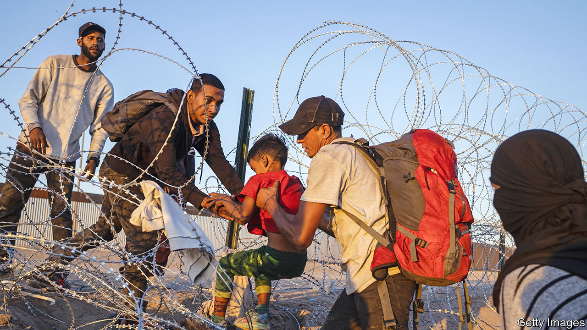

###### Border trouble

# Small, sensible steps could help ease America’s border woes 

##### The art of the practical in dealing with migrants, drugs and gangs 

 

> May 11th 2023 

A TRIPLE TRAGEDY is playing out on either side of the border between the United States and Mexico. The most visible element is a migration crisis, brought to a head by the end of a pandemic-era provision called Title 42, which has allowed the rapid expulsion of migrants on public-health grounds. Officials have been bracing themselves for  on May 11th: some expect 13,000 people a day to seek asylum in America. 

Regulating the flow of migrants is hard enough. Stopping the flow of drugs across the border is . Fentanyl, a synthetic opioid, is 50 times more potent than heroin and produced in vast quantities in Mexico. It is also especially deadly, killing more people in a year than the total of Americans who died fighting wars in Korea, Vietnam, Iraq and Afghanistan. All told, drug overdoses have now claimed 1m American lives since 1999. The third tragedy is in Mexico, where a proliferating number of  are fighting over the profits from trafficking drugs, people and guns—and have grown powerful enough to subvert local government and muscle their way into other businesses. 

None of these problems has a simple solution. The supply chains for fentanyl, for example, stretch to China (for the precursor chemicals) and are quick to adapt to any disruption. America has been waging a war on drugs for half a century, with negligible success and much collateral damage. Cross-border collaboration might help, but relations between America and Mexico are touchy and likely to grow touchier as both countries gear up for presidential elections next year. Some Republicans are recklessly and provocatively calling for America to send troops to Mexico to crush the gangs, (unleashing “the fury and might of the US”, as Senator Lindsey Graham put it), with or without Mexico’s consent. Mexico’s populist president, Andrés Manuel López Obrador, has denied that fentanyl is being produced in his country, and blames his northern neighbour for the social ills that fuel demand for the drug.

On migration, the Biden administration has groped its way to a policy that moves in the right direction: beefing up border forces, expanding legal avenues for asylum-seekers and vowing to deport illicit border-crossers swiftly. Republicans give him no credit, caricaturing him instead as letting illegal immigrants bearing fentanyl flood into the country. Ron DeSantis, the Florida governor and a likely presidential candidate, is said to be preparing further headline-grabbing displays in which migrants are transported to Democrat-run states.

Political polarisation for now rules out bold reforms on drugs or immigration (nothing will get through Congress). But in the meantime many smaller practical steps are possible. To reduce the harm caused by opioids, the government could expand access to treatments for addiction. It could also make test strips for fentanyl widely available (instead of treating them as illegal drug paraphernalia), so that people know when they are about to take (and perhaps overdose on) the lethal substance.

To relieve pressure on the border, it would help if more jobseekers were allowed in legally. America’s whole immigration system is clogged up, with would-be migrants and employers sometimes waiting years for a decision. A new report from the Cato Institute, a think-tank in Washington, lists a raft of reforms that could reduce a backlog of 20m applications with little money and no new legislation: from reducing duplication between agencies to eliminating unnecessary requests for evidence to extending the length of visas. If the system were more streamlined, employers would be able to fill vacancies more quickly and fewer people would feel they had no choice but to try their luck with people-smugglers or speculative asylum claims. Mr Biden cannot solve the problems on America’s southern border; but he could ease them a little if he pushed harder. ■

