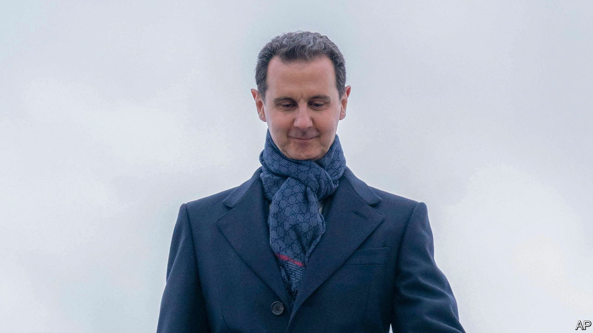

###### The outcast returns

# The rehabilitation of Syria’s dictator raises awkward questions for the West 

##### Clearer principles about how and when to ease sanctions are needed 

 

> May 11th 2023 

The Arab League’s annual summit is not a hot ticket. Yet Bashar al-Assad must be delighted with his invitation to join it in Saudi Arabia this month. Syria’s president has been ostracised by most of the world since 2011, when his repression of his people sparked one of the 21st century’s most savage civil wars. Now, as we report, he has won the conflict, and his neighbours—and some in the West—are weighing whether to . The dilemma over Syria is acute and found elsewhere, from Afghanistan to Zimbabwe. Should governments continue to isolate pariah states long after it is clear that sanctions will not induce political change? 

Make no mistake,  is a war criminal. Over 300,000 civilians have been killed since 2011, 1.4% of Syria’s pre-war population of 22m. He has relied on terror, barrel bombs, Wagner mercenaries and Iranian-backed militias to stay in power. Cities have been reduced to rubble. Some 6m citizens have been displaced inside Syria; a similar number have fled from the country. He sits atop a mafia economy. Before the war 50 Syrian pounds were worth one dollar; now the rate is around 8,700. 

Having once opposed Mr Assad and even funded his enemies, Sunni Arab countries are changing tack. Their logic is that he is here to stay. They are also keen that millions of Syrian refugees return home, especially after an earthquake in February swelled their ranks. Saudi Arabia’s recent detente with Iran may mean Syria is no longer a flashpoint in a bigger conflict between two of the Middle East’s most powerful states. And if left isolated, Mr Assad’s regime can be a menace. It funds itself by drug-peddling: , an amphetamine, is Syria’s largest export.

For the West the downside of lifting sanctions on Mr Assad is obvious. He would feel vindicated and the deterrent effect of sanctions on other regimes, including , might be eroded. Yet the prospect of Syria indefinitely remaining a failed state and humanitarian catastrophe is not enticing either. If Egypt, Saudi Arabia and the United Arab Emirates (uae) trade with Syria, America will face the prospect of having to impose sanctions on its allies to try to keep the embargo on Syria watertight. 

So Syria is a test case. As America and Europe have grown reluctant to use military force abroad, they have made more use of economic coercion. America has imposed sanctions on some 10,000 individuals and on companies in 50 countries, which together account for 27% of global gdp. It has placed tight embargoes on some states, from Cuba to Myanmar. In a growing number of cases other countries are ignoring the West and starting to engage with pariah regimes. China’s foreign minister has just held talks with the Taliban. A conference of Latin American countries last month discussed re-recognising Venezuela’s dictatorial regime as legitimate. Some Western diplomats in Zimbabwe whisper that it might be better to lift sanctions to revive its wretched economy and help its hapless people.

In response America and Europe should think about sanctions more flexibly. Three principles should apply. First, personal sanctions on despots—in this case Mr Assad and his cronies—should remain in place. Second, humanitarian carve-outs should permit a broader range of activities, from fixing utilities to rebuilding schools, that might help alleviate civilian suffering. The uae is eager to build a solar-power plant in Syria that would help restore electricity, but is hesitating because it fears being punished for violating sanctions. 

Finally, any rollback of sanctions beyond this must be contingent on serious changes in behaviour that fall short of regime change. In Syria’s case that would mean the government stopping drug-dealing and allowing refugees to return. For Russia, at some point in the future, a partial unwinding of sanctions might depend on its giving back Ukrainian territory; Iran would need to take steps to curb its nuclear programme. 

A decade ago many policymakers saw sanctions as a cheaper, safer alternative to war, allowing the economically dominant West to cripple hostile regimes without firing a shot. They were far too optimistic, as Syria shows. But that does not mean that sanctions are useless. They should be thought of as a dial that can be turned up and down over time. They cannot depose despots such as Mr Assad, but they can perhaps give them incentives to behave slightly less badly. For the people who suffer under rogue regimes, even small mercies are worth grasping. ■

