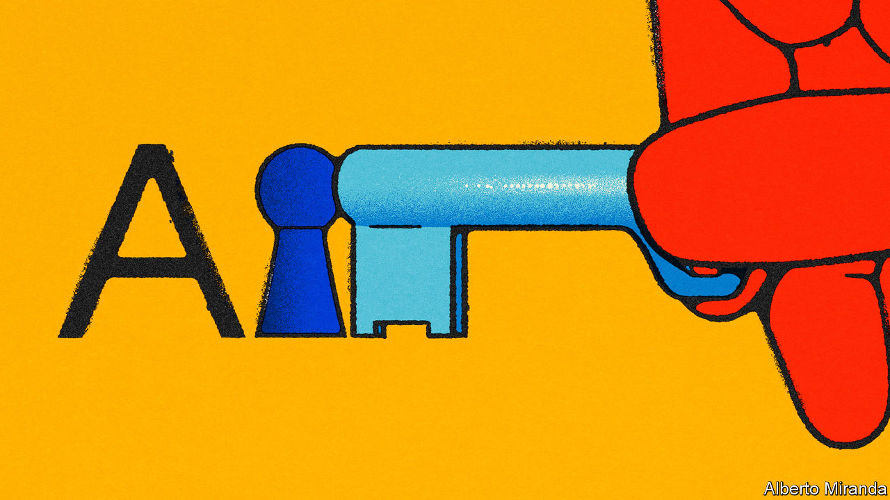

###### A stochastic parrot in every pot

# What does a leaked Google memo reveal about the future of AI? 

##### Open-source AI is booming. That makes it less likely that a handful of firms will control the technology 

 

> May 11th 2023 

THEY HAVE changed the world by writing software. But techy types are also known for composing lengthy memos in prose, the most famous of which have marked turning points in computing. Think of Bill Gates’s “Internet tidal wave” memo of 1995, which reoriented Microsoft towards the web; or Jeff Bezos’s “API mandate” memo of 2002, which opened up Amazon’s digital infrastructure, paving the way for modern cloud computing. Now techies are abuzz about another memo, this time leaked from within Google, titled “We have no moat”. Its unknown author details the astonishing progress being made in —and challenges some long-held assumptions about the balance of power in this fast-moving industry.

AI burst into the public consciousness with the launch in late 2022 of , a chatbot powered by a “large language model” (LLM) made by OpenAI, a startup closely linked to Microsoft. Its success prompted Google and other tech firms to release their own LLM-powered . Such systems can generate text and hold realistic conversations because they have been trained using trillions of words taken from the internet. Training a large LLM takes months and costs tens of millions of dollars. This led to concerns that AI would be dominated by a few deep-pocketed firms.

But that assumption is wrong, says the Google memo. It notes that researchers in the open-source community, using free, online resources, are now achieving results comparable to the biggest proprietary models. It turns out that LLMs can be “fine-tuned” using a technique called low-rank adaptation, or LoRa. This allows an existing LLM to be optimised for a particular task far more quickly and cheaply than training an LLM from scratch. 

Activity in open-source AI exploded in March, when LLaMa, a model created by Meta, Facebook’s parent, was leaked online. Although it is smaller than the largest LLMs (its smallest version has 7bn parameters, compared with 540bn for Google’s PaLM) it was quickly fine-tuned to produce results comparable to the original version of ChatGPT on some tasks. As open-source researchers built on each other’s work with LLaMa, “a tremendous outpouring of innovation followed,” the memo’s author writes. 

This could have seismic implications for the industry’s future. “The barrier to entry for training and experimentation has dropped from the total output of a major research organisation to one person, an evening, and a beefy laptop,” the Google memo claims. An LLM can now be fine-tuned for $100 in a few hours. With its fast-moving, collaborative and low-cost model, “open-source has some significant advantages that we cannot replicate.” Hence the memo’s title: this may mean Google has no defensive “moat” against open-source competitors. Nor, for that matter, does .

Not everyone agrees with this thesis. It is true that the internet runs on open-source software. But people use paid-for, proprietary software, from Adobe Photoshop to Microsoft Windows, as well. AI may find a similar balance. Moreover, benchmarking AI systems is notoriously hard. Yet even if the memo is partly right, the implication is that access to AI technology will be far more democratised than seemed possible even a year ago. Powerful LLMs can be run on a laptop; anyone who wants to can now fine-tune their own AI. 

This has both positive and negative implications. On the plus side, it makes monopolistic control of AI by a handful of companies far less likely. It will make access to AI much cheaper, accelerate innovation across the field and make it easier for researchers to analyse the behaviour of AI systems (their access to proprietary models was limited), boosting transparency and safety. But easier access to AI also means bad actors will be able to fine-tune systems for nefarious purposes, such as generating disinformation. It means Western attempts to prevent hostile regimes from gaining access to powerful AI technology will fail. And it makes AI harder to regulate, because the genie is out of the bottle.

Whether Google and its ilk really have lost their moat in AI will soon become apparent. But as with those previous memos, this feels like another turning point for computing. ■

