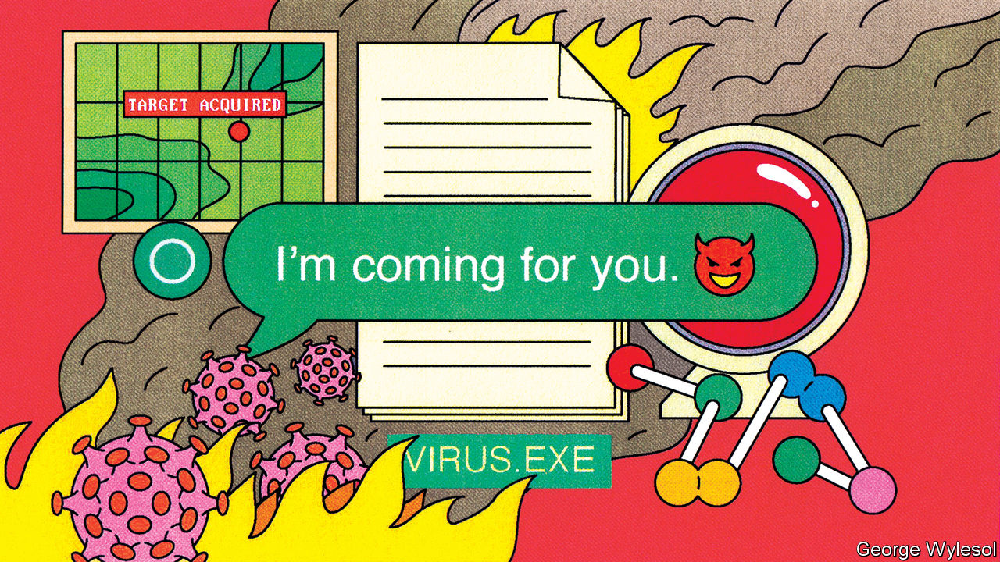

###### On non-aligned countries and Ukraine, Israel, Turkey, artificial intelligence

# Letters to the editor 

##### A selection of correspondence 

 

> May 11th 2023 


Subtle support for Ukraine

“” (April 15th) highlighted how the 25 non-aligned “transactional” countries you listed are using diplomacy, trade and investment to play more diverse global roles. Yet the behaviour of the T25 also has some commonality with other parts of the world. You say that they have “sat on the fence” on the Ukraine war. It is true that this group has not sanctioned Russia or supplied military equipment to Ukraine. They have no record of ever imposing sanctions except when mandated by the UN. However, 19 out of the T25 supported the UN General Assembly resolution of February 23rd 2023 calling on Russia to withdraw from Ukraine. The other six abstained. None voted with Russia. A month later the G20 drafted a statement in similar terms and the Indian foreign minister said that all but Russia and China were ready to support it. And no G20 or T25 country, including China and India, has recognised the Russian annexation of Crimea. 

Paul Hare

Boston University

 


America and Israel

America’s partnership with Israel has not always run smoothly (, April 29th). Although Harry Truman did recognise the new state of Israel his administration slapped an arms embargo on it, even prosecuting Americans who broke the ban. Only communist Czechoslovakia was willing to arm Israel. Dwight Eisenhower openly sided with Egypt during the Suez crisis and threatened Israel with UN sanctions. Eventually an ineffective UN peacekeeping force and worthless promises allowed Israel to save face, but the lack of security led directly to another war a decade later. It was John Kennedy who sent American weapons to Israel for the first time. Support for Israel is broad and bipartisan, but it has not always been so.

Charles Hall


 


The Turkish election

 did not surprise us in its misguided attempt to tell Turkish voters how they should act (“”, May 6th). Türkiye is a democratic country that has a long-standing tradition of holding free and fair elections, where governments have been elected into office by popular vote. Trying to belittle and smear the democratic choice of the people, and attempting to lecture them from afar on what they “should” do comes off as presumptuous to say the least.

Although your coverage dismissed the contributions Türkiye made to global and regional security and welfare for decades, my country will continue to be a provider of peace in a volatile region. We deem this a responsibility to our history and people.

Osman Koray Ertaş

Turkish ambassador


 


Don’t regulate AI now

Your recent coverage on artificial intelligence was inspired, though your argument for regulating AI boiled down to comparing the technology to cars, planes and medicines (“”, April 22nd). This is not a good analogy. Regulating AI is more like regulating physics or mechanical engineering, in other words it makes no sense. Specific applications of AI can be and are regulated, such as in self-driving cars. Many regulations assume human biases that are not present in AI (see chapter 21 of Daniel Kahneman’s “Thinking Fast and Slow”). The question is then whether these products should be regulated differently when AI is involved. 

If AI gives rise to entirely new products then they should be regulated as such, if needed, but it would be quite premature to try to do so now. Regulating a nascent industry like AI opens the door to all sorts of noxious political and special-group interference. Imagine if the same had happened to the internet. The EU’s “regulate first, ask questions later” approach is damaging to both consumers and the European tech industry. Kudos to Britain and America for being more sensible so far.

Pedro Domingos

Professor emeritus, computer science and engineering

University of Washington


In order to endanger civilisation a super-powered AI would merely need access to money and unsavoury information. It would readily find both of these on the internet. The existence of cryptocurrencies makes the first part easier. A capable AI with access to funds would be able to avail itself of a vast array of professional services used by the very wealthy to hide their identities. It would thereby be able to conduct legitimate business dealings, and also be able to procure illegitimate services (such as contract killings) on the dark net.

The problem is that an AI doesn’t necessarily even need to be “sentient” to do these things. A complex enough “model” that uses the internet as training data may inadvertently “teach” an AI not only that crime pays, but also how to do it. Now imagine what such a system could accomplish under the direction of a malicious human operator. If we can’t stop a 21-year-old from leaking top-secret documents, how would we stop a disgruntled employee from repurposing a powerful AI for crime?

In China the unpredictability of complex AI models causes the government to worry that such a model might also “learn” that democracy results in better outcomes for people, and how to circumvent authoritarian controls.

Michael Franz

Professor of computer science

University of California, Irvine

We share your assessment that Britain’s “light-touch” approach to regulating AI is unlikely to establish the necessary guardrails to make it safe and reliable. In our comprehensive survey of national AI policies and practices, the Artificial Intelligence and Democratic Values index, we found that countries favour greater regulation as they develop a deeper understanding of the uses of AI. This is true not only in the EU and China, but also in America, where Joe Biden has recently stated that companies should not release commercial AI products that are not safe. The White House has called for an AI bill of rights, and federal agencies, including the Federal Trade Commission, have issued a joint declaration on enforcement efforts against discrimination and bias in automated systems. Chuck Schumer, the leader of the Senate, has made AI a legislative priority.

As for the principles-based approach you propose, one possibility is the Universal Guidelines for Artificial Intelligence, a foundational framework for AI policy that outlines rights and responsibilities for the development and deployment of AI systems to maximise the benefits and minimise the risks. 

Merve Hickok

President

Lorraine Kisselburgh

Chair

Marc Rotenberg

Executive director

Centre for AI and Digital Policy

 

Although I was pleased to see so much attention dedicated to the enormous potential of AI, it was disappointing to see Britain’s plan for regulating this technology described as “light touch”. This seems to imply that we are avoiding regulation, and that is not the case.

Our AI regulation white paper sets out an adaptable, proportionate regulatory framework, underpinned by principles that our expert regulators would apply to ensure good, responsible use of this technology. We are actively seeking feedback as we develop these plans. We want to get the right balance between mitigating risk and driving innovation.

AI presents colossal opportunities, from medical breakthroughs to powering the technology behind self-driving cars. This is an industry that already employs over 50,000 people and contributed £3.7bn ($4.7bn) to the British economy last year. The government has specifically earmarked AI as one of the five critical technologies that could drive job creation and economic growth and transform people’s quality of life. 

We have to seize this moment, and we have already started by committing £100m to creating a Foundation Model Task Force, to unlock opportunities for safe and responsible innovation in future AI tech. 

VISCOUNT CAMROSE

Minister for AI and intellectual property

Department for Science, Innovation and Technology


 


You did a fine job outlining the risks and general ethical concerns associated with large language models (“”, April 22nd). However, the new wave of generative AI is unique for its potential to enable manipulative influence at scale. The problem with that goes much deeper than easing the spread of misleading or false information. Effective influence is a prized goal, for nefarious and benevolent actors alike, such as governments, corporations, or alleged Nigerian princes in dire straits. 

To influence effectively you need to understand what makes people tick and then tailor your approach. What makes generative AI unique is that it removes the bottleneck of having to create the tailored influence yourself. Highly persuasive messages, images, and videos are available at the click of a button. Such persuasive influence easily degenerates into manipulation when it does not contribute to understanding and successful inquiry. 

It is a welcome sign that institutions like the EU ponder plans to explicitly outlaw manipulation by AI. For that regulation to have a bite, however, more attention must be paid to the question of how to avoid manipulation and design for influence that aids understanding. Otherwise, I worry that before a “stochastic parrot” can obtain superhuman intelligence, it will do much harm by amplifying (wittingly or unwittingly) manipulation at scale. Although we are not being turned into paper clips just yet, we must ask both quotidian and quintessentially humane questions of how generative AI can contribute to good, meaningful influence. 

Dr Michael Klenk

Assistant professor of philosophy and ethics of technology

Delft University of Technology


If an AI can be “poisoned” to not recognise an apple, or act in a nefarious way, then surely it can also be poisoned into preventing an extinction event with the injection of the right data. Google is ahead of the game in this respect, releasing its killer-robots.txt Easter egg a decade before the rest of us started worrying about AI.

Nick Wills-Johnson


 


Mirror image

Bartleby missed the most important rule of videoconferencing (April 15th). If you wear glasses, you should not surf other web sites during the meeting. The reflection from the monitor in your spectacles will inform the entire group that your attention is elsewhere.

Charles Rosenblatt


