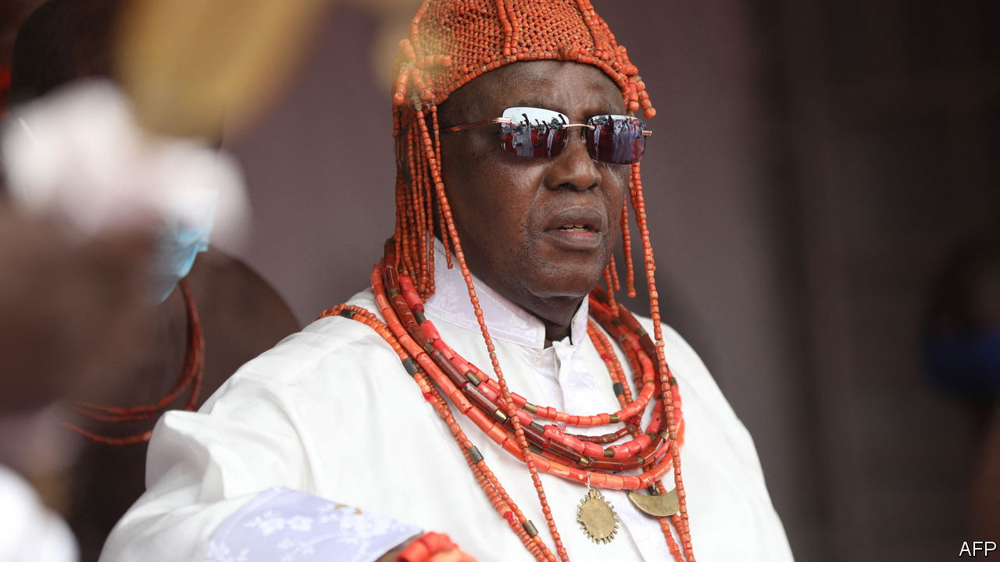

###### Oba v Obaseki

# A ruling over ownership of the Benin bronzes may delay their return 

##### Should Nigeria’s art treasures belong to the nation or the royal Oba? 

 

> May 11th 2023 

THE SACKING of Benin City by a heavily armed expeditionary force in February 1897 was said to be an act of revenge in a bitter trade dispute between Britain and the Kingdom of Benin, east of Lagos. Over the course of a fortnight, the city was burned to the ground. Its royal ruler, the Oba, was eventually imprisoned and the magnificent collection of plaques and statues made from brass, wood and ivory was ripped from the walls of his palace and sold to museums and private collectors in Britain, Europe and America.

The dispersal of the Benin bronzes around the world did much to cement their historical and aesthetic reputation as some of the finest artworks ever made in Africa. But views about how they were acquired have changed. The destruction of Benin City has come to be seen as one of the low points of British imperialism, the looting of its sculptures as indefensible. 

The case for their return is so morally clear that it has been widely taken up by those arguing for the restitution of artworks seized during the colonial period. A concerted campaign by artists, activists and curators has begun to yield results. In the past two years museums in America, Britain, France and Germany, as well as at least three universities, have all signed pledges to return their Benin bronzes to Nigeria’s National Commission for Museums and Monuments (NCMM). 

Those efforts are now being turned upside down—by the Nigerian government. President Muhammadu Buhari, who leaves office this month, recently announced that returned bronzes will not be handed to the NCMM, but to the current Oba, Ewuare II (pictured), “as the original owner and custodian of the culture, heritage and tradition of the people of Benin Kingdom”. Ewuare II is the great-great-grandson of Oba Ovonramwen Nogbaisi, from whom the bronzes were first seized. 

The announcement caught the NCMM completely by surprise, as it did many of its museum partners in Britain and Europe, which now fear the returned pieces will end up in a private collection rather than being put on public display, as promised. Last year the German government signed an agreement with the NCMM to return 1,100 artefacts from museums including those in Berlin, Cologne, Hamburg, Leipzig and Stuttgart. “What politicians thought of as the return of cultural heritage to the Nigerian ‘nation’ has instead turned into a present to a single royal family,” Brigitta Hauser-Schäublin of Göttingen University wrote in the  this month. A meeting between officials from the NCMM and the Museum of Archaeology and Anthropology in Cambridge to transfer ownership of 116 objects in the museum’s collection (and hand over the first dozen pieces) has been postponed.

Museum-watchers see Mr Buhari’s decision to favour the Oba over Nigeria’s own federal museum authorities as the latest move in a power play between the Oba and Godwin Obaseki, the governor of Edo State, of which Benin City is the capital. Mr Obaseki wants all restituted bronzes to be put on display in a new museum he is planning, the Edo Museum of West African Arts (EMOWAA). This is to be designed by Sir David Adjaye, a celebrated British-Ghanaian architect. A storage facility and study facility are already under construction. 

Yet some Nigerians fret over the federal government’s poor record as custodian. In 1973 Nigeria’s military dictator gave a rare bronze head—which was looted by the British in 1897, then returned to the National Museum of Nigeria after the second world war—to Queen Elizabeth. It is now in the Grand Vestibule at Windsor Castle. 

The Oba, who is the Edo people’s traditional ruler and keeper of the Edo culture, wants to house all the bronzes in his palace. Mr Obaseki, who ends his second and final term in office in 2024, does not have long to assert his authority. He will need to lengthen his stride if his view has any chance of prevailing. ■

