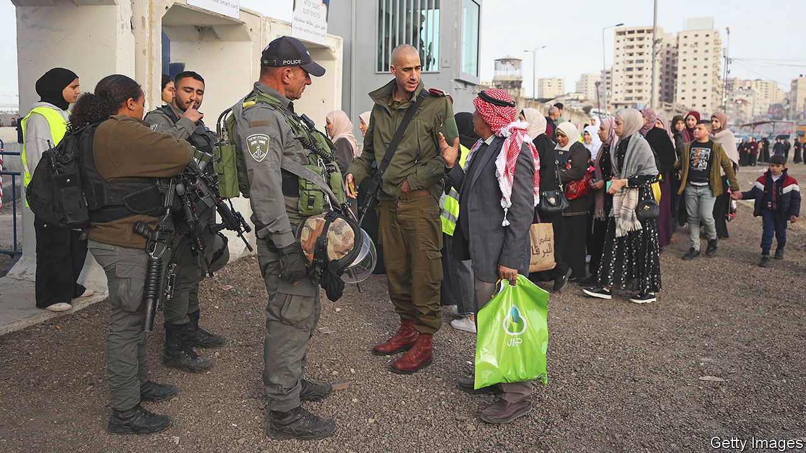
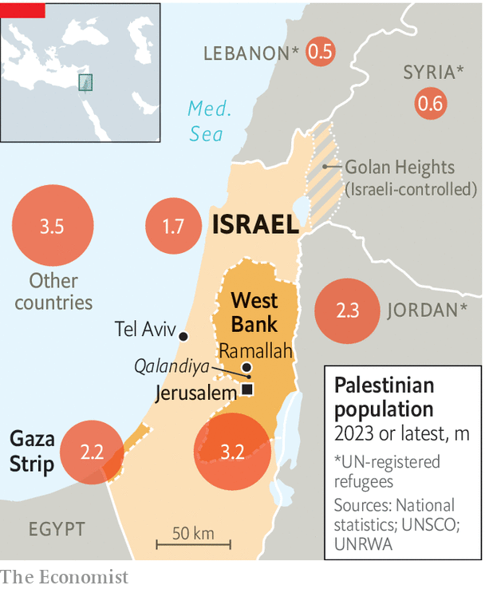

###### The hapless, stateless Palestinians

# The Palestinians need new leaders 

##### But few believe that Israel will ever let them have a state of their own 

 

> May 11th 2023 

Few experiences are more humiliating for Palestinians than plodding through the Israeli checkpoint at Qalandiya, where the West Bank’s administrative headquarters at Ramallah are separated from the Palestinians’ would-be capital in east Jerusalem. Young Israeli conscripts bark orders at middle-aged labourers queuing to cross. Meanwhile the Palestinian workers can hear the roar of Israeli commuters who live in settlements on nearby Palestinian land zooming along a four-lane motorway barred to Palestinians, en route to jobs in Tel Aviv. “The humiliation is a tax I have to pay to feed my six children,” says a day labourer trudging to work in Israel.

Seventy-five years after the UN voted to divide Palestine into an Arab and a Jewish state, Palestinians are still waiting for one. While Israelis celebrate May 14th 1948 as their day of independence, Palestinians mourn their , or catastrophe, when some 700,000 of them were forced from their homes or just fled.

 


Israel now rules over 7m Palestinians, including those in Israel and in the West Bank and the Gaza Strip, which are internationally regarded as the basis of an independent Palestinian state. Another 7m are strewn across the Arab world and beyond, about half registered as refugees (see map). Palestinians are a slight overall majority in the territories controlled by Israel and in Israel proper. But they are divided over how to build a future.

At times statehood has beckoned. In 1993 Israel and the Palestinian Liberation Organisation (PLO), the Palestinians’ representative body, signed the Oslo accords that provided for Palestinian self-rule in Gaza and the West Bank under a Palestinian National Authority (PA) and an end to Israel’s occupation within five years. It never happened. Israel withdrew its forces and settlers from Gaza in 2005 but since 1993 it has more than quadrupled the tally of Jewish settlers in the West Bank to over half a million, excluding East Jerusalem.

Meanwhile the PA has rotted. Hamas, an armed Palestinian Islamist movement, won a general election in 2005 and set up a separate administration in Gaza, leaving an enfeebled PA to run bits of the West Bank. Jewish settlers there, including Bezalel Smotrich, the finance minister, have become a menacing power behind Binyamin Netanyahu’s coalition government. 

It has withheld tax revenues that fund the PA. Foreign donors, discouraged by corruption within the PA, have cut aid. America’s Congress, viewing the PA as an instrument of terrorism, have long been loth to fund it. The West Bank’s 3.2m Palestinians, by contrast, resent the PA for seeming to acquiesce in Israel’s occupation.

The PA’s ailing 87-year-old president, Mahmoud Abbas, and his Fatah party have stifled democracy. Nineteen years into a five-year term, he has repeatedly postponed elections. In 2007 he closed down the parliament. In 2018 he dissolved it.

A recent opinion poll said 77% of Palestinians wanted him to resign; four-fifths consider his regime corrupt. The West Bank’s economy has festered. Frustration is rising. A new , or uprising, could erupt. Last year’s West Bank death toll from violence was the highest since the end of the previous deadly in 2004. This year’s rate so far has been higher.

Gaza is more hopeless still. “It’s practically a separate state,” says a former head of Israeli intelligence, Tamir Hayman. Israel controls its borders, sea and air space so its 2.2m people feel besieged, as if in an open-air prison. Income per person is less than a third that of the West Bank. Hamas rules with a heavy hand, by decree. It is officially wedded to armed struggle but, since Israel has smashed it whenever it fires too many rockets into the Jewish state, it has practised a measure of restraint.

It repeatedly negotiates ceasefires with Israel, including one earlier this month after Islamic Jihad, another armed Islamist faction, fired scores of rockets and mortars to protest against the death of a Palestinian hunger-striker in an Israeli jail. In the past few days Israel’s air force has hit Islamic Jihad targets, killing at least 25 Palestinians. Hamas has been under local pressure to respond but knows that that would provoke an even fiercer, lethal Israeli response.

So despair overwhelms Gaza and the West Bank. With no prospect of negotiations and foreign mediation, over 40% of Palestinians favour violence against Israel, according to a poll conducted by Zimam, a Palestinian ngo in Ramallah, and funded by the eu. Nearly 40% say they dislike the main Palestinian parties. Over 70% have lost hope in a two-state solution, with Israel and Palestine co-existing side by side.

Palestinian support for a two-state deal is highest among Israel’s 1.7m Arab citizens. Their income of $36,500 a head (measured in 2019) is eight times what Palestinian West Bankers earn and 30 times that of Gazans, at the last count. Alone among Palestinians under Israel’s control, they can vote and carry the same passports as Jewish Israelis. An Arab-Israeli party was part of Israel’s previous coalition government. 

But the rise of Israel’s far right horrifies Arabs on both sides of Israel’s security barrier (in large stretches it is a six-metre-high concrete wall). Mr Smotrich says there is “no such thing as Palestinians” and has called for “finishing the job”, a euphemism for expelling Arab Israelis. 

Let’s have the whole lot back

A growing number of Palestinians in the diaspora, including refugees, are paying less heed to the official PLO leadership under Mr Abbas. Instead they have begun to call for a one-state solution, where Jews and Arabs between the Jordan river and the Mediterranean would live together in a single democratic state—and where Arabs would have a slender overall majority. 

Some Palestinians are looking again to regional leaders. Mr Abbas visited Saudi Arabia in April for the first time in years. A Hamas delegation has recently been there after an absence of eight years. The United Arab Emirates, which signed the Abraham accords that normalised relations with Israel in 2020, may be cooling towards it as Mr Netanyahu’s government lurches even further to the right. Meanwhile Mr Abbas’s refusal to appoint a deputy prompts fear of a power struggle within Fatah that could turn violent when he goes. 

Opinion polls suggest that the vast majority of Palestinians want a true democracy. Some of the Western donors on whom the Palestinians rely have urged Mr Abbas to hold presidential and parliamentary elections that might bring Gaza and the West Bank back together under a single authority. It could rejuvenate its leadership and legitimise it, in the event of negotiations with Israel. Even Hamas, still ostracised as a terrorist organisation by most Western countries, has told diplomats it would accept a limit to the size of its representation in a new Palestinian parliament and would not bid for the presidency. 

Indeed, elections might break the hold of both Hamas and Fatah over Palestinian politics. Opinion polls suggest that over 40% of voters—and a majority in the West Bank—want “none of the above”, preferring a pragmatic leadership to tackle the poverty and corruption currently winked at by what they see as brutal Israeli overlords. For the moment neither model—one state or two—looks remotely feasible. The essential first step before Palestinians can contemplate the distant future is to revive a democratic Palestinian Authority. ■

