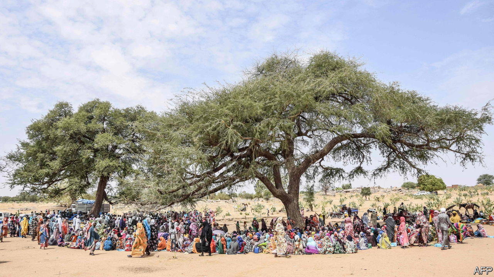
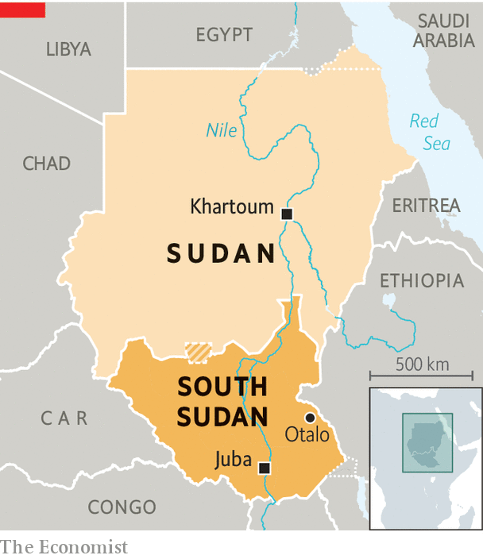

###### War and peacemaking

# What the West gets wrong about peacemaking in Sudan 

##### Do not treat warlords likes statesmen 

 

> May 11th 2023 

The war in Sudan is causing relief, fear and déjà vu in Juba, the capital of its southern neighbour. Relief because South Sudan, which seceded from Sudan in 2011, seems somewhat insulated from the chaos. Fear because Sudan’s violence may nevertheless spill over the border between the two, exacerbating the conflicts that still rage in the world’s newest country. And déjà vu because what is happening in Sudan today looks like a repeat of events in South Sudan in its years after independence, when the West’s well-intentioned attempts at peacemaking and state-building ended in war and anarchy.

The complex causes of wars in the two Sudans date back decades, if not centuries. The men who choose to butcher their countrymen are most directly responsible. Yet since two rival armies went to war over Khartoum, Sudan’s capital, on April 15th there has been a tsunami of criticism of the diplomacy employed by the West and regional governments in their failed bid to avert conflict. Much of it has been self-recrimination, with diplomats and former officials agonising over missteps and whether they could have done things differently. But a feeling is afoot that the very model of “conflict resolution” widely employed in such cases is flawed. If these mistakes are not addressed, the latest efforts to silence the guns in Sudan, which began in Saudi Arabia on May 6th, are doomed. 

At the heart of peacemaking in Sudan was an effort to get two military strongmen to share power after their coup in April 2019. This was triggered by sustained street protests that led to the toppling of Omar al-Bashir, who had ruled Sudan as a dictator since 1989. But it was a half-finished revolution. Seeing Mr Bashir was about to fall, his armed forces booted him out and grabbed power for themselves.

 


The putsch was led by General Abdel Fattah al-Burhan, the head of the Sudanese Armed Forces (SAF), and Muhammad Hamdan Dagalo (better known as Hemedti), who led a militia-turned-paramilitary group known as the Rapid Support Forces (RSF). To break the will of demonstrators, the security forces massacred more than 100 people in June 2019. Soon after this, diplomats cobbled together a power-sharing deal hoping to prevent more bloodshed. Ostensibly it was for a “civilian-led” transition to democracy, but in fact all the power was still held by the army and RSF. 

The strategy of focusing on the men with guns was well meaning, if also expedient. With no clear leadership among the bouquet of “resistance committees” that had blossomed in Khartoum, it was not easy to know which civilians to include in the talks. This difficulty was exacerbated by a risk-averse culture that tends to keep diplomats in conference rooms and cocktail parties rather than on the streets. “Of course not,” an American diplomat said in 2019, when asked whether he had mingled with protesters. “We would not be allowed.” Perhaps the biggest flaw was that the deal was premised on the idea that General Burhan and Mr Dagalo could be trusted when they told negotiators that they would hand over power to civilians. 

They could not be. Both blocked attempts to reform Sudan’s kleptocratic economy by Abdalla Hamdok, an economist drafted in as a technocratic prime minister. In October 2021, five hours after telling Jeffrey Feltman, who was then America’s envoy to the Horn of Africa, that they were happy with yet another rewritten deal that would have further delayed the handover of power, General Burhan and Mr Dagalo ousted Mr Hamdok in a coup. In April this year they made similar promises to diplomats but just days later went to war with each other instead. 

Stressed are the peacemakers

“[The] international community adopted what, we told ourselves, was the only realistic approach: dealing with the warlords themselves,” Mr Feltman recently noted. “We considered ourselves pragmatic. Hindsight suggests wishful thinking to be a more accurate description.”

Behind the naivety lay flawed assumptions about the incentives of General Burhan and Mr Dagalo. Sudan, like many fragile countries, can be understood as a political marketplace where the main currency is violence. The SAF and RSF were “two protection rackets trying to corner the market”, says a former Western diplomat. The coup in 2021 was prompted by fears in the army that efforts to crack down on the military’s economic interests were gathering pace—and, simultaneously, by concerns that Mr Dagalo would profit from any fire-sale of assets held by the army’s vast networks, says the diplomat. 

In negotiations, notes Cameron Hudson, a former American diplomat, it is easy to become deluded that “other actors are playing along in a way that you would play along”. Envoys dangled incentives such as aid spending on education in exchange for political or anti-corruption reforms, which the two military leaders saw as a direct threat. “You are offering them a route to unemployment,” argues Mr Hudson. 

The latest fighting seems to have been sparked by talks aimed at merging the RSF into the SAF. Yet in pushing the two to share power, diplomats created a “zero-sum logic” that was a “formula for an explosion”, argues Alex de Waal of the London School of Economics. “Violence is not a breakdown of the system but part of a natural sequence,” adds Clionadh Raleigh of the Armed Conflict Location &amp; Event Data Project (ACLED). 

Her research shows how, across Africa, there has been a steady rise in the number of militias and the violence they perpetrate. This trend is because of the incentives inherent in fragile or “transitional” democracies, where bigwigs use violence to bargain for power that is then made formal in peace deals. Looming over these peace talks is not so much Chekhov’s gun as Chekhov’s Kalashnikov. 

Similar mistakes were made in South Sudan (sometimes by the same people). At the heart of the new government in South Sudan was—and still is—a power-sharing deal between Salva Kiir, the president, and Riek Machar, the first vice-president. In 2013 the two took their young country back to civil war, at a cost of about 400,000 lives. Though it nominally ended in 2018, localised violence continues. In April a UN report accused various prominent politicians of responsibility for murder, rape and sexual slavery. “The country is peaceful,” argues Rizik Zakaria Hassan, a cabinet ally of Mr Kiir. “Or at least 90% of it is.”

The strongmen there have not held a general election since independence in 2011, despite repeated promises to do so. A demoralised diplomatic corps in Juba holds out little hope that a vote due by the end of next year will take place. 

South Sudan was never going to be Sweden. But the unintended consequences of promoting “stability” have harmed the country, argues Peter Ajak, a South Sudanese academic. “When the elites stay in power only through violence and corruption, there cannot be true stability.” One of five vice-presidents, Mr Machar is a product of a system that rewards warlordism with power. “We are quick to blame the politicians,” says a Western diplomat. “But we should spend more time looking in the mirror.”

Away from the compounds full of well-paid aid workers in Juba, life is often dangerous and miserable. In Otalo, in the east of South Sudan, children are sporadically abducted by a rival tribe. There are no paid teachers at the local school. All that the “clinic” can do is hand out donated nutrition sachets to starved infants. Last year flash flooding wiped out most of the crops and cattle. Ojwok Lero, a community leader, says he is “very disappointed in independence”. The root cause, he says, is the “political business…first you rebel, then you are rewarded by the government.” 

Like Sudan, South Sudan seems beholden to two would-be big men. In March, in the latest twist of their long-running drama, Mr Kiir fired his defence minister, who happens to be Mr Machar’s wife. Wani, a student in Juba, explains that “we have a problem with our leaders: they both want a job that cannot be divided.” He fancies a political career himself. “You come, you grab what you can eat, then go,” he says. “That’s why everyone wants to be president—even me.” 

There is now a belated realisation that in both countries outsiders have not done enough to bolster the power of civilian institutions. “We have seen many times in Africa that you cannot help build democracies by excluding civil society and being lenient on the generals,” argues Amjed Farid, a former official in Sudan’s transition government. Nor did America under the Trump administration help things by cajoling Mr Hamdok to sign a peace deal with Israel at a cost to his political capital and to his valuable time. Another fatal mistake was not giving Mr Hamdok sufficient financial support—such as through the World Bank and IMF—early enough. “If you don’t get food to people in time, they die,” says the former diplomat. “Here if you don’t get money to civilian governments in time, then politics dies.” 

Some analysts go even further, arguing that the very process of appeasing armed groups can block the natural flow of politics. In “When Peace Kills Politics”, a book by Sharath Srinivasan, based on the Cambridge academic’s research in the Sudans, he argues that peacemaking as promoted by Western diplomats quashes the sort of bottom-up political movements that toppled Mr Bashir in 2019. Setting up forums where spoils are divvied up among those with guns and parachuting in technocrats such as Mr Hamdok sidelines the politicians with real constituencies who should be at the table. 

Mr Ajak, the South Sudanese economist, adds that America should be wary of eroding what should be its biggest advantage in an age of geopolitical competition. America ought to be a model for aspiring democracies. But if it is seen as propping up warlords in fragile states, “How are you going to compete with China?” he asks. “The only difference between the two is that when Africans deal with Americans they come back with empty promises rather than bags of money.” ■

