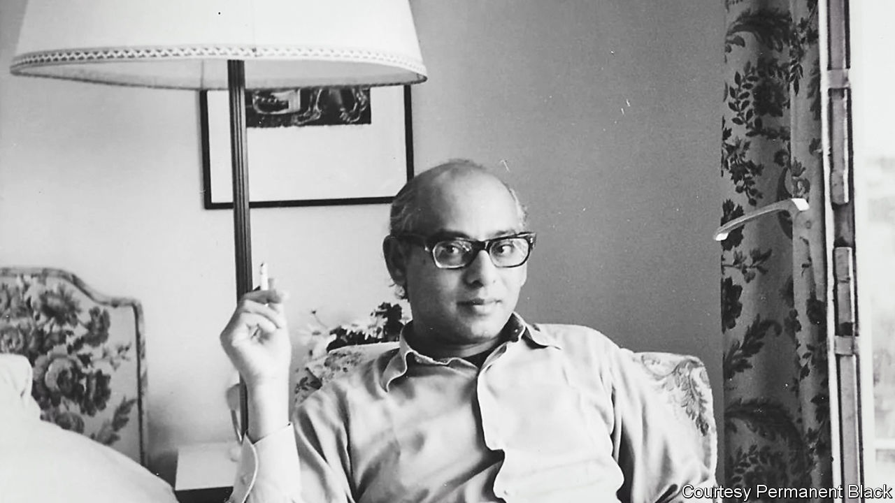

###### Bottom-up history

# Ranajit Guha revolutionised the study of India’s past 

##### The Bengali historian died on April 28th, aged 99 

 

> May 11th 2023 

The three short depositions, written in rustic Bengali in 1849, told the story of a young woman named Chandra. Pregnant as a result of an illicit affair, and in danger of being banished from her village, she was given poison one night by her mother and her sister. After several hours she expelled a small bloody fetus, and then, just before dawn, she died. “I administered the medicine in the belief that it would terminate her pregnancy,” her sister declared to the village scribe who’d been put to work by local law-enforcers. “I did not realise it would kill her.” 

The depositions amounted to no more than a few dozen lines. But the historian who found them saw far more there than the scant details of a young life cut tragically short. He teased out what the wider context revealed about the Indian subcontinent: about its strict caste rules, its legal frameworks, its ways of disciplining transgression, the mores and pressures of its village elders (almost always men) and the unspoken solidarity among women that underpinned so much of rural life in Bengal then. 

His essay, “Chandra’s Death”, is still widely quoted. It appeared first in 1987 in the fifth volume of “Subaltern Studies: Writings on South Asian History and Society”, a series started by a soft-spoken, balding academic working in Manchester, Sussex and then Canberra rather than at the Oxbridge colleges that had long dominated the study of India’s grand past. “How is one to reclaim this document for history?” he asked. That question lay at the root of the movement he launched with a group of younger scholars, both Indian and British. Most of them had studied in the West, and were keen to throw off the conservatism of other historians. 

“Subaltern Studies” would become a manifesto for a new kind of Indian history written outside the mainstream of the ideas of both the colonial period and the era of Jawaharlal Nehru’s leadership. These were stories of India from the bottom up, or as one fellow academic liked to call it: “insurgent history”. Through the six volumes of “Subaltern Studies” that he edited between 1982 and 1989, he showed over and over how change in India had not been, as many historians would have you believe, a case of elites acting first, with the peasantry always following obediently behind. The poor and marginalised had their own ideas about the change they wanted and had always been prepared to fight for it, whether it was the indigo revolt of 1859 or the many Dalit movements of the mid-20th century. Edward Said, no slouch himself when it came to revisionist essays about colonial history, called Ranajit Guha’s writing “a brilliant example of revolutionary historical method”. 

He had alighted upon the term “Subaltern” in the prison diaries of Antonio Gramsci. A founder of the Italian Communist Party, Gramsci wanted a word that corresponded to Marx’s proletariat, but which was better suited to an agrarian society like Italy. Though the word had come to mean a young British officer in India, it also means lower status. The double meaning appealed to Mr Guha’s sense of humour. Using unorthodox sources, including songs and plays, and writing from the vantage of India’s “subalterns”—the slum-dwellers, tribespeople and women of all classes, but especially poor rural women—the Indian historian repurposed Gramsci’s term for the post-colonial world, giving it an entirely new life. 

That he was almost 60 when the first “Subaltern Studies” came out didn’t bother him. Nor was he troubled by the fact that he was retired when, at last, he became a cult figure among historians, anthropologists and cultural theorists the world over. Non-conformity was something he’d been preparing for all his life. He was born the son of a middling land-owning family in what is now Bangladesh, but found the life of an entitled upper-caste Hindu intolerable, even though his grandfather taught him Sanskrit and he spent hours reading English literature in his father’s library. 

A new essay by Partha Chatterjee, a distinguished political theorist and close friend of Mr Guha’s, explains how he was affected by his background. When the family tenants came to his grandfather’s house “they would never sit down and would touch the feet of even the children of the master’s family”. Like many young Bengalis then, he joined the Communist Party and later went on to work for it full-time. The party offered new opportunities. He told Mr Chatterjee that he travelled to Paris, freshly liberated from Nazi occupation, to eastern Europe and across Russia by train in one of the first foreign groups to visit China after the revolution. But when the Soviet Union invaded Hungary in 1956, he resigned from the party and found a home at the new Jadavpur University in what was then called Calcutta.

There he turned to Bengal’s feudal system. As Mr Chatterjee explains, Mr Guha wanted to understand how laws introduced in the late 18th century to create enterprising farmers instead ended up producing the hated  system of extracting heavy rents from tenant farmers. Other historians were not convinced by his argument that it was what Mr Chatterjee calls “a necessary consequence” of British colonial rule. His doctoral thesis was turned down, though it was eventually published in 1963 as “A Rule of Property for Bengal”. That book, Mr Chatterjee writes in his essay, is now “a classic of modern Indian history”.

Revolting peasants

He took a job teaching at Sussex University. He wrote about the brutality of Indira Gandhi’s government. And then he became fixated during a year spent in India on the crushing of the communist Naxalite movement and its aftermath. Returning to England, he studied the long history of peasant revolts. The creation of “Subaltern Studies” was the obvious next step. 

After years battling historical orthodoxy, he found a fresh insight in his late 70s, says Mr Chatterjee: that the truth of human life was not to be found in history, but in literature and in the words of ordinary people—people like the young woman who was poisoned for being pregnant.■

