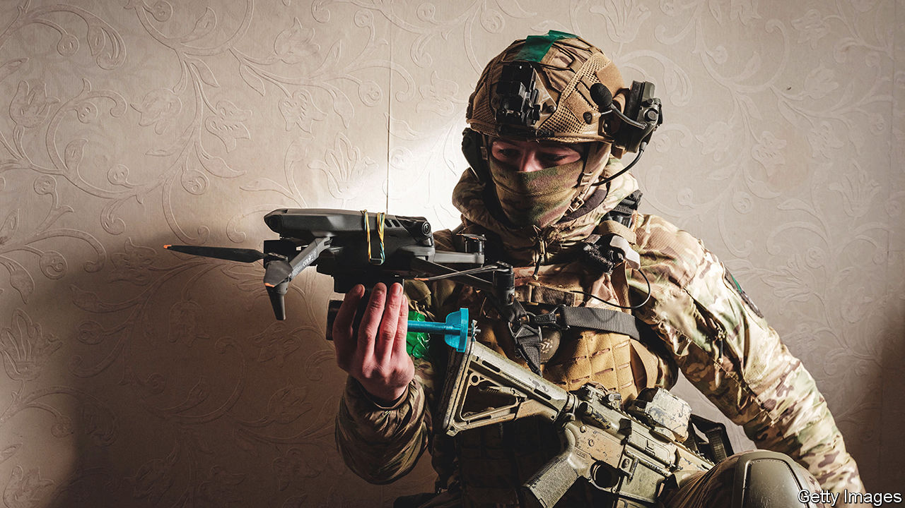

###### War on the fly

# How Ukrainians modify civilian drones for military use 

##### In the fight against Russian invaders, ingenuity pays 

 

> May 8th 2023 

IN FEBRUARY 2022, four days after Russia’s , a man who goes by the pseudonym “Swat”, and who lives in Kyiv, switched on a  in his garage and began to make plastic tailfins. The idea was to attach them to hand grenades, turning them into miniature bombs that can be dropped from drones.

A year on, Swat (which means “go-between” in Ukrainian) helps run a network called Druk (“Printing”) Army, which co-ordinates the output of over 300 3D printers across the country. A similar network run from Latvia, Swat says, has about 150 members. Following a trail blazed by the likes of Hizbullah and Islamic State, they specialise in converting civilian drones designed for hobbyists, film-makers and farmers into lethal weapons of war. 

The machines tend not to last long. Russian jamming causes many crashes, says a Ukrainian soldier with the call-sign “Bilyy”, who flies drones near the occupied city of Donetsk. He loses a couple of machines a day. Yet the role of drones in the defence of Ukraine is growing. A colonel in Kyiv, speaking on condition of anonymity, says that, counting their role as reconnaissance machines for artillery, the flying robots now play a part in more than 70% of Russian casualties. The hacked-together drones tend to be cheaper, and in some cases more effective, than some purpose-designed military machines. The result, says the colonel, is a “new level of war”.

March of the makers

The work itself combines ingenuity with frugality. One early hurdle was devising a way to allow civilian drones to drop grenades. Hobbyists worked out a clever solution by connecting a 3D-printed clamp to an electric motor. The motor is connected to a photo-receptive sensor, which is positioned, in turn, under a light that comes as standard on many consumer drones. (The lights are intended to allow flying at night, and to make drones more visible.) When an operator turns the light on, the motor turns, the gripper opens and the payload drops away. “Mag”, a young man from Kyiv who has made around 2,000 of these gizmos, says each costs him about $10.

Once a grenade has been dropped, it has to be persuaded to explode. In the years after Russia’s seizure of Crimea in 2014, hand grenades were squeezed into glass jars that would hold their handles closed. When dropped, the glass would shatter, releasing the handle and detonating the grenade. The drawback, says Bilyy, the drone operator, is that glass is heavy, and does not always break. 

These days the handles are held with a ring of printed plastic designed to snap even when landing on soft ground. For grenades designed to be fired from a launcher, rather than thrown by hand, the fuse is replaced with a 3D-printed tip that holds a nail. Impact pushes the nail into the grenade’s detonator, causing it to explode.

Engineers describe the work as exciting. Feedback from users comes quickly. Many of the best creations are distributed to other workshops by organisers like Swat. He points to a computer file that instructs 3D printers to make a plastic encasement full of ball bearings. Designed to fit around an anti-tank mine, it converts it into an anti-personnel weapon that can be dropped from bigger drones. 

Some of the work involves augmenting the drones themselves, rather than simply fashioning clever payloads for them to carry. A workshop in Kyiv that calls itself Eyes of Army specialises in turning eight-rotor drones designed for crop-dusting into what a member calls “heavy” bombers. The machines carry four mortar rounds. Each weighs 3kg and can, if aimed properly, destroy a tank. The trick is getting close enough. The cropdusters are loud enough to be heard half a kilometre away, so the team installs quieter transmission systems and rotors. An infrared sensor is also added, as are long-range radios made by Dragon Link, an American firm.

The Eyes of Army crew spends part of its time at the front, flying combat missions at night with the permission of Ukrainian commanders. When donations allow, they can produce a full attack package for other civilian warriors. Besides the modified drone, this $35,000 kit includes an off-road vehicle with light armour, a control computer with goggles, and multiple battery packs to allow the drone to fly several sorties in quick succession.

Russia flies drones of its own, which Ukrainian soldiers are keen to knock out. In one Ukrainian city a rocketry hobbyist nicknamed “Rocketrin” builds, on a workbench at home, his second version of such a system. Dubbed Moskit, it launches from a tube. Unlike most surface-to-air missiles, which are destroyed along with their target, Moskit uses compressed air tanks in its nose to eject a net designed to entangle the enemy drone. A parachute saves the interceptor for reuse.

Rocketrin 3D prints most parts. That allows quick design changes, he says, so it is good for prototyping. But printing a tricky component can take ten hours, and demand along the front for drones is “endless”. So he plans to set up, probably in a car mechanic’s shop, a production line equipped with conventional tools.

All of this improvisation saves money. Eyes of Army reckons its octocopters cost a fifth of what an imported military drone with similar capabilities might cost. In another workshop elsewhere in Ukraine, a team of 30 volunteers is cutting carbon fibre with lasers to produce kamikaze quadcopters that deliver 1.5kg of explosives to targets up to 8km away. Each UAV-7, as they are known, costs about $2,000 including its control console. The comparison is imperfect, but the Switchblade 300, a suicide drone with a similar payload and range made by AeroVironment, an American firm, is reported to cost roughly $6,000.

Ukrainian troops fly both machines in the heavily jammed airspace around Bakhmut, an embattled eastern city. Operators there tell the workshop’s boss, whose pseudonym is Boevsskiy, that the UAV-7 is more resistant to Russian electronic warfare than the Switchblade 300—though they will not go into the technical details. One advantage is a clever signal repeater that greatly extends the UAV-7’s range.

Secrecy is vital, lest a Kremlin supporter decides “to take revenge”, as Swat notes. One way to produce military drones discreetly is to do so in an existing factory that makes civilian goods. Last year the owner of one such factory near Kyiv quietly asked some employees to turn Mavic 3s, a hobbyist quadcopter sold by DJI, a Chinese company, into bombers. Today, 15 of the firm’s employees produce roughly 5,000 quadcopter bombers a month. 

The street finds its own use for things

One weak link, says the firm’s owner, is his reliance on electric motors imported, at a cost of $16 each, from China. He fears China, which has refused to condemn Russia’s invasion, might restrict supply. The company’s engineers are developing an electric motor of their own, projected to cost just $5. The design is “primitive”, admits the owner. But with attrition rates as high as they are, he says, components need not last long. Businessmen friends defray his costs with monthly donations totalling tens of thousands of dollars.

Outside Ukraine, firms sympathetic to the cause need not be so secretive. Ivan Tolchinsky, the CEO of Atlas Aerospace, a maker of civilian drones based in Riga, says he has looked into mass-producing converted civilian craft for use in the fighting. The required paperwork put him off. But he notes that a handful of Atlas engineers, working on their own time, are assisting Ukraine’s improvisers with technical drawings and advice. One says he has sent designs for better radios, and helped to calculate how much payload the cobbled-together drones might carry.

As one Ukrainian soldier in Kyiv points out, the national culture is fertile ground for homespun engineering. Ukraine’s education system emphasises both mathematics and engineering. The same is true in Russia, but Ukraine, he says, encourages personal initiative in ways that Russia’s more authoritarian system does not.

Kostyantyn Leonenko works for Tolocar, a charity based in Hamburg that aims to foster “innovation by mass collaboration” in Ukraine. He notes that, in the rich West, tinkering is often playful. In a middle-income country like Ukraine, let alone one at war, it is a more pragmatic business. Tolocar’s teams teach people to insulate their homes, replace broken windows, and make things like electric heating mats.

A visit to Ostriv, a “maker lab” in Kyiv, is illuminating. Mr Leonenko and a colleague, on their way to teach bicycle-making in Chernihiv, are installing a computerised milling machine. The warren of rooms already hosts a carpentry shop, a metalworking space and equipment for laser cutting, sewing and 3D printing. Kos Kuchabskiy, who runs the place, says that its tinkerers have made bulletproof vests, medical bags and beds for people displaced by the war. For a while, four members built suicide drones, before decamping to a workshop that specialises in such things.

Back at headquarters, the colonel in Kyiv thinks this duct-tape-and-baling-wire ecosystem a marvel. Elements of it could be incorporated into the Ukrainian defence ministry’s procurement process. Mag, the maker of dropping mechanisms, is already receiving official letters with orders for items, albeit without payment. 

Russia’s army, for its part, is fielding more modified commercial drones, too. But its effort is relatively nascent, and its civilian techies far less motivated to support the war effort. As a result, the impact of Russia’s makeshift drones has been less striking, experts say. The big question is if that will change. ■


