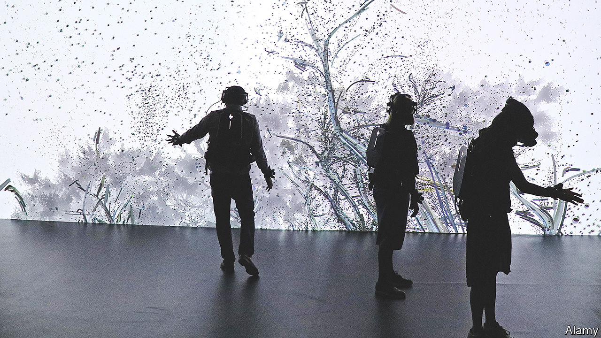

###### Smell-O-Vision 2.0

# How to bring scents to the metaverse 

##### VR enthusiasts turn their attentions to an evocative, but neglected, sense 

 

> May 10th 2023 

It was one of those many inventions that never quite took off. In 1960, audiences watching the film “Scent of Mystery” got to experience the wonders of “Smell-O-Vision”. Mounted under the cinema seats, the system pumped out 30 different scents—from salty ocean breezes to whiffs of wine—at crucial moments in the plot. The system had its quirks. Those in the balcony complained that the smells reached them too late. Others found the scents to be too faint, or else irritatingly persistent. More novel than effective, Smell-O-Vision never really took root in Hollywood. 

These days the cutting-edge of entertainment is video games and virtual reality, not films. Several groups are trying to bring scents to virtual worlds. In one paper published this week in , Xinge Yu at City University of Hong Kong and Yuhang Li at Beihang University describe two wearable “olfaction interfaces”. The first is the size of a plaster, and is affixed to the skin, like a fake moustache, under the user’s nose. The second, more capable version is a flexible face mask. 

Both rely on heating tiny tiles of paraffin wax that have been impregnated with various liquid perfumes. The smaller version of the system uses two such tiles; the bigger one has nine. The researchers claim that they can generate a scent, such as mint or green tea, in as little as 1.44 seconds. The nine generators on the mask can combine to produce hundreds of possible odours.

Drs Li and Yu have been beaten to market by OVR, a startup based in Vermont. Its headset uses a system of refillable cartridges, each of which can make thousands of scents. The firm’s newest product, the “ION3”, will be released later this year, and can be tied into existing game-creation tools with minimal fuss. 

Getting smells right could make virtual worlds more compelling. Odours are famously evocative. The part of the brain that processes them connects directly to parts associated with emotions and memory. But the science is tricky. Unlike colour or sound, where wavelengths and frequencies combine in predictable ways, smell is not so straightforward. Altering a single chemical bond can shift a scent from sweet to rancid. Whether smelly VR will do better than smelly films remains to be seen. But perhaps one day users will be able to stop, swipe and smell the virtual roses. ■


