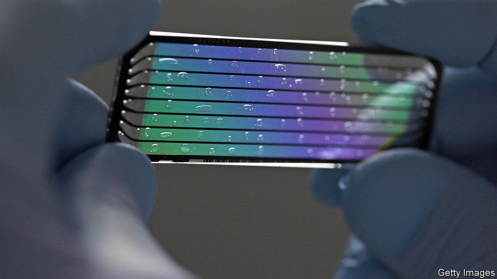
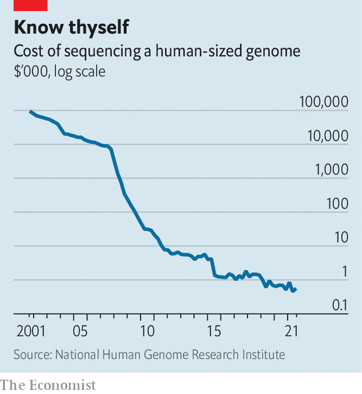

###### 47 genomes are better than one

# “The” human genome was always a misnomer 

##### A new repository aims to capture the genetic diversity of humanity 

 

> May 10th 2023 

The human Genome Project, which published its results 20 years ago , was a landmark in biology. It was also somewhat misleadingly named. After all, there is no such thing as “the” human genome. Instead, there are 8bn individual humans, each of whom share the vast majority of their DNA—but not all of it. The genome published by the Human Genome Project in 2003 was put together from a dozen anonymous blood donors in and around Buffalo, in New York state. 

But there is more to life than Buffalo. That, in essence, is the motive behind the publication this week, in , of a set of 47 new “reference” genomes taken from individuals on four continents (Africa, both of the Americas, and Asia). The idea of the Human Pangenome Project, the organisation behind the publications, is that rather than relying on a single “reference” genome, it would be better to have several, and to ensure that between them they capture as much of the genetic diversity of  as possible. 

Compared with the total size of the genome, the amount of diversity in question is small. Two people picked at random will share around 99.6% of their DNA. That similarity is why the original genome produced by the Human Genome Project has proved so useful. Its annotated strings of genetic code serve as a baseline. Other genomes can be compared with it to look for variations, whether harmful or beneficial. 

Yet although humans are mostly alike, their differences do matter. A relatively recent mutation, for instance, means adults with ancestors from northern Europe, or some parts of India and the Middle East, are more likely to be able to digest lactose (a sugar found in milk) than those from elsewhere. Which variation deserves to be treated as the standard? 

Sometimes, the limits of using a single reference have direct medical consequences. A set of genes called hla, for instance, are involved in running the immune system. They are highly variable, and mutations in them have been associated with autoimmune diseases such as type-1 diabetes. One study, published in 2015, found that, because many gene-sequencing technologies are not perfectly accurate, comparing readouts from the region with the single reference genome led to mistakes around 20% of the time. Another paper, published in 2022, found that relying on the reference genome meant that the details of some gene variants found in people with African ancestry, and seemingly associated with cancer, are poorly understood.

 


In an age of home gene-testing kits, powered by falls in the cost of sequencing (see chart), 47 genomes may not sound that impressive. But existing sequencing technologies produce incomplete results. They rely on reading short snippets of DNA, and do not deal well with the long, repetitive regions that dot the genome. As Evan Eichler, a geneticist at the University of Washington, told a press conference: “There are complex forms of [genetic] variation where we know the existing technology doesn’t do a good job…it misses about two-thirds of those.” The Pangenome Project uses newer,  That allows researchers to spot variants that might otherwise be missed, and to glean a better understanding of how, exactly, mutations arise. 

The new genomes, then, represent a big improvement on the status quo. But gaps remain. All the genomes were drawn from material donated to the 1,000 Genomes Project, a collection of anonymised samples which began in 2008. It suffers from a shortage of donations from the Pacific islands and the Middle East. The researchers plan to fix that. But maximising diversity is unlikely to mean sampling every part of the world equally. Most human genetic diversity is found within Africa, the species’ ancestral homeland. (People in the rest of the world are descended from a relatively small band who migrated outwards between 50,000 and 70,000 years ago.)

The researchers do not intend to catalogue every genetic variation there is. That would be a Sisyphean task: as Tobias Marschall, a computational geneticist at Heinrich Heine University, noted, every baby is born with dozens of mutations possessed by neither of its parents. Benedict Paten, a geneticist at the University of California, Santa Cruz, and one of the authors of this week’s clutch of papers, says the aim instead is to reach 350 high-quality genomes. That should allow the researchers to capture the vast majority of the genetic variation that is thought to be out there. That will give humanity a much more representative picture of one of its favourite research subjects—itself. ■


