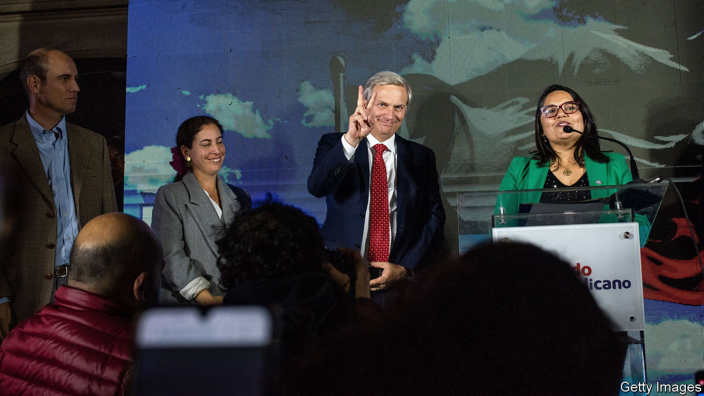

###### In the swing

# Conservatives dominate Chile’s constitutional assembly this time around 

##### Last year the assembly was seen as too far left 

 

> May 11th 2023 

The pendulum of Chilean politics has swung a long way in a short time. In October 2019 millions took to the streets to demand better education, health care and pensions. To quell the protest, politicians offered to rewrite the country’s constitution, adopted in 1980 under Augusto Pinochet, a military dictator. Left-wing activists won the most seats in a convention called in 2021 to draft the new charter. Later that year Chileans voted in Gabriel Boric, a left-wing former student leader, as president. 

Then came the swing. In 2022, 62% of Chileans rejected the charter the convention had drafted. Mr Boric’s approval ratings tumbled. And on May 7th conservative parties won the biggest share of seats in a new convention tasked with producing another draft constitution. 

Last year’s draft was widely seen as too left-wing: liberalising abortion, watering down property rights and giving trade unions an almost unfettered right to strike. Yet a majority of Chileans continued to demand a new constitution, so Congress was persuaded to call for the new convention. To prevent excesses, legislators devised a set of rules that cannot be modified, such as respect for private property and a bicameral Congress. In spite of all that, hardliners trounced moderates again, but this time from the other flank. A final draft will be put to a national vote in December. 

The Republican Party was the biggest winner, with 23 of the 51 seats in the assembly. The party was founded in 2019 by José Antonio Kast, a conservative Catholic who was defeated for the presidency by Mr Boric in 2021. Other conservatives won another 11 seats. A coalition aligned with Mr Boric took just 16. 

Mr Kast has spoken admiringly of Pinochet. His views have become popular amid concerns about crime and migration. The greatest danger for his party, however, may not be that it does too much in the convention, but too little. It has repeatedly said it does not believe Chile needs a new constitution. It launched candidates for Sunday’s vote only when it sensed the pendulum swinging its way. After the vote, Mr Boric said “the previous process…failed…because we did not know how to listen to each other”, and he called on the Republican Party “not to make the same mistake we made”. 

