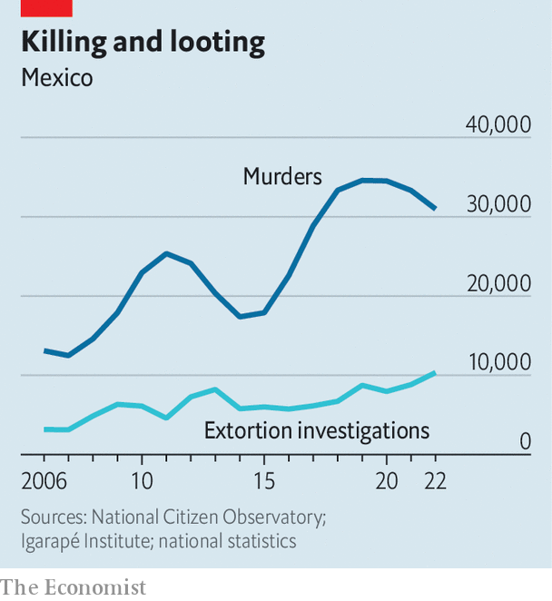

###### Beyond drugs

# Mexico’s gangs are becoming criminal conglomerates 

##### They are expanding into every corner of society 

 

> May 11th 2023 

On may 3rd Mexico introduced a law applying strict controls on the import of chemicals used by Mexico’s gangs to make synthetic drugs. The law is backed by harsh criminal penalties. This is a striking move by Andrés Manuel López Obrador, Mexico’s populist president, who has shied away from tackling the country’s gangs, preferring to blame drugs and disorder on family breakdown over the border and poverty at home. In truth, under his tenure gangs are increasingly powerful and diversified. 

Mexico’s cartels have always been adaptable. In the 1980s they trafficked marijuana and then cocaine from Colombia to the United States. But in the past decade they have mutated into a much wider array of groups, with their tentacles reaching beyond the drugs trade into extortion, people-smuggling, arms-selling and illegal mining. “We look at organised crime trends through a drug-cartel lens, when today in Mexico we have a mafia-like criminal landscape,” says Romain Le Cour Grandmaison of the Global Initiative Against Transnational Organised Crime, an ngo based in Switzerland. 

However, the government response continues to be shaped by a focus on narcotics, not least because of the United States and its war on drugs. The pressure has only increased with the recent crisis surrounding . The head of the us Drug Enforcement Administration (dea) last month described the Sinaloa cartel and the Jalisco New Generation cartel (cjng), Mexico’s two biggest groups, as the “greatest drug threat our nation has ever faced”.

Drugs continue to make up a large part of the business, especially for the two main gangs. Production of cocaine, cultivated in South America and trafficked through Mexico, has more than doubled since 2014, says the un’s Office on Drugs and Crime, while the price has not dropped. The pivot to synthetics such as methamphetamine, which is sold locally, and fentanyl, which is sent north, has only made business more lucrative. The indictments in the United States in April of the “Chapitos”, the four sons of Joaquín Guzmán, known as “El Chapo”, the head of the Sinaloa cartel who is now in prison in Colorado, have shed light on the changing shape of the trade. 

The dea estimates that a pill that costs ten cents to make in Mexico can be sold to a wholesaler for 50 cents. Unlike marijuana or cocaine, no land is needed for synthetics: the chemicals are imported through Mexican airports or ports from China. Gangs drop them off to labs, sometimes family kitchens in northern states, before pressing them into pills to take north. Perhaps 40% of the Sinaloa cartel’s income comes from drugs, estimates one official, half of which come from synthetics.

War on everything

Gangs have diversified for several reasons. First, “El Narco”, as Mexicans call them, is simply “a monster that eats everything it can,” says Ioan Grillo, an author. But official policy has exacerbated the problem. The war on drugs, begun in 2006 by the then president Felipe Calderón, caused groups to splinter and multiply. By 2020 the number of gangs had increased to more than 200, from 76 in 2010, according to the International Crisis Group (ICG), a think-tank based in Brussels. Not all have the ability or connections to traffic or make drugs: the dea recognises only nine major drug-trafficking organisations in Mexico. 

Second, the security policies of Mr López Obrador, who is often known as amlo, have given gangs room to expand. His approach to security is known as “” (“hugs not bullets”), a policy that seeks to tackle root causes, but does little to confront existing gangs. 

 


This has let the groups deepen their expansion, which started a decade ago, into the legal economy, says Vanda Felbab-Brown of the Brookings Institution, an American think-tank. The biggest source of income after drugs is “without a doubt” extortion, says Eduardo Guerrero of Lantia Intelligence, a consultancy. Groups extort money from everyone, whether taco-stand owners or pilgrims, some of whom, over Easter, were forced to pay to take part in processions. In 2022 almost double the number of Mexicans reported having money extorted than did five years before (see chart). Only a tiny minority report. 

The big money comes, however, from “taxing” businesses in sectors such as agriculture and mining. Avocados, Mexico’s “green gold”, are a good example. The country provides almost a third of global supply, most of which is grown in the western state of Michoacán. The $3bn-worth of them exported every year to the United States is a huge source of income for the producers and also for gangs. For the past three years Erick Rodríguez, a farmer, has paid an annual “fee” of 10,000 pesos ($560) per hectare to Familia Michoacana, a local criminal group. Mr Rodríguez (not his real name) says the gang comes with data about the size of his farm and tells him to hold back stock to push up prices. Ms Felbab-Brown’s fieldwork in Mexico shows how gangs also force fishermen to sell their catch at a cut price, which they then sell for a profit to restaurants. They also dictate the terms of when and what they can fish.

Smuggling people is another area of expansion. Criminal groups used to leave this to small-time smugglers known as . As the border has tightened and the number trying to cross has risen, so has the cost, making it even more attractive to the gangs. The us border police apprehended migrants trying to cross illegally 2.2m times last year, a six-fold increase on a decade earlier. The cost to transit Mexico and cross into the United States can now be as high as $12,500 per person, according to a study supported by bbva, a Spanish bank. Gangs also kidnap migrants to extort money from their richer relatives north of the border. Mexico’s immigration agency freed over 2,000 kidnapped migrants last year. Many more are never found. 

Meanwhile, a growing percentage of the 25 people who disappear every day in Mexico are 12- to 15-year-old girls, many of whom are likely to be trafficked into prostitution. And, though guns are tightly regulated in Mexico, gangs smuggle them in from the United States. 

Trafficking natural resources is lucrative, too, says the Global Initiative Against Transnational Organised Crime. In 2014 Mexico’s government acknowledged for the first time that gangs illegally mine and export iron ore from Michoacán. A report by Insight Crime, an investigative outfit, last year found the activity is thriving now under the cjng. In the state of Jalisco gangs control the timber market. Demand for Mexican animals, though a niche business, is growing, too. Most are believed to be sent to China, sometimes in exchange for chemicals for drugs.

Oil is also a target industry. Gangs siphon it off, sometimes cutting deals with corrupt officials at Pemex, the state oil company. They steal and sell water in the states of Mexico and Nuevo León.

Taking over the land

One result of this expansion is a rise in violence. Drug trafficking requires little more than someone corruptible at a border, but today’s activities are only possible where groups control territory, causing violent clashes across the country. They are particularly fierce in Michoacán, where at least 35 groups compete for resources, now using military-grade weapons bought with income from the drugs trade.

Homicide figures are alarming, but a poor measurement of the impact. Murders fell by 7% from 2021 to 2022, to a still shocking total of almost 31,000 (see chart). But disappearances, most of which are murders with no body, have risen. “Unlike in the past when gangs were only involved in the illegal economy, today every citizen and business is exposed to being controlled by them,” says Ms Felbab-Brown.

amlo has only made things worse. After the United States arrested Salvador Cienfuegos, a former head of Mexico’s armed forces, the president in 2021 enacted a national-security law to curtail the dea’s ability to operate in Mexico. Relations have subsequently improved, and the government has been carrying out more strikes against gang operatives, as well as co-operating on financial investigations. Yet taking out kingpins, a policy popular under Mr Calderón, has had little effect. The president has spread out the National Guard, a federal police force he created in 2019, to reassert the state’s presence. But in many places he has ordered them to stay in the barracks. His tenure has been marked by a general passivity towards security and corruption, notes Mr Guerrero.

This has led to a second consequence: deeper corruption within the state, which allows gangs to diversify further. Officials have always struck deals with organised crime. But under the Institutional Revolutionary Party (pri), which ruled Mexico for 71 years until 2000, the government called the shots. Democratisation and the decentralisation of power have tilted the balance of power in favour of the criminals. 

The recent conviction in the United States of Genaro García Luna, Mexico’s security minister under Mr Calderón, for taking bribes from the Sinaloa cartel to facilitate drug-trafficking, was a rare proven case involving a federal official. Criminal groups are deeply entwined with local police, mayors and politicians, who can be threatened or bought. This gives them access to more sources of revenue through public contracts to build roads and other infrastructure. More worryingly, rather than just threatening elected officials, gangs are gaining unprecedented influence over elections. Before midterm polls in 2021, nearly 40 candidates were killed. 

Gangs are having a greater impact on businesses and society, as well. Some firms see no option but to employ the groups to protect them, notes Teresa Martínez of Tec de Monterrey, a university. Extortion by gangs is one reason for Mexico’s sluggish economic growth. Small-business owners say they struggle to pay up or do not want to grow so big as to attract attention. For the most part the gangs show little interest in building ties with the communities they prey on. But some do engage. On Children’s Day, a festival at the start of May, the cjng even handed out toys. “We are seeing the transformation not only from drug-trafficking organisations to multi-commodity ones, but now to actual local strongmen exercising political control,” says Falko Ernst of the ICG. 

Mexico’s gangs have sprawled to such an extent that Mr Grillo and others have started calling the situation “an insurgency”. Certainly their mutation makes everything harder to tackle. It requires a broad national response, including weeding out corruption, creating a functioning justice system and re-establishing the remit of the state (as well as tackling drug consumption in the United States). But with the damage being wrought by fentanyl, a shift from the narrow focus on drugs, north and south of the border, looks unlikely. ■

