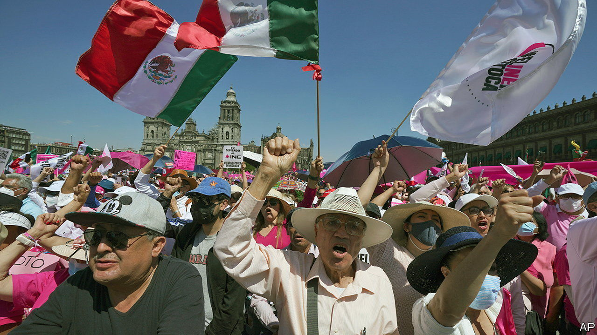

###### The president v the court

# The Mexican Supreme Court does battle with AMLO 

##### The president may not achieve the legacy he wants 

 

> May 11th 2023 

Mexico’s supreme court has ruled that elements of a series of laws hastily pushed through by President Andrés Manuel López Obrador to change the electoral system were unconstitutional. The laws imposed looser limits on how public officials, many of them members of the president’s Morena party, can campaign. 

The legislation was part of a package of reforms that the president, often known as amlo, said would reduce the cost of elections and strengthen democracy. In reality the laws would endanger it. If allowed to stand, they could affect the vote to pick governors in two states later this year and the outcome of the general election scheduled for mid-2024. Tens of thousands of people have protested against them since they were passed in February. 

On May 8th nine of the court’s 11 justices ruled that the reforms had been passed so quickly as to violate due process. (A supermajority of eight justices is needed to declare a law unconstitutional.) One judge noted that lawmakers in Congress had passed the reforms in a single night in less than three hours. 

The ruling comes after one last month which ordered the president to restore civilian control over the National Guard, a federal police force he created in 2019 to replace the regular force that he disbanded on taking power. In line with the unprecedented power amlo has given to the armed forces, he has made up the new National Guard almost entirely with soldiers and moved authority over it to the defence ministry. The Supreme Court ruled this was in breach of the constitution.

The court has heard cases about, and struck down, policies by all governments since it was strengthened during the country’s transition to democracy in the 1990s and early 2000s. Yet never have so many parts of a president’s agenda come before it as today. This is because many of amlo’s reforms involve issues enshrined in the constitution. Though Morena, with its allies, enjoys a majority in both houses of congress, it does not have the supermajority needed to amend the constitution. So the president has tried to make his reforms under regular legislation that only requires a simple majority. 

The rest of the new electoral laws may now also be overturned by the Supreme Court in coming weeks. This is even more important, because the laws would cut the funding of the National Electoral Institute (INE) and would lead to thousands of staff members being fired. INE is a vital institution that has helped nurture Mexican democracy by policing campaigning and elections. It is one of the few bodies (apart from the Supreme Court itself) that holds amlo to account. He has called it corrupt and inefficient.

The Supreme Court’s reputation as a bastion of democratic oversight has been bolstered since January by a new president, Norma Piña, who has been willing to take on cases from which her predecessor shied away. Under her, the court is also looking at the president’s use of national-security laws to conceal information about large infrastructure projects. And the ruling that rushing legislation violates due process could open up more laws to challenge. Last month the Senate approved 20 laws in a matter of hours, with Morena senators voting outside the main chamber after opposition senators occupied it to protest at the lack of debate.

amlo is not quietly bowing to the court’s authority. On May 9th he called the judges , or rotten, and said he wanted to make sure they are elected and not appointed. He has told his cabinet not to answer telephone calls from clerks wanting to set a date for the transfer of power over the National Guard. He is also urging voters to give his party a supermajority in elections in 2024, so his successor can have another go at passing the reforms. Without that, his grand plans to transform Mexico look unlikely to come to pass. ■

