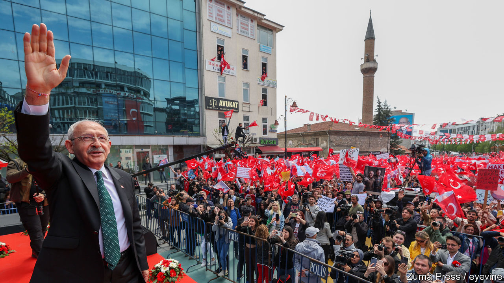

###### The Economist explains

# How free and fair will Turkey’s election be? 

##### The polls are closer than they have been since Recep Tayyip Erdogan came to power 20 years ago 

 

> May 12th 2023 

EVER SINCE Recep Tayyip Erdogan won power in Turkey 20 years ago he has been in little danger of losing it. Mr Erdogan and his Justice and Development (AK) party have won every presidential and parliamentary election, usually by comfortable margins. During that period he has become increasingly autocratic, exerting undue influence over the courts,  and other state institutions and intimidating the opposition and independent media. The polls, however, show that even with the odds stacked in Mr Erdogan’s favour, the presidential and parliamentary elections to be held on May 14th are . (A second round will be held on May 28th if no presidential candidate wins more than half the vote.) Assuming the voting is free, Mr Erdogan could well be unseated by , who leads a unified opposition that is committed to . Will it be?

The high stakes and the narrow polling gap between the two main candidates have led to speculation that Mr Erdogan may interfere with the elections, challenge the results if he loses or even refuse to abide by them. Turkey’s strongman has not allayed these concerns. “My people will not hand over this country to a president supported by [terrorists],” he said on May 1st. The interior minister, Suleyman Soylu, has claimed that the election could become “a political coup attempt backed by the West”.

The first question is whether the votes will be counted accurately. Opposition politicians say they have the means to ensure that they will be. The opposition plans to post at least two monitors to each of the 192,000 ballot boxes, carry out its own vote count and compare its numbers with those issued through the night by Turkey’s election board (which supports Mr Erdogan, but is not fully controlled by him). In addition, Oy ve Otesi, an NGO, plans to deploy at least 70,000 non-partisan observers. So many people have volunteered that the group has closed registrations in Turkey’s three biggest cities, Istanbul, Izmir and Ankara, says Hande Turan, a member of its board. The high level of scrutiny means that the risk of vote rigging on a large scale is negligible, she believes. 

The situation in parts of the country  in February that killed more than 50,000 people may be a bigger problem. Of the 3m people displaced by the disaster, only half have registered to vote in the places to which they have moved. Turkey has few provisions for absentee voting. The remainder, meaning the number who would need to return to their destroyed hometowns to cast their ballots, represents about 2% of Turkey’s 64m voters. Political parties have offered to bus them back, but many may not make the long journey. It is unclear who would benefit if turnout among such voters is low. 

Then there is the question of what Mr Erdogan will do if the votes go against him. Senior AK officials reject any suggestion that the president would refuse to hand over power. But scores of people with a lot to lose, including corrupt officials and crony businessmen who rely on state contracts, may try to persuade him to hold on to it, especially in case of a narrow loss. To do this Mr Erdogan would need the backing of the bureaucracy and security forces, says Gonul Tol, an analyst at the Middle East Institute, a Washington-based think-tank. “But that’s a risky scenario for him,” she says. “I don’t think the institutions will back an Erdogan who has just lost an election, because they don’t want to risk legal repercussions [in case the opposition prevails].” 

Many observers outside Turkey believe that Mr Erdogan cannot afford to lose an election. The more common view inside the country is that he cannot afford to steal one. Turks are convinced that their votes matter. Turnout has averaged 85% in the past four elections, a number that puts most European countries to shame. Past elections have been flawed, but have never been stolen outright. Any attempt at electoral fraud or a coup could provoke mass protests, violence and economic upheaval. The ballot box has become perhaps Turkey’s last valve for dissent. Close it, and the country risks blowing up. ■

