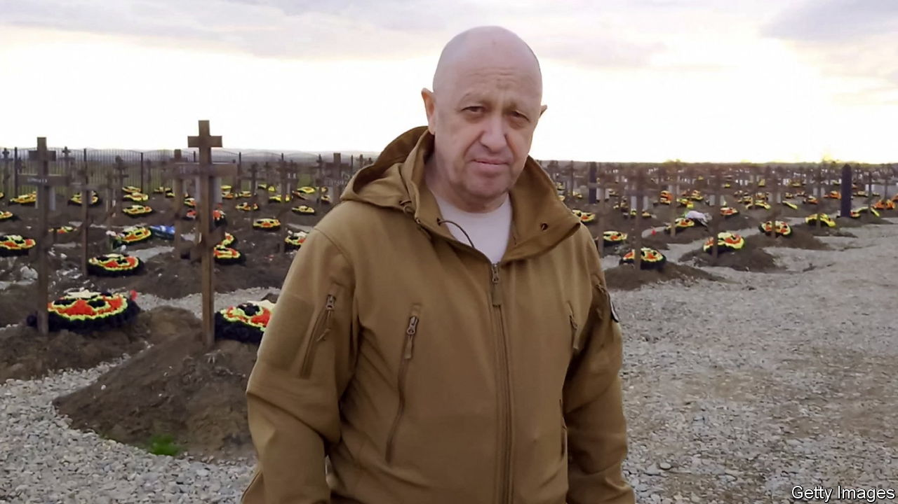

###### The Economist explains

# Why the boss of Wagner Group is feuding with Russia’s military leaders 

##### Yevgeny Prigozhin, commander of a Russian mercenary force, is losing influence 

 

> May 11th 2023 

A PILE OF corpses is quite a backdrop for a monologue. On May 4th , the leader of , a Russian mercenary group, stood among the bodies of dozens of his fighters and recorded an extraordinary diatribe against Sergei Shoigu, Russia’s defence minister, and , head of the armed forces. He claimed the pair were withholding ammunition from his mercenaries in , a town in eastern Ukraine that Russia has been trying to capture for months. He later warned that Wagner would retreat if supplies were not forthcoming. His outbursts are part of the latest episode in a long-running spat between Mr Prigozhin and Russia’s top brass. Why are they feuding and what does it say about the state of the country’s military command? 

The quarrel reflects the Kremlin’s failure to create a clear command structure in Ukraine. Vladimir Putin, Russia’s president, did not appoint an overall commander for the invasion until April 2022, more than a month after the attack began. General Alexander Dvornikov was initially given the role. But the position has been rotated three times since: first to General Gennady Zhidko in May, then to  in October, and finally to General Gerasimov in January 2023. Analysis by the Institute for the Study of War (ISW), a think-tank, shows that other important roles, such as regional-command positions, are also under heavy rotation. 

The merry-go-round has bred factionalism. That may suit the Kremlin’s desire not to allow any one individual too much power, but it hardly provides a bedrock for effective military strategy. The presence on the ground of several Russian mercenary groups further complicates the picture. Wagner is the most prominent. Mr Prigozhin, a convicted criminal, is its public face and operates in close co-ordination with commanders from the GRU, Russia’s military intelligence service. 


Mr Prigozhin’s fluctuating fortunes reflect the course of the war. As the Russian invasion stalled, his star began to rise. By the summer of 2022 losses were mounting and the Kremlin needed troops. Mr Putin seems to have given Mr Prigozhin licence to expand his militia: videos emerged of the Wagner boss telling prison inmates that they could earn their freedom by signing up to fight. 

In late summer and autumn of 2022 Ukraine carried out successful counter-offensives in Kharkiv and Kherson provinces. According to the ISW, these setbacks for Russia led to the emergence of a faction within the country’s defence ministry that was critical of General Gerasimov and his associates. The dispute worked in Mr Prigozhin’s favour. He welcomed the appointment in October of General Surovikin—who is thought to be friendly towards Wagner—to lead the war in Ukraine. Collaboration between the army and Wagner intensified and Mr Prigozhin’s men took the lead in Bakhmut. He is thought to have promised the Kremlin that Wagner would deliver Russia’s first victory in months. 

Yet as that assault dragged on with little success, the fragility of Mr Prigozhin’s position became clear. In January General Gerasimov replaced General Surovikin as head of operations in Ukraine, an apparent blow to the anti-Gerasimov faction. Soon Mr Prigozhin began to allege that Mr Shoigu and General Gerasimov were withholding supplies from Wagner fighters. (In fact, Western military analysts suggest that Russia’s generals are probably trying to save munitions to prepare for another Ukrainian counter-attack.) 

Wagner remains important to Russia. Ukrainian military officials say that the group’s units are among their enemy’s most effective, not least because of their . Meanwhile, Re:Russia, another think-tank, notes that, according to Mr Prigozhin, General Surovikin has begun to represent Wagner’s interests among Russia’s senior commanders. 

Still, the outlook for Mr Prigozhin is unclear. Because Russia’s winter offensive proved a , analysts suspect that Mr Putin is now dividing responsibility between the rival factions in his military. The generals who support Wagner’s brutal tactics could regain their clout. But it is possible that those same army figures are trying to establish control over Wagner at the expense of its increasingly erratic founder. That could explain Mr Prigozhin’s desperate statements. ■

