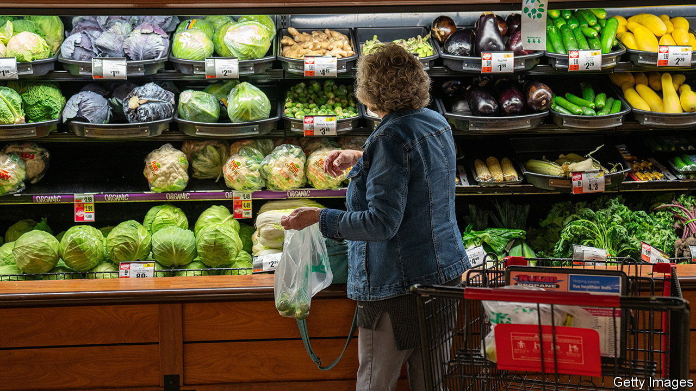
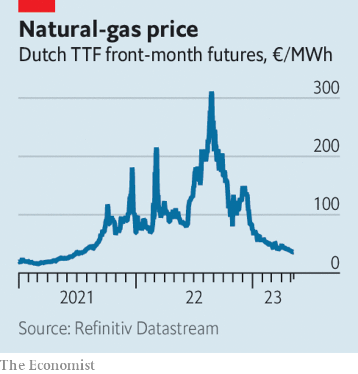

###### The world this week

# Business 

#####  

 

> May 11th 2023 

America’s annual  rate dipped again in April, to 4.9%. The core inflation rate, which excludes energy and food prices, also fell slightly, to 5.5%. The core rate has been higher than the overall rate for two months now. The Federal Reserve’s interest-rate increases have helped consumer-price growth to slow since its peak in June. Markets are betting that the Fed will soon pause the run of rate rises, though the is still running hot. Employers created 253,000 jobs last month, well above estimates. 

The  raised its benchmark interest rate for the twelfth consecutive time, lifting it by a quarter of a percentage point to 4.5%, its highest level since 2008. Annual inflation in Britain has remained stubbornly high at 10.1%, well above inflation in America and the euro area. The bank said that further rate rises were on the cards, if inflationary pressures persist. 

The leisure class

Quarterly earnings from Air France-KLM and International Airline Group, the owner of British Airways, provided more evidence of the rebound in . Both reported higher revenues and are expecting a surge in summer bookings. IAG raised its outlook for the year. Global airlines are also benefiting from a recent trend of wealthy holidaymakers choosing to fly in first and business class.

The discount end of the airline industry is also experiencing higher demand. , Europe’s biggest carrier, has ordered 150 737 MAX jets from , with an option to buy 150 more. Michael O’Leary, Ryanair’s mercurial boss, criticised Boeing last year for aircraft delays, describing its management as “headless chickens”. This week he likened the two companies’ relationship to a marriage: we have rows, but then we “kiss and make up”, he said. 

 hugely reduced the losses at its streaming business in the latest quarter, after a cost-cutting drive by Bob Iger, the chief executive. But it also lost 4m subscribers from the previous three months, mostly in India, where Disney has lost the rights to broadcast premier-league cricket. 

 swung to a small quarterly loss because of costs associated with its $787.5m settlement in a defamation case brought by Dominion Voting Systems. Lachlan Murdoch, Fox’s chief executive, said the payout was a “business decision”. 

 


The price of in Europe fell to its lowest level since July 2021. Alternatives to Russian energy and a mild winter that has left gas stocks in good shape were factors in the benchmark Dutch TTF contract falling to just over €35 ($38) a megawatt hour. Last August the price peaked at more than €300 a MWh as Russia squeezed its supplies. Meanwhile, Russia has reportedly been forced to increase taxes on domestic oil producers to fill a hole in government revenues caused by Western sanctions. 

Net profit atfell by 20% in the first quarter, year on year. The Saudi state-controlled oil giant still made $32bn in the quarter, equivalent to the combined profits that have been announced by BP, Chevron, ExxonMobil and Shell. Aramco is expanding its production of fossil fuels, as it believes that “oil and gas will remain critical components of the global energy mix for the foreseeable future.”

 appointed Ulrich Körner, the chief executive of , to its board, as it prepares to finalise its takeover of its former rival. Mr Körner will oversee the operational continuity of Credit Suisse, which collapsed in March. Sergio Ermotti, the CEO of UBS, has warned of difficult months ahead, reminding staff that “your new colleagues are not your competitors”.

 management saw off a challenge from Ping An, a Chinese insurance company and the bank’s biggest investor, to consider hiving off its Asian business. A vote on the proposal at the annual general meeting was supported by only 20% of shareholders. The unhappy, mostly Asian group of investors also voted against extending the terms of Mark Tucker as chairman and Noel Quinn as chief executive. Mr Tucker hoped that the defeat of the proposal would “draw a line” under Ping An’s campaign to break up the bank. 

 revenues from the iPhone grew in the first three months of 2023 compared with the same quarter in 2022. That allayed fears among investors that lockdowns late last year at the factories in China that assemble the device would impact income from Apple’s biggest money-spinner. The company’s overall revenue dropped, however, as sales of iPads and Mac computers fell. 

Call of duty

 has reportedly employed David Pannick, one of Britain’s leading lawyers, to fight its case against the decision by the country’s competition regulator to block its acquisition by Microsoft. The hiring of Lord Pannick, who has successfully held the government to account in cases related to Brexit and defended the BBC against charges of blasphemy, suggests that it isn’t game over for the takeover yet. 

 agreed to buy  for $4bn. The deal is expected to be put to bed in the second half of next year. 

