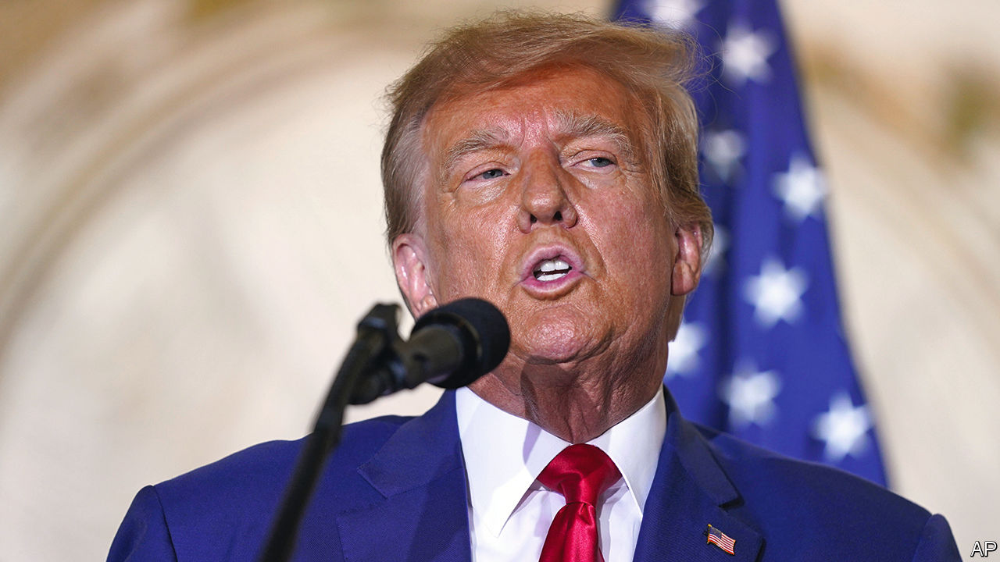
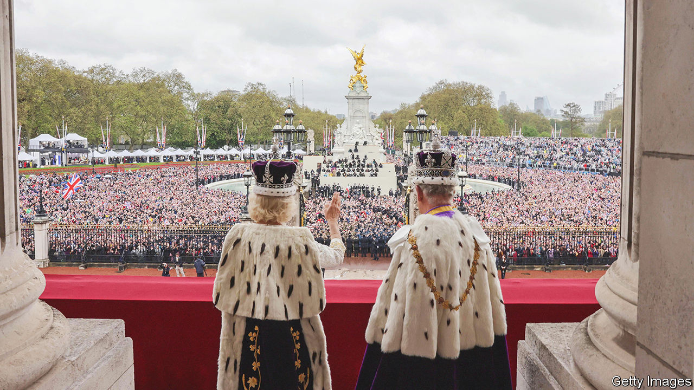

###### The world this week

# Politics 

#####  

 

> May 11th 2023 

A jury in Manhattan found  liable for sexually abusing a woman in the mid-1990s and for defaming her, and awarded her $5m. He called the verdict a “disgrace”. The jury did not agree that Mr Trump’s abuse of E. Jean Carroll constituted rape. Later, in a , Mr Trump refused to say whether he supported Ukraine, said America should default on its debt unless the Democrats agree to spending cuts and reiterated his fake claim that the 2020 election was stolen from him. Mr Trump is the front-runner for the Republican presidential nomination. 

, a Republican congressman known for being economical with the truth, was charged with embezzling contributions, fraudulently obtaining unemployment benefits and lying to Congress about his financial circumstances. Mr Santos has come under pressure to resign over his many lies, such as claiming he has a degree from a college that he did not attend. 

American states on the border with Mexico braced themselves for a surge of illegal crossings after the expiration of , a pandemic measure that had allowed for the swift removal of migrants. 

At least eight people died in violence that swept across  after Imran Khan, a former prime minister, was arrested and charged with graft. Senior leaders of his party were also detained. Mr Khan pleaded not guilty to the charges of selling state gifts while he was in power. A conviction would disqualify him from running for office again.

 foreign minister, Qin Gang, held talks in Pakistan with the Taliban government of  to discuss bringing the country into the Belt and Road Initiative, China’s global infrastructure-building scheme. China has long had an eye on Afghanistan’s vast mineral resources. 

Kishida Fumio,  prime minister, visited  for talks with the country’s president, Yoon Suk-yeol. It was their second meeting in two months—more evidence of a return to normal relations after years of acrimony. 

Thaksin times

Thaksin Shinawatra,  prime minister between 2001 and 2006, said he would return to his country in July after 17 years in exile. Mr Thaksin was ousted in a coup, but remains an influential figure. A party controlled by his allies is expected to do well in a general election on May 14th. 

 expelled a Chinese diplomat accused of targeting an MP and his relatives in Hong Kong. The MP, Michael Chong, had accused of human-rights abuses. The Canadian government said it would not tolerate interference in domestic affairs. China expelled a Canadian diplomat in retaliation. 

The Republican Party and other right-of-centre parties won the majority of seats in an election to choose members of an assembly that will draw up  new constitution. The main left-wing coalition won 16, leaving it short of the number needed for a veto. A draft constitution by a previous assembly was rejected in a referendum last year, because it was seen as too left-wing. 

Fighting intensified in Khartoum, the capital of , despite diplomatic efforts to impose a ceasefire. The conflict between Sudan’s army and a rival paramilitary force has claimed hundreds of lives since mid-April.

The Southern African Development Community agreed to deploy troops to eastern  to restore security. Congo’s government is battling an insurgency by the M23 rebel group and has already enlisted the help of soldiers from members of the East African Community, another regional bloc.

Police and protesters clashed in Dakar, the capital of , after a court imposed a suspended six-month jail sentence for defamation on Ousmane Sonko, a leading opposition figure, that will prevent him from contesting the presidential election next year. 

At least 25  in Gaza were killed in  air strikes. The dead included some children as well as leaders of Islamic Jihad, a militant group. Israel says it was targeting members of the group who were planning attacks on Israel. Militants in Gaza fired hundreds of rockets in response. Most were intercepted by Israel’s Iron Dome defence system or landed harmlessly. 

The Arab League reinstated  as a member. The country was kicked out more than a decade ago after Bashar al-Assad’s brutal repression of protests plunged the country into civil war. The move comes ahead of a summit due in Saudi Arabia later this month. 

The annual Victory Day parade in  to commemorate the country’s triumph against Nazi Germany was somewhat muted, given Vladimir Putin’s setbacks in Ukraine. The parade in Moscow featured just one tank. In his speech the president struck his usual belligerent tone, claiming the West was trying to destroy Russia. Kim Jong Un, North Korea’s dictator, sent “warm wishes” to Russia in its “holy fight to preserve world peace”. 

Russia launched another wave of missiles at , most of them targeting Kyiv, the capital. Ukrainian forces shot almost all of them down. Ursula von der Leyen, the president of the European Commission, visited Kyiv on Russia’s Victory Day. The EU began discussing new  on Russia focusing on “third countries” that circumvent existing trade bans, which would include China. 

Tens of thousands of people demonstrated in  against gun violence, after two mass shootings killed 17 people, including eight schoolchildren. Aleksandar Vucic, the president, criticised the protests, suggesting they were organised by the opposition for political gain. 

Rishi Sunak faced his first electoral test since becoming  prime minister last October. His ruling Conservative Party lost over 1,000 councillors in local elections; the opposition Labour Party now controls more councils than the Tories. Many of Labour’s gains were in areas that had switched to the Conservatives at the last general election in 2019.

Not all the people rejoiced

 


The  was held at Westminster Abbey. London’s police force expressed regret for arresting six anti-monarchy protesters. It said there was no evidence they were planning to disrupt the event. 

The World Health Organisation declared that is no longer a “public health emergency of international concern”, three years after the disease broke out. Although 7m deaths from covid have been reported, the WHO thinks the true toll is at least 20m. 

