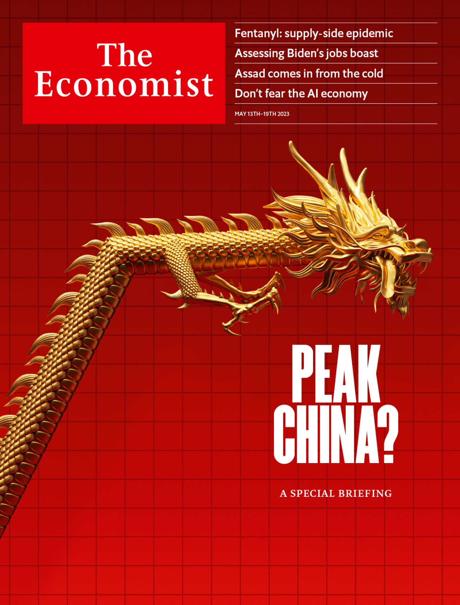

###### The Economist

# This week’s cover 

##### How we saw the world 

> May 11th 2023 

Our global cover this week asked: is China about to peak? In some senses, clearly not: its people will keep growing richer for many years to come, and its military might is increasing. But its economy cannot keep growing at the world-shaking pace of the past few decades. Its population is shrinking and ageing. Forecasters who once thought that China’s economy would soon be much larger than America’s now think that, at market exchange rates, it will never overtake it by much. Instead, the two superpowers face a long period of rough parity. We explore what that might mean for the world, and draw a surprisingly optimistic conclusion. 

One simple idea for illustrating a metaphorical peak was to use a literal one. We considered showing a gorgeous photo of Longquan Mountain in China’s Guizhou province, with a line of people hiking happily to the top to enjoy the view, and presumably walking down the other side to face the future. Better still was a classical-style painting of a lone figure on a summit, contemplating what lies in the distance. This, we thought, was both elegant and enigmatic.

Our artists love animals, and one came up with a drawing of a pole-vaulting panda. Corny, perhaps, but somehow pleasing to look at. The panda had soared as high as it could, leaving the viewer to wonder whether it would pull off a soft landing or a painful belly-flop. Another thought was to put a dragon on a treadmill. Having maintained a cracking pace for some time it was starting to flag. The machine, too, was a bit worse for wear, with fuses blowing and smoke billowing out of it.

The Chinese flag is adorned with five bright yellow stars. (The big one represents the Communist Party; the others are the four social classes: peasants, workers, scholars and merchants.) So we also tried taking a star and using one of its points to represent a peak. This was such a striking image that we worked it up into a full-fledged cover.

However, we had a nagging feeling that the peak was too sharp. We expect China’s relative economic weight and geopolitical heft to reach a plateau, not to fall off a cliff. In the end we preferred to show a golden dragon that does just that: it rises steeply, then levels off. To add a playful touch, we gave the mythical beast a weary look, with its tongue lolling out, as if it had been running very hard and was now in need of a rest and a cool glass of whatever it is that dragons drink. We hope it piques your interest in the fascinating report our China team pulled together this week. 

 


: 

: 

: 

: 

: 

: 

